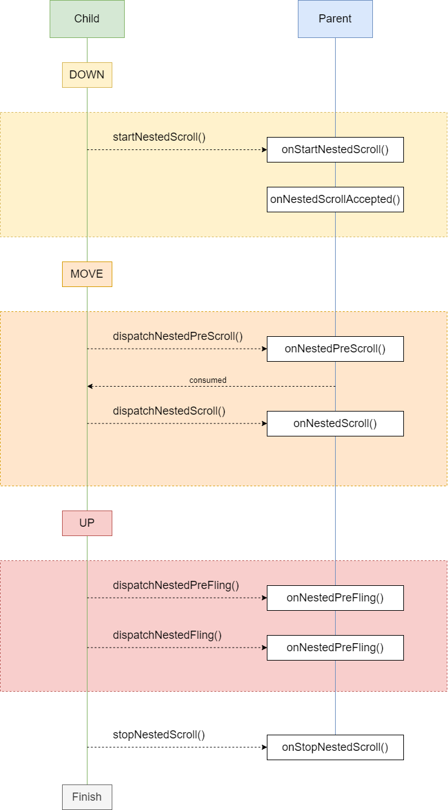

# NestScroll

业务场景：新闻详情页，有一个ContainerView作为父容器，其包含一个WebView子View用于显示新闻详情页面，一个RecyclerView子View用于显示评论。

问题的难点在于拖动事件（Scroll）和惯性滑动事件（Fling）需要合理地分发到相应的View，让页面浏览顺滑自然。

综合网上查阅到的资料，考虑有以下两种实现方式：

1. ContainerView全权处理Scroll事件及后续Fling事件，经过仔细的计算，准确地将Scroll偏移量（Fling事件最终也是归结于Scroll偏移量，性质一样）分发给相应的子View处理，或者自己消费，进行页面滚动。
2. 使用官方提供的嵌套滑动框架，让父容器和子容器分别实现`NestedScrollingParent`和`NestedScrollingParent`接口，进行事件的处理。

## ConsecutiveScrollView

第一种方式的实现，核心思路是监听Touch事件，拦截下所有的拖动事件，计算分发对象，分发处理事件。

参考的开源项目：[ConsecutiveScroller](https://github.com/donkingliang/ConsecutiveScroller)。

### 事件监听

事件的监听离不开`dispatchTouchEvent`，`onInterceptTouchEvent`和`onTouchEvent`，下面分别说明，这几个方法中需要进行什么操作。

* `dispatchTouchEvent`

  ```java
  @Override
  public boolean dispatchTouchEvent(MotionEvent event) {
      int action = event.getActionMasked();
      switch (action) {
          case MotionEvent.ACTION_DOWN:
              mScroller.abortAnimation();
              mDragging = false;
              mInitialY = mLastY = (int) event.getY();
              break;
          case MotionEvent.ACTION_MOVE:
              int offsetY = (int) event.getY() - mInitialY;
              if (!mDragging) {
                  if (Math.abs(offsetY) > mTouchSlop) {
                      mDragging = true;
                  }
              }
              break;
          case MotionEvent.ACTION_CANCEL:
          case MotionEvent.ACTION_UP:
              mDragging = false;
              break;
      }
      return super.dispatchTouchEvent(event);
  }
  ```

  此方法中需要做的事情有：

  终止现有的Scroller动画；

  在`Move`事件时进行判断当前一系列Touch事件是否发生了拖动。

* `onInterceptTouchEvent`

  ```java
  @Override
  public boolean onInterceptTouchEvent(MotionEvent event) {
      int action = event.getActionMasked();
      if (action == MotionEvent.ACTION_MOVE) {
          if (mDragging) {
              return true;
          }
      }
      return super.onInterceptTouchEvent(event);
  }
  ```

  此方法中需要做的事情有：

  如果当前一系列Touch事件已经发生了拖动，拦截后续的`Move`事件，好让事件能传递到`onTouchEvent`方法中进行具体的分发处理。

* `onTouchEvent`

  ```java
  @Override
  @SuppressLint("ClickableViewAccessibility")
  public boolean onTouchEvent(MotionEvent event) {
      Log.d(TAG, "onTouchEvent() event = [" + event + "]");
      int action = event.getActionMasked();
      switch (action) {
          case MotionEvent.ACTION_DOWN:
              mLastY = (int) event.getY();
              initOrResetVelocityTracker();
              mVelocityTracker.addMovement(event);
              break;
  
          case MotionEvent.ACTION_MOVE:
              int y = (int) event.getY();
              int offsetY = y - mLastY;
              mLastY = y;
              scrollBy(0, -offsetY);
              initVelocityTrackerIfNotExist();
              mVelocityTracker.addMovement(event);
              break;
  
          case MotionEvent.ACTION_CANCEL:
          case MotionEvent.ACTION_UP:
              if (mVelocityTracker != null) {
                  mVelocityTracker.addMovement(event);
                  mVelocityTracker.computeCurrentVelocity(1000, mMaximumFlingVelocity);
                  int velocityY = (int) mVelocityTracker.getYVelocity();
                  velocityY = Math.max(-mMaximumFlingVelocity, Math.min(velocityY, mMaximumFlingVelocity));
                  recycleVelocityTracker();
                  fling(-velocityY);
              }
              break;
      }
      return true;
  }
  ```

  此方法中需要做的事情：

  在`Down`事件中初始化`VelocityTracker`；

  在`Move`事件中计算拖动偏移，调用`scrollBy()`方法处理偏移量（后面将重写`scrollBy()`和`scrollTo()`方法进行统一处理）；另外，为了之后能`fling`，将事件添加到`VelocityTracker`；

  在`Up`事件中启动`fling`。

  

`fling`操作需要`Scroller`和`computeScroll()`配合起来使用：

* `fling()`

  ```java
  public void fling(int velocityY) {
      if (Math.abs(velocityY) > mMinimumFlingVelocity) {
          mLastScrollY = getScrollY();
          mScroller.fling(0, getScrollY(), 0, velocityY, Integer.MIN_VALUE, Integer.MAX_VALUE, Integer.MIN_VALUE, Integer.MAX_VALUE);
          invalidate();
      }
  }
  ```

* `computeScroll()`

  ```java
  @Override
  public void computeScroll() {
      if (mScroller.computeScrollOffset()) {
          int y = mScroller.getCurrY();
          int offsetY = y - mLastScrollY;
          mLastScrollY = y;
          if (offsetY > 0) {
              if (!hitBottom()) {
                  scrollBy(0, offsetY);
                  invalidate();
              } else {
                  mScroller.abortAnimation();
              }
          } else {
              if (!hitTop()) {
                  scrollBy(0, offsetY);
                  invalidate();
              } else {
                  mScroller.abortAnimation();
              }
          }
      }
  }
  ```

  需要注意的是在这里计算偏移量的时候不能像平常的时候一样使用`getScrollY()`进行计算，因为它只是父容器的滚动偏移量，我们这里计算的是整个交互行为的整体偏移量，因此需要引入一个新的字段`mLastScrollY`来辅助计算。


### 分发拖动偏移量

所有拖动偏移量先统一汇总到`scrollBy()`和`scrollTo()`方法，然后重写这两个方法进行统一的处理。为什么要调用这两个方法，然后重写来实现具体的逻辑，而不是直接新建一个方法来做一样的事情。这样保持了`scrollBy()`和`scrollTo()`的原有功能，对外部的View来说，调用这两个方法来与父容器交互完全是可以正常工作的，父容器内部的实现逻辑就可以很好地不对外暴露。

* `scrollBy()`

  ```java
  @Override
  public void scrollBy(int x, int y) {
      scrollTo(x, mTotalScroll + y);
  }
  ```

  此方法的原始实现是`scrollTo(mScrollX + x, mScrollY + y)`，因为这里我们不关心x方向的滚动，所以x的传值无所谓，那么y的传值为什么不能直接用`mScrollY + y`呢？要回答这个问题，我们得先理解一下`mScrollY`。

  `mScrollY`记录了的是父容器的拖动偏移量，它和子View的滚动情况没有直接关系。比如我们在刚进入页面，开始滚动上方的WebView的时候，父容器并没有发生页面的滚动。因此，这个值并不能完整的记录整个交互的拖动距离。

  在我们的场景中，整个拖动交互的总距离除了父容器的拖动长度外还需要包括所有子View的拖动长度之和。

  这就是为什么这里使用了一个自定义的字段`mTotalScroll`来记录整个拖动行为的长度。

* `scrollTo()`

  ```java
  @Override
  public void scrollTo(int x, int y) {
      dispatchScroll(y);
  }
  
  private void dispatchScroll(int y) {
      int offsetY = y - mTotalScroll;
      if (offsetY > 0) {
          scrollDown(offsetY);
      } else {
          scrollUp(offsetY);
      }
  }
  ```

  使用了之前引入的`mTotalScroll`字段，就能很容易计算出拖动距离，并进一步分发到`scrollDown()`和`scrollUp()`方法。

* `scrollDown()`

  ```java
  private void scrollDown(int offsetY) {
      int remainOffsetY = offsetY;
      // 当偏移量仍有剩余，并且没有完全触底时，才继续进行分发
      while (remainOffsetY > 0 && !hitBottom()) {
          // 唤醒滚动条
          awakenScrollBars();
          // 找到当前屏幕中第一个子View
          View firstView = findFirstVisibleView();
          if (firstView != null) {
              // 计算子View自身拖动到底部需要多远的距离
              int hitBottomOffset = ScrollUtils.getScrollBottomOffset(firstView);
              // 计算父容易滚动多远的记录，可以让子View移除屏幕
              int scrollOutOffset = firstView.getBottom() - getPaddingTop() - getScrollY();
              if (hitBottomOffset > 0) {
                  // 如果子View自身仍没有滚动到底部，先让它消费偏移量
                  offsetY = Math.min(hitBottomOffset, remainOffsetY);
                  firstView.scrollBy(0, offsetY);
              } else {
                  // 如果子View自身已经滚动到底部了，我们就让父容器消费偏移量，将它移出屏幕
                  offsetY = Math.min(scrollOutOffset, remainOffsetY);
                  scrollSelfBy(offsetY);
              }
              mTotalScroll += offsetY;
              remainOffsetY -= offsetY;
          }
      }
  }
  ```

* `scrollUp()`

  ```java
  private void scrollUp(int offsetY) {
      int remainOffsetY = offsetY;
      // 当偏移量仍有剩余，并且没有完全触顶时，才继续进行分发
      while (remainOffsetY < 0 && !hitTop()) {
          // 唤醒滚动条
          awakenScrollBars();
          // 找到当前屏幕中最后一个子View
          View lastView = findLastVisibleView();
          if (lastView != null) {
              // 计算子View自身拖动到顶部需要多远的距离
              int hitTopOffset = ScrollUtils.getScrollTopOffset(lastView);
              // 计算父容易滚动多远的记录，可以让子View移除屏幕
              int scrollOutOffset = lastView.getTop() + getPaddingBottom() - getScrollY() - getHeight();
              if (hitTopOffset < 0) {
                  // 如果子View自身仍没有滚动到顶部，先让它消费偏移量
                  offsetY = Math.max(hitTopOffset, remainOffsetY);
                  lastView.scrollBy(0, offsetY);
              } else {
                  // 如果子View自身已经滚动到顶部了，我们就让父容器消费偏移量，将它移出屏幕
                  offsetY = Math.max(scrollOutOffset, remainOffsetY);
                  scrollSelfBy(offsetY);
              }
              mTotalScroll += offsetY;
              remainOffsetY -= offsetY;
          }
      }
  }
  ```

具体计算是否触顶，是否触底，距离触底触顶还剩多少距离时，我们需要借助于这三个方法：

* `computeVerticalScrollRange()`，计算垂直滚动范围
* `computeVerticalScrollOffset()`，计算垂直滚动偏移量
* `computeVerticalScrollExtent()`，计算窗口大小

这三个方法是定义在`View`上的，原本是提供给`SeekBar`用于计算拖动比例的。我们一样可以借助它们完成我们拖动的计算。

### 总结

这样的实现方式确实比较容易的地解决了嵌套滑动的问题，并且它的巧妙之处在于，借助的方法基本上都是View上提供的（虽然`computeVerticalScrollXXX()`三个方法是`protected`的，需要进行反射），并不依赖于任何子View的类型，只要它们都是按标准实现了这几个接口就行。


## NestedScrollContainer

第二种方案的实现思路是：让所有子View继承`NestedScrollingChild`接口，让`NestedScrollContainer`实现`NestedScrollingParent`接口。配合使用这两个接口完成滑动事件的分发处理。

### 接口实现

一般我们需要在`NestedScrollContainer`内部使用`RecyclerView`或者`WebView`进行嵌套滑动。

`RecyclerView`已经默认实现了`NestedScrollingChild`接口，无需额外的操作。

`WebView`默认没有实现`NestedScrollingChild`接口，如果需要使用`WebView`，我们需要额外处理Touch事件。

### 分发拖动偏移量

分发拖动偏移量的时机是在`NestedScrollContainer.onNestedPreScroll()`方法中。在这个方法中可以根据子View的情况将事件自己消费，或者交给子View处理。

```java
@Override
public void onNestedPreScroll(@NonNull View target, int dx, int dy, @NonNull int[] consumed, int type) {
    if (dy > 0) {
        scrollDown(dy);
    } else {
        scrollUp(dy);
    }
}
```

具体的处理方式类与第一种实现方式的类似。

需要注意的是，无需在特殊处理`onNestedPreFling()`和`onNestedFling()`方法。因为`RecyclerView`内部最终会将Fling事件转化为Scroll回调给`NestedScrollContainer`。

### 总结

这一种实现方式较第一种更为复杂，尤其是在需要使用`WebView`作为子View的情况下，需要额外处理Touch事件的分发。


## NestedScrollingParent和NestedScrollingChild接口

这两个接口是官方提供的接口，需要配套使用，其目的是用于解决父容器与子View嵌套滑动的问题。

具体思路是，让子View处理Touch事件与Fling，父容器不直接拦截。但是，在子View消耗这些操作之前，先将这些操作分发给父容器，询问父容器是否需要提前执行滑动操作，以此来达到分解滑动偏移量的目的。

### NestedScrollingChild

接口包含的方法如下：

```java
public interface NestedScrollingChild {
    
    // 设置是否支持嵌套滑动
    void setNestedScrollingEnabled(boolean enabled);
    
    // 返回是否支持嵌套滑动
    boolean isNestedScrollingEnabled();
    
    // 开始嵌套滑动
    boolean startNestedScroll(@ScrollAxis int axes);
    
    // 结束嵌套滑动
    void stopNestedScroll();
    
    // 是否有嵌套滑动的父容器
    boolean hasNestedScrollingParent();
    
    // 在子View消耗Scroll偏移量之前，将偏移量分发给父容器，询问其是否需要先进行消耗
    // 如果父容器消耗了偏移量，方法将返回true，消耗的数值将存在consumed数组中，
    // 如果父容器进行了窗口滑动，滑动的位移将存在offsetInWindow中
    boolean dispatchNestedPreScroll(int dx, int dy, @Nullable int[] consumed,
            @Nullable int[] offsetInWindow);
    
    // 在子View消耗了Scroll偏移量之后，将剩余的偏移量分发给父容器，询问其是否需要进行消耗
    // dxConsumed和dyConsumed为子View消耗的数值，dxUnconsumed和dyUnconsumed为剩余数值
    // 如果父容器消耗了偏移量，方法将返回true，消耗的数值将存在consumed数组中，
    // 如果父容器进行了窗口滑动，滑动的位移将存在offsetInWindow中
    boolean dispatchNestedScroll(int dxConsumed, int dyConsumed,
            int dxUnconsumed, int dyUnconsumed, @Nullable int[] offsetInWindow);
    
    // 在子View消耗Fling之前，将Fling的速度分发给父容器，询问其是否需要先进行消耗
    // 如果父容器消耗了Fling事件，方法将返回true
    boolean dispatchNestedPreFling(float velocityX, float velocityY);
    
    // 分发一个Fling事件给父容器
    // consumed为子View是否已经消耗了这个Fling
    // 如果子View已经到达了边缘，不能再滚动了，可以使用这个方法把Fling事件转发给父容器
    boolean dispatchNestedFling(float velocityX, float velocityY, boolean consumed);     
}
```

值得额外说明的是`offsetInWindow`这个属性需要如何使用。

如果父容器消耗了滑动事件，并且滚动了窗口，是需要将窗口平移距离通过这个参数告知子View的，子View需要在Touch事件中调用`event.offsetLocation(offsetInWindow[0], offsetInWindow[1])`来调整Touch事件的坐标。

此处的处理逻辑可以参考`RecyclerView`对`offsetInWindow`的处理：

```java
if (action == MotionEvent.ACTION_DOWN) {
    mNestedOffsets[0] = mNestedOffsets[1] = 0;
}
final MotionEvent vtev = MotionEvent.obtain(e);
vtev.offsetLocation(mNestedOffsets[0], mNestedOffsets[1]);
```

```java
if (dispatchNestedPreScroll(
    canScrollHorizontally ? dx : 0,
    canScrollVertically ? dy : 0,
    mReusableIntPair, mScrollOffset, TYPE_TOUCH
)) {
    dx -= mReusableIntPair[0];
    dy -= mReusableIntPair[1];
    // Updated the nested offsets
    mNestedOffsets[0] += mScrollOffset[0];
    mNestedOffsets[1] += mScrollOffset[1];
    // Scroll has initiated, prevent parents from intercepting
    getParent().requestDisallowInterceptTouchEvent(true);
}

mLastTouchX = x - mScrollOffset[0];
mLastTouchY = y - mScrollOffset[1];
```

使用mNestedOffset整体记录嵌套滑动带来的窗口偏移，并且在接收到事件时，追加上这个偏移量。

### NestedScrollingParent

接口包含方法如下：

```java
public interface NestedScrollingParent {
    
    // 当子View调用了startNestedScroll()后，父容器会回调此方法
    boolean onStartNestedScroll(@NonNull View child, @NonNull View target, @ScrollAxis int axes);
    
    // 当嵌套滑动事件已经被接受后，也就是onStartNestedScroll()方法返回true后，父容器会回调此方法
    void onNestedScrollAccepted(@NonNull View child, @NonNull View target, @ScrollAxis int axes);
    
    // 当子View调用了stopNestedScroll()后，父容器会回调此方法
    void onStopNestedScroll(@NonNull View target);
    
    // 当子View调用dispatchNestedPreScroll()后，父容器会回调此方法
    void onNestedPreScroll(@NonNull View target, int dx, int dy, @NonNull int[] consumed);
    
    // 当子View调用dispatchNestedScroll()后，父容器会回调此方法
    void onNestedScroll(@NonNull View target, int dxConsumed, int dyConsumed,
            int dxUnconsumed, int dyUnconsumed);
    
    // 当子View调用dispatchNestedPreFling()后，父容器会回调此方法
    boolean onNestedPreFling(@NonNull View target, float velocityX, float velocityY);
    
    // 当子View调用dispatchNestedFling()后，父容器会调用此方法
    boolean onNestedFling(@NonNull View target, float velocityX, float velocityY, boolean consumed);
    
    // 获取嵌套滑动坐标轴
    int getNestedScrollAxes();
}
```


从这两个接口的方法是需要配合另外两个Helper类`NestedScrollingParentHelper`和`NestedScrollingChildHelper`成套使用的。

子View的Helper类主要做的是在子View调用的方法后，寻找到父容器，触发相应的回调。

父容器的Helper类主要做的是一些滑动状态的保存。


两者交互流程如下：




## NestedScrollView的问题

不推荐使用`NestedScrollView`和`RecyclerView`进行嵌套使用，虽然嵌套滑动事件可以正确处理，但是这会导致`RecyclerView`的高度被处理成所有Item全部展示的高度，进而导致所有Item都被渲染，因此严重的性能问题。