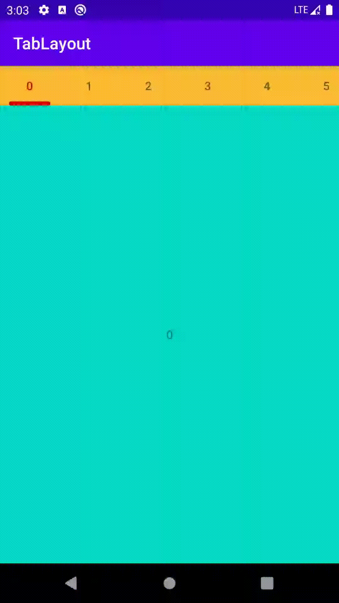
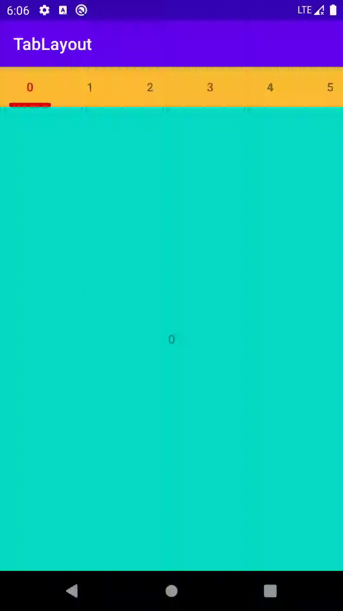
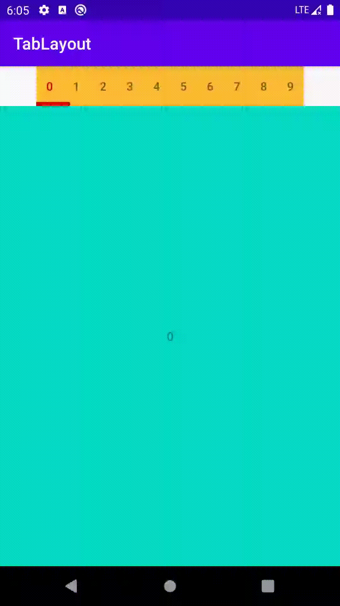
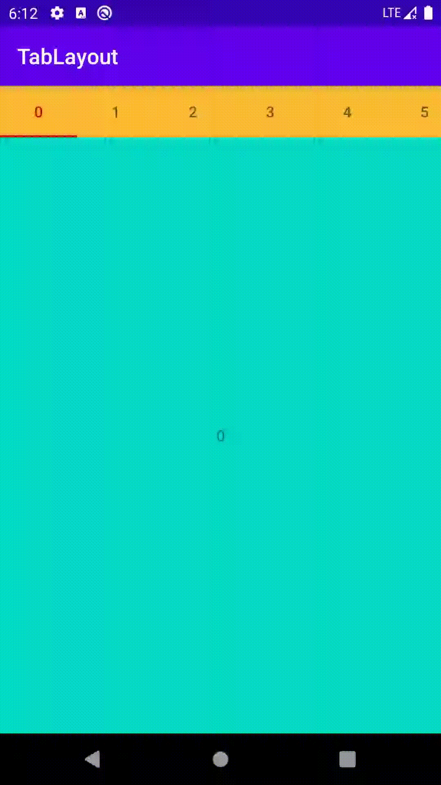

# TabLayout

`TabLayout`用于和`ViewPager`配合使用，用于展示页面标签。



## 绑定ViewPager

有两种方式与`ViewPager`进行数据绑定。一种是调用`TabLayout.setupWithViewPager(ViewPager viewPager)`，另一种是将`TabLayout`设置为`ViewPager`的子`DecorView`。

### TabLayout.setupWithViewPager()

这种绑定方式在视图结构上并没有特定的限制，可以将两者放在视图的同一级。

```xml
<?xml version="1.0" encoding="utf-8"?>
<androidx.constraintlayout.widget.ConstraintLayout xmlns:android="http://schemas.android.com/apk/res/android"
    xmlns:app="http://schemas.android.com/apk/res-auto"
    xmlns:tools="http://schemas.android.com/tools"
    android:layout_width="match_parent"
    android:layout_height="match_parent"
    tools:context=".MainActivity">

    <com.google.android.material.tabs.TabLayout
        android:id="@+id/tabLayout"
        android:layout_width="wrap_content"
        android:layout_height="wrap_content"
        app:layout_constraintEnd_toEndOf="parent"
        app:layout_constraintStart_toStartOf="parent"
        app:layout_constraintTop_toTopOf="parent"
        app:tabBackground="@android:color/holo_orange_light"
        app:tabIndicatorColor="@android:color/holo_red_dark"
        app:tabMode="auto"
        app:tabSelectedTextColor="@android:color/holo_red_dark" />

    <androidx.viewpager.widget.ViewPager
        android:id="@+id/viewPager"
        android:layout_width="match_parent"
        android:layout_height="0dp"
        app:layout_constraintBottom_toBottomOf="parent"
        app:layout_constraintEnd_toEndOf="parent"
        app:layout_constraintStart_toStartOf="parent"
        app:layout_constraintTop_toBottomOf="@+id/tabLayout" />
</androidx.constraintlayout.widget.ConstraintLayout>
```

然后在调用`TabLayout.setupWithViewPager()`进行数据绑定。

```java
ViewPager viewPager = findViewById(R.id.viewPager);
viewPager.setAdapter(new NumberAdapter(getSupportFragmentManager(), 10));

TabLayout tabLayout = findViewById(R.id.tabLayout);
tabLayout.setupWithViewPager(viewPager);
```

### ViewPager.DecorView

这种方式需要将`TabLayout`添加到`ViewPager`中作为子View。

```xml
<?xml version="1.0" encoding="utf-8"?>
<androidx.constraintlayout.widget.ConstraintLayout xmlns:android="http://schemas.android.com/apk/res/android"
    xmlns:app="http://schemas.android.com/apk/res-auto"
    xmlns:tools="http://schemas.android.com/tools"
    android:layout_width="match_parent"
    android:layout_height="match_parent"
    tools:context=".Approach2Activity">

    <androidx.viewpager.widget.ViewPager
        android:id="@+id/viewPager"
        android:layout_width="match_parent"
        android:layout_height="0dp"
        app:layout_constraintBottom_toBottomOf="parent"
        app:layout_constraintEnd_toEndOf="parent"
        app:layout_constraintStart_toStartOf="parent"
        app:layout_constraintTop_toTopOf="parent">

        <com.google.android.material.tabs.TabLayout
            android:id="@+id/tabLayout"
            android:layout_width="wrap_content"
            android:layout_height="wrap_content"
            app:layout_constraintEnd_toEndOf="parent"
            app:layout_constraintStart_toStartOf="parent"
            app:layout_constraintTop_toTopOf="parent"
            app:tabBackground="@android:color/holo_orange_light"
            app:tabIndicatorColor="@android:color/holo_red_dark"
            app:tabMode="auto"
            app:tabSelectedTextColor="@android:color/holo_red_dark" />
    </androidx.viewpager.widget.ViewPager>

</androidx.constraintlayout.widget.ConstraintLayout>
```

在`ViewPager.addView()`方法中，对所有子View进行了判断，如果添加过`ViewPager.DecorView`注解，将在layout和measure过程特殊处理。

```java
@Override
public void addView(View child, int index, ViewGroup.LayoutParams params) {
    if (!checkLayoutParams(params)) {
        params = generateLayoutParams(params);
    }
    final LayoutParams lp = (LayoutParams) params;
    // Any views added via inflation should be classed as part of the decor
    lp.isDecor |= isDecorView(child);
    if (mInLayout) {
        if (lp != null && lp.isDecor) {
            throw new IllegalStateException("Cannot add pager decor view during layout");
        }
        lp.needsMeasure = true;
        addViewInLayout(child, index, params);
    } else {
        super.addView(child, index, params);
    }

    if (USE_CACHE) {
        if (child.getVisibility() != GONE) {
            child.setDrawingCacheEnabled(mScrollingCacheEnabled);
        } else {
            child.setDrawingCacheEnabled(false);
        }
    }
}

private static boolean isDecorView(@NonNull View view) {
    Class<?> clazz = view.getClass();
    return clazz.getAnnotation(DecorView.class) != null;
}
```

`TabLayout`类上定义了`ViewPager.DecorView`的注解。因此，它将会被作为固定不动的`DecorView`被`ViewPager`处理。

```java
@ViewPager.DecorView
public class TabLayout extends HorizontalScrollView {
}
```

并且在`TabLayout.onAttachedToWindow()`方法中会调用`setupWithViewPager()`方法进行绑定。

```java
@Override
protected void onAttachedToWindow() {
    super.onAttachedToWindow();

    MaterialShapeUtils.setParentAbsoluteElevation(this);

    if (viewPager == null) {
        // If we don't have a ViewPager already, check if our parent is a ViewPager to
        // setup with it automatically
        final ViewParent vp = getParent();
        if (vp instanceof ViewPager) {
            // If we have a ViewPager parent and we've been added as part of its decor, let's
            // assume that we should automatically setup to display any titles
            setupWithViewPager((ViewPager) vp, true, true);
        }
    }
}
```


## Api

### TabLayout.setTabMode()

通过这个方法可以设置展示形式。

* `MODE_SCROLLABLE`

  如果Tab内容超出了显示范围，将可以滑动。

  

* `MODE_FIXED`

  如果Tab内容超出了显示方位，不可以滑动。

  

* `MODE_AUTO`

  `TabLayout`将根据内容的长度自行判断是否使用滑动。

### TabLayout.addTab()

如果不和`ViewPager`一起使用，通过这个方法可以动态添加`Tab`。

### TabLayout.setRippleColor()

通过这个方法可以设置Tab点击时水波纹的颜色。


### TabLayout.setTabIndicatorFullWidth()

通过这个方法可以设置选中Indicator是否显示为整个Tab长度。

* true

  

* false

  

### TabLayout.setSelectedTabIndicator()

通过这方法可以设置选中的Tab展示的indicator的drawable。

配合`layer-list`可以达到设置长度，圆角等效果。

```xml
<?xml version="1.0" encoding="utf-8"?>
<layer-list xmlns:android="http://schemas.android.com/apk/res/android">

    <item android:gravity="center">
        <shape>
            <solid android:color="@android:color/holo_red_dark" />
            <size
                android:width="50dp"
                android:height="5dp" />
            <corners android:radius="2dp" />
        </shape>
    </item>
</layer-list>
```


### Tab.setCustomView()

通过给`Tab`设置`CustomView`可以达到自定义Tab样式的目的。