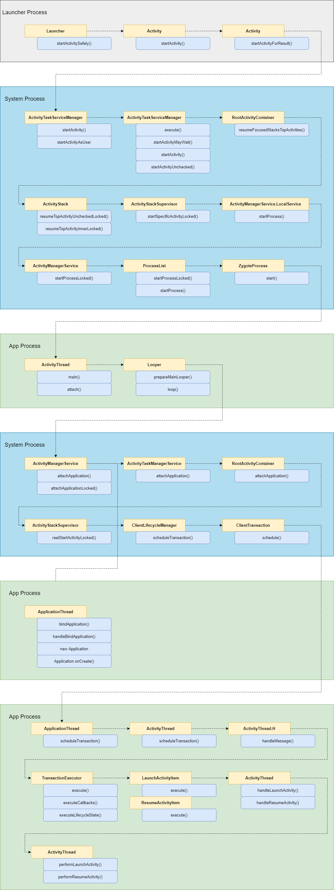

# 应用启动流程

从手机桌面点击一个App的图标，到App启动和Activity显示经过了哪些步骤？

下面通过Android P源码的分析，寻找答案。


## 整体流程

整体流程大致分为几个部分：

* Launcher进程中发起Intent
* 创建App进程
* 启动Application
* 启动Activity

详细的调用链见下图：

其中灰色部分是在Launcher进程中，蓝色部分是在系统进程中，绿色部分是在App进程中。




## 发起Intent

桌面其实也是一个应用，它的源码位于AOSP项目`platform/packages/apps/launcher/`文件夹下。

当点击桌面一个App的Icon时，其实背后发生的无非就是：获取了这个App的信息，组装了Intent，发起Intent启动Activity。这个过程涉及几个类：`Launcher`，`Activity`，`Instrumentation`，整个过程发生在Launcher应用所在的进程。

* `Launcher` 

  点击App图标后，Launcher根据应用的信息组装Intent，调用到`Launcher.startActivitySafely()`方法启动应用入口Activity。

  ```java
  void startActivitySafely(Intent intent) {
      intent.addFlags(Intent.FLAG_ACTIVITY_NEW_TASK);
      try {
          /* ---------- 关键入口 ---------- */
          startActivity(intent);
          /* ----------------------------- */
      } catch (ActivityNotFoundException e) {
          Toast.makeText(this, R.string.activity_not_found, Toast.LENGTH_SHORT).show();
      } catch (SecurityException e) {
          Toast.makeText(this, R.string.activity_not_found, Toast.LENGTH_SHORT).show();
      }
  }
  ```

* `Activty`

  `startActivity()`方法是一个定义在`Context`类上的抽象方法，因为`Launcher`类本身是一个`Acitivity`，因此，在这里调用的其实是`Activity.startActivity()`。

  经过一系列调用后，最终会来到`Activity.startActivityForResult()`方法。

  在这个方法中，Activity并没有自己进行处理，而是转交给了`Instrumentation`类。

  ```java
  public void startActivityForResult(
      /* ---------- 关键入口 ---------- */
      Instrumentation.ActivityResult ar =
          mInstrumentation.execStartActivity(
          this, mMainThread.getApplicationThread(), mToken, who,
          intent, requestCode, options);
      /* ----------------------------- */
  }
  ```

  * `Instrumentation`是做什么的？

    通过阅读`Instrumentation`类的注释，可以发现它是用于监控系统和Application的交互的。其实它就是一个应用生命周期的Hook。

    ```java
    /**
     * Base class for implementing application instrumentation code.  When running
     * with instrumentation turned on, this class will be instantiated for you
     * before any of the application code, allowing you to monitor all of the
     * interaction the system has with the application.  An Instrumentation
     * implementation is described to the system through an AndroidManifest.xml's
     * &lt;instrumentation&gt; tag.
     */
    ```

    它定义了方法一系列与`App`，`Activity`相关的方法，例如：`newApplication()`，`callActivityOnCreate()`等。如果继承`Instrumentation`类，重写这些方法可以自定义处理的逻辑。实现对`App`和`Activity`的主要方法的Hook。

  * 重要的参数

    * `mMainThread.getApplicationThread()`

      `mMainThread`的类型是`ActivityThread`，`getApplicationThread()`返回的是`ApplicationThread`类型的对象。

      它的作用是将作为Binder接口提供给Server端。

    * `mToken`

      ?

* `Instrumentation`

  `Instumentation`调用`ActivityTaskManager.getService()`获取到`ActivityTaskManagerService`的Binder接口，调用了`ActivityTaskManagerService.startActivity()`。

  这里进行了一次关键的Binder调用，进程从Launcher应用进程跨越到了系统进程。

  ```java
  public ActivityResult execStartActivity(
      Context who, IBinder contextThread, IBinder token, Activity target,
      Intent intent, int requestCode, Bundle options) {
      IApplicationThread whoThread = (IApplicationThread) contextThread;
      try {
          intent.migrateExtraStreamToClipData();
          intent.prepareToLeaveProcess(who);
          /* ---------- 关键入口 ---------- */
          int result = ActivityTaskManager.getService()
              .startActivity(whoThread, who.getBasePackageName(), intent,
                             intent.resolveTypeIfNeeded(who.getContentResolver()),
                             token, target != null ? target.mEmbeddedID : null,
                             requestCode, 0, null, options);
          /* ----------------------------- */
          checkStartActivityResult(result, intent);
      } catch (RemoteException e) {
          throw new RuntimeException("Failure from system", e);
      }
      return null;
  }
  ```


## 创建进程

每个应用都运行在自己的进程中，所以新启动一个应用，必须要给它创建一个进程。在系统Service的调用链中，以下关键方法涉及到进程的创建。

* `ActivityStackSupervisor`

  ```java
  void startSpecificActivityLocked(ActivityRecord r, boolean andResume, boolean checkConfig) {
      ...
      final Message msg = PooledLambda.obtainMessage(
          ActivityManagerInternal::startProcess,
          ...
      );
      mService.mH.sendMessage(msg);
      ...
  }
  ```

  `ActivityManagerInternal`是一个接口，其实现类为`ActivityManagerService` 的内部类`ActivityManagerServie.LocalService`，它提供了给系统进程本地使用的方法。

* ActivityManagerService.LocalService

  ```java
  public void startProcess(...) {
      ...
      startProcessLocked(...);
      ...
  }
  ```

  ```java
  final ProcessRecord startProcessLocked(...) {
      return mProcessList.startProcessLocked(...);
  }
  ```

* `ProcessList`

  最终经过一系列调用，会进入`ProcessList.startProcess()`方法。进一步，使用`ZygoteProcess.start()`方法创建进程。

  ```java
  private Process.ProcessStartResult startProcess(...) {
      ...
      if (hostingRecord.usesAppZygote()) {
          /* ---------- 关键入口 ---------- */
          startResult = appZygote.getProcess().start(...);
          /* ----------------------------- */
      }
      ...
  }
  ```

* `ZygoteProcess`

  ```java
  /**
   * Start a new process.
   *
   * <p>If processes are enabled, a new process is created and the
   * static main() function of a <var>processClass</var> is executed there.
   * The process will continue running after this function returns.
   */
  ```

  通过`start()`方法的注释，我们可以知道，App进程启动后，会执行到`ActivityThread`的main函数。当main函数开始执行，应用就开始了启动的过程。


## 启动Application

* `ActivityThread`

   在`main()`函数中，主要做了两件事情：

  * 创建Looper，并开始主线程事件循环
  
    `ActivityThread.main()`方法执行所在的线程就是这个App的主线程，在调用`Looper.loop()`方法后，主线程将一直循环运行下去。
  
  * 调用`attach()`方法
  
    这个方法的作用是向系统服务注册当前创建的App，将`ApplicationThread`对象作为`Binder`通信的接口，传递给系统服务。
  
  ```java
  public static void main(String[] args) {
  	...
          
      Looper.prepareMainLooper();
      
      ActivityThread thread = new ActivityThread();
      thread.attach(false, startSeq);
      
      ...
  
      Looper.loop();
  
      throw new RuntimeException("Main thread loop unexpectedly exited");
  }
  ```
  
  ```java
  private void attach(boolean system, long startSeq) {
      ...
      final IActivityManager mgr = ActivityManager.getService();
      try {
          mgr.attachApplication(mAppThread, startSeq);
      } catch (RemoteException ex) {
          throw ex.rethrowFromSystemServer();
      }
     ...
  }
  ```
  
* `ActivityManagerService`

   ```java
   public final void attachApplication(IApplicationThread thread, long startSeq) {
       synchronized (this) {
           ...
           attachApplicationLocked(thread, callingPid, callingUid, startSeq);
   		...
       }
   }
   ```

   ```java
   private final boolean attachApplicationLocked(IApplicationThread thread, int pid, int callingUid, long startSeq) {
       ...
   	thread.bindApplication(...);
       ...
   	didSomething = mAtmInternal.attachApplication(app.getWindowProcessController());
       ...
   }
   ```

   在后续的`ActivityThread.bindApplication()`的步骤里，将会完成`Application`的创建，`ContentProvider`的初始化，`Application.onCreate()`生命周期的回调等操作。

* ActivityTaskManagerService

   ```java
   public boolean attachApplication(WindowProcessController wpc) throws RemoteException {
       synchronized (mGlobalLockWithoutBoost) {
           return mRootActivityContainer.attachApplication(wpc);
       }
   }
   ```

* `RootActivityContainer`

   进行到这里，就开始Activity的启动步骤。

   ```java
   boolean attachApplication(WindowProcessController app) throws RemoteException {
       ...
   	mStackSupervisor.realStartActivityLocked(...);
       ...
   }
   ```


## 启动Activity

* `ActivityStackSupervisor`

  在这一步里，`ActivityStackSupervisor`将通过`ClientLifecycleManager`向客户端发起`LaunchActivityItem`的callback指令和`ResumeActivityItem`的lifecycles指令。

  ```java
  boolean realStartActivityLocked(ActivityRecord r, WindowProcessController proc,
              boolean andResume, boolean checkConfig) throws RemoteException {
      ...
      clientTransaction.addCallback(LaunchActivityItem.obtain(...));
      final ActivityLifecycleItem lifecycleItem;
      if (andResume) { // 这里为true
          lifecycleItem = ResumeActivityItem.obtain(dc.isNextTransitionForward());
      } else {
          lifecycleItem = PauseActivityItem.obtain();
      }
      clientTransaction.setLifecycleStateRequest(lifecycleItem);
      mService.getLifecycleManager().scheduleTransaction(clientTransaction);
      ...
  }
  ```

* `ClientLifecycleManager`

  ```java
  void scheduleTransaction(ClientTransaction transaction) throws RemoteException {
      ...
      transaction.schedule();
  	...
  }
  ```

* `ClientTransaction`

  通过Binder机制，调用到应用进程的`ApplicationThread.scheduleTransaction()` 。

  ```java
  /** Target client. */
  private IApplicationThread mClient;
  
  ...
      
  public void schedule() throws RemoteException {
  	mClient.scheduleTransaction(this);
  }
  ```

* `ActivityThread.ApplicationThread`

  `ActivityThread`继承自`ClientTransactionHandler`，这里会调用`ClientTransactionHandler.scheduleTransaction()`。

  ```java
  @Override
  public void scheduleTransaction(ClientTransaction transaction) throws RemoteException {
      ActivityThread.this.scheduleTransaction(transaction);
  }
  ```

* `ClientTransactionHandler`

  通过`ActivityThread.H`分发事件。

  ```java
  void scheduleTransaction(ClientTransaction transaction) {
      transaction.preExecute(this);
      sendMessage(ActivityThread.H.EXECUTE_TRANSACTION, transaction);
  }
  ```

* `ActivityThread.H`

  ```java
  case EXECUTE_TRANSACTION:
      final ClientTransaction transaction = (ClientTransaction) msg.obj;
      mTransactionExecutor.execute(transaction);
      if (isSystem()) {
          // Client transactions inside system process are recycled on the client side
          // instead of ClientLifecycleManager to avoid being cleared before this
          // message is handled.
          transaction.recycle();
      }
      // TODO(lifecycler): Recycle locally scheduled transactions.
      break;
  ```

* `TransactionExecutor`

  会分别执行到`ClientTransactionItem`和`ActivityLifecycleItem`的`execute()`方法和`postExecute()`方法。在回到`ActivityStackSupervisor.realStartActivityLocked()`方法中，可以看到分别会执行`LaunchActivityItem`和`ResumeActivityItem`。

  ```java
  public void execute(ClientTransaction transaction) {
      ...
      executeCallbacks(transaction);
      executeLifecycleState(transaction);
      ...
  }
  ```

  ```
  public void executeCallbacks(ClientTransaction transaction) {
      final List<ClientTransactionItem> callbacks = transaction.getCallbacks();
      
      final int size = callbacks.size();
      for (int i = 0; i < size; ++i) {
          final ClientTransactionItem item = callbacks.get(i);
          ...
          item.execute(mTransactionHandler, token, mPendingActions);
          item.postExecute(mTransactionHandler, token, mPendingActions);
          ...
      }
  }
  ```

  ```
  private void executeLifecycleState(ClientTransaction transaction) {
      final ActivityLifecycleItem lifecycleItem = transaction.getLifecycleStateRequest();
  
      ...
  
      lifecycleItem.execute(mTransactionHandler, token, mPendingActions);
      lifecycleItem.postExecute(mTransactionHandler, token, mPendingActions);
  }
  ```

  

* `LaunchActivityItem`

  最终调用到`ActivityThread.handleLaunchActivity()`。创建Application对象，Activity对象，并调用`attach()`，`performCreate()`方法等。

  ```java
  public void execute(ClientTransactionHandler client, IBinder token,
                      PendingTransactionActions pendingActions) {
  	...
      client.handleLaunchActivity(r, pendingActions, null /* customIntent */);
  	...
  }
  ```

* ResumeActivityItem

  最终调用到`ActivityThread.handleResumeActivity()`。调用`performResume()`方法。

  ```java
  @Override
  public void execute(ClientTransactionHandler client, IBinder token,
                      PendingTransactionActions pendingActions) {
      client.handleResumeActivity(...);
  }
  ```
  
