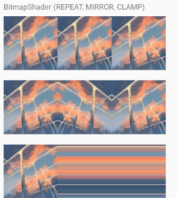
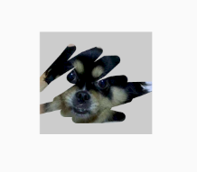

# Paint

## Shader
着色器，可以调用`Paint.setShader()`方法设置给Paint，作为绘制时的颜色空间。

如何理解颜色空间？

可以想象设置了shader后，绘制时是在“揭露”设置的shader。类似于刮奖的效果。

* LinearGradient
  
  一组颜色线性排列的色彩空间。
  
  
  
  * 构造函数：
  
    ```java
    public LinearGradient(float x0, float y0, float x1, float y1, @NonNull @ColorInt int[] colors, @Nullable float[] positions, @NonNull TileMode tile) {
        this(x0, y0, x1, y1, convertColors(colors), positions, tile,
             ColorSpace.get(ColorSpace.Named.SRGB));
    }
    ```
  
    * x0，y0：表示起点坐标
  
    * x1，y1：表示终点坐标
  
    * colors：填充的颜色数组
  
    * positions：每种颜色所占的比例，传null为等分
  
    * tile：填充模式（Shader.TileMode.REPEAT，Shader.TileMode.MIRROR，Shader.TileMode.CLAMP）
  
  * 使用例子：
  
    文字的闪动效果。
  
    

* BitmapGradient

  图片作为色彩空间，可以设置x方向和y方向的平铺模式。

  

  * 构造函数

    ```java
    public BitmapShader(@NonNull Bitmap bitmap, @NonNull TileMode tileX, @NonNull TileMode tileY) {
        this(bitmap, tileX.nativeInt, tileY.nativeInt);
    }
    ```

    * bitmap：使用的图片
    * tileX：X方向平铺模式
    * tileY：Y方向平铺模式

  * 使用例子：

    刮奖效果。

    