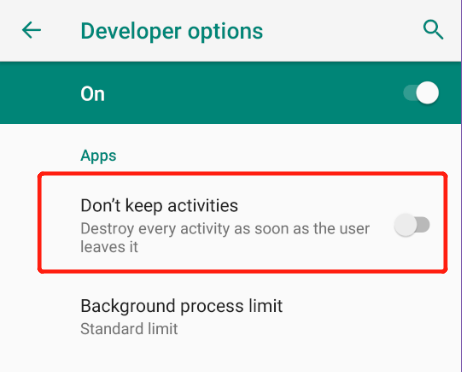

# Reference
* [Fragments - Android Developers](https://developer.android.com/guide/components/fragments)
* [Android Fragment 非常详细的一篇](https://www.jianshu.com/p/11c8ced79193)
* [A diagram of the Android Activity / Fragment lifecycle](https://github.com/xxv/android-lifecycle)
* [避免使用onActivityResult，提高代码可读性](https://mp.weixin.qq.com/s/w_n4ppDoWFTLttpdPx-Yww)

# 作用
* 将Activity的UI进行分块，方便复用与扩展。  
* 给UI提供生命周期。

# LifeCycles
官方版本较为简略：  


Github版本非常详细：  


# 使用Fragment
建议使用support库（androidx库）中的Fragment，而不要直接使用`android.app.Fragment`。因此需要使用`FragmentActivity`，`AppCompatActivity`是`FragmentActivity`的子类。

## 创建Fragment对象
使用静态方法创建，并传入参数`Fragment#setArguments()`。不要直接使用带参数的构造方法传递参数，因为系统因内存不足回收Fragment后，之后重建时不会再次调用有参数的构造方法，只会调用默认构造方法，而参数将通过`arguments`重建，所以使用`arguments`进行参数传递。
```java
public static AnimeDetailFragment newInstance(Anime anime) {
    Bundle argument = new Bundle();
    argument.putParcelable(ARGUMENT_KEY_ANIME, anime);
    AnimeDetailFragment fragment = new AnimeDetailFragment();
    fragment.setArguments(argument);
    return fragment;
}
```

## 创建Fragment的界面
在`Fragment#onCreateView()`回调时创建Fragment的界面。
```Java
public View onCreateView(LayoutInflater inflater, ViewGroup container, Bundle savedInstanceState) {
    View fragmentView = inflater.inflate(R.layout.fragment_anime_list, container, false);
    AnimeRecyclerView animeRecyclerView = fragmentView.findViewById(R.id.recyclerView_anime);
    animeRecyclerView.setOnAnimeClickedListener(mOnAnimeClickedListener);
    return fragmentView;
}
```
`inflate`方法传入的最后一个boolean参数`attachToRoot`表示是否把inflate的view添加到container中，这里设为`false`因为Fragment内部会实现此逻辑，避免重复addView。

## 静态添加Fragment
静态添加需要在Activity的Layout文件中提前声明Fragment的布局。
```xml
<fragment
    android:id="@+id/fragment_animeList"
    android:name="zhaoyun.techstack.android.fragment.list.AnimeListFragment"
    android:layout_width="0dp"
    android:layout_height="0dp"
    android:layout_marginStart="8dp"
    android:layout_marginTop="8dp"
    android:layout_marginEnd="8dp"
    android:layout_marginBottom="8dp"
    app:layout_constraintBottom_toTopOf="@id/fragment_container"
    app:layout_constraintEnd_toEndOf="parent"
    app:layout_constraintStart_toStartOf="parent"
    app:layout_constraintTop_toTopOf="parent"
    app:layout_constraintVertical_weight="2"/>
```

## 动态添加Fragment
动态添加需要在运行时调用`SupportFragmentManager`的api进行。
```java
Fragment fragment = AnimeDetailFragment.newInstance(anime);
getSupportFragmentManager()
        .beginTransaction()
        .setCustomAnimations(
                R.anim.fragment_in,
                R.anim.fragment_out,
                R.anim.fragment_in,
                R.anim.fragment_out
        )
        .replace(R.id.fragment_container, fragment)
        .addToBackStack(null)
        .commit();
```

## SupportFragmentManager
有以下常用api：
* `add()` 添加Fragment到FragmentContainer
* `remove()` 从FragmentContainer中删除Fragment
* `replace()` 从FragmentContainer中删除所有Fragment，再添加Fragment
* `show()` 显示Fragment
* `hide()` 隐藏Fragment

## BackStack
可以使用`addToBackStack()`方法把操作加到BackStack中。用户点击Back键时会回退操作。

## Animation
可以使用`setCustomAnimations`设置fragment切换时的动画。

## 与Activity（其它Fragment）通信
与Activity通信分为三步实现：
1. Fragment中定义接口
    ```java
    public interface OnAnimeClickedListener {
        void onAnimeClicked(Anime anime);
    }
    ```

2. Activity实现接口
    ```java
    public class MainActivity extends AppCompatActivity implements AnimeListFragment.OnAnimeClickedListener
    ```

3. `Fragment#onAttach()`时获取接口
    ```java
    @Override
    public void onAttach(Context context) {
        super.onAttach(context);

        if (context instanceof OnAnimeClickedListener) {
            mOnAnimeClickedListener = (OnAnimeClickedListener) context;
        }
    }
    ```

与其他Fragment通信可以使用上述方法通过Activity转发。

## 黑科技
可以使用一个没有界面的空Fragment去代理Activity的方法，实现统一管理的目的。  
参考：[避免使用onActivityResult，提高代码可读性](https://mp.weixin.qq.com/s/w_n4ppDoWFTLttpdPx-Yww)。

# 注意
## Overlapping
当系统内存不足时，可能会回收Fragment。在下次启动的时候，`FragmentActivity`会进行Fragment的重建，就会在视图树中还原之前被销毁Fragment。  
因此，如果在`Activity#onCreate`初始化时有Fragment相关的操作，需要根据`savedInstanceState`是否为空来判断是否从保存的状态中恢复。如果是状态恢复，需要避免重复添加的操作。
```java
@Override
protected void onCreate(Bundle savedInstanceState) {
    super.onCreate(savedInstanceState);
    setContentView(R.layout.activity_main);
    if (savedInstanceState != null) {
        // add Fragment
    }
}
```
 另外，可以在开发者选项中打开`Don't keep activities`选项，进行上述情况的模拟。
