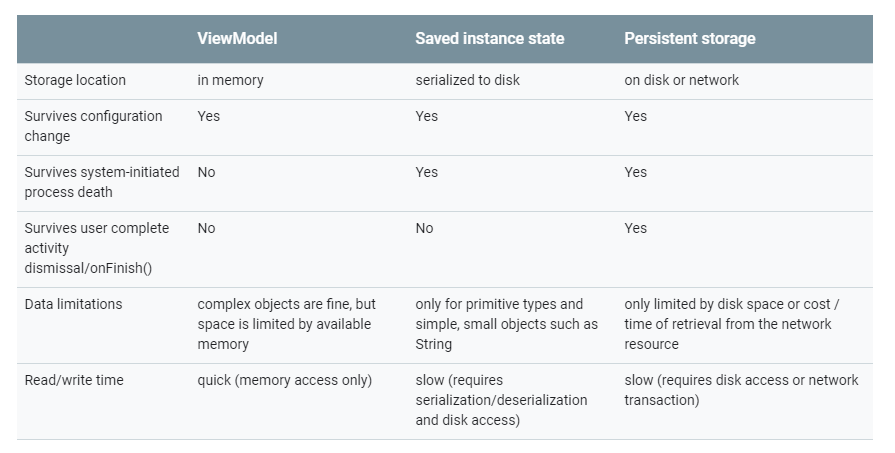

# Activity Lifecycles

## 生命周期

Activity的生命周期如下图：


## 常见问题

### 横竖屏切换的时候，Activity 各种情况下的生命周期

* 默认情况下：

  ```
  onPause()
  onStop()
  onDestroy()
  onCreate()
  onStart()
  onResume()
  ```

* AndroidManifest.xml设置configChanges后：

  ```xml
  <activity 
  	android:name=".SecondActivity"
  	android:configChanges="orientation">
  </activity>
  ```

  ```
  onConfigurationChanged()
  ```


### 前台切换到后台，然后再回到前台，Activity生命周期回调方法

* 切换到后台

  ```
  onPause()
  onStop()
  ```

* 回到前台

  ```
  onRestart()
  onStart()
  onResume()
  ```


### 弹出Dialog，生命值周期回调方法

```
onCreateDialog()
```

`Activity`并不会发生生命周期变化


### Activity跳转时生命周期

* 普通的Activity

  ```
  FirstActivity: onPause()
  								SecondActivity: onCreate()
  								SecondActivity: onStart()
  								SecondActivity: onResume()
  FirstActivity: onStop()
  ```

  在第一个Activity调用`onPause()`后，界面仍处于可见状态，需要等待第二个Activity界面完全显示。在第二个Activity界面完全创建并调用`onResume()`后，才会执行第一个Activity的`onStop()`。因此，和UI相关的回收操作应该放在`onStop()`中，而不是`onPause()`中。

  ```
  								SecondActivity: onPause()
  FirstActivity: onActivityResult()
  FirstActivity: onRestart()
  FirstActivity: onStart()
  FirstActivity: onResume()
  								SecondActivity: onStop()
  								SecondActivity: onDestroy()
  ```

  同样的道理，在第二个Activity调用`onPause()`后，需要等待第一个activity的界面完全显示并调用`onResume()`后，才会执行第二个activity的`onStop()`和`onDestroy()`。

* 透明Activity

  ```
  FirstActivity: onPause()
  								TransparentActivity: onCreate()
  								TransparentActivity: onStart()
  								TransparentActivity: onResume()
  ```

  ```
  								TransparentActivity: onPause()
  FirstActivity: onActivityResult()
  FirstActivity: onResume()
  								TransparentActivity: onStop()
  								TransparentActivity: onDestroy()
  ```

* DialogActivity

  ```
  FirstActivity: onPause()
  								DialogActivity: onCreate()
  								DialogActivity: onStart()
  								DialogActivity: onResume()
  ```

  ```
  								DialogActivity: onPause()
  FirstActivity: onActivityResult()
  FirstActivity: onResume()
  								DialogActivity: onStop()
  								DialogActivity: onDestroy()
  ```


### `onStop()`和`onPause()`区别

* `onPause()`

  界面失去焦点，但对用户仍然可见。

  可以做一些轻量的回收工作，不建议做类似于DB操作、网络请求的比较重的回收工作，因为这个处于这个阶段的界面可能会很快切换到`onResume()`状态。

  另外，在多窗口模式下，只有一个window是获得焦点的，其它Activity虽然处于`onPause()` 状态，界面显示仍需要更新，从这个角度也不应该在这里进行类似于停止动画的回收工作。

* `onStop()`

  界面完全不可见。

  可以做一个比较重的回收工作，如网路请求和DB操作。


### `onSaveInstanceState()`和`onRestoreInstanceState()`

* 用途

  这两个方法用于保存视图的临时状态，一般不用于保存复杂的数据。

  

  需要注意的是，两个方法都需要调用super的方法，以完成整个视图树的保存和重建。方法最终会回调到`View.onSaveInstanceState()`和`View.onRestoreInstanceState()`，系统View已经替我们实现好了状态的恢复。

* 回调时机

  如果是用户主动关闭Activity，比如按返回键、从常用任务栏中划动删除任务等，是用户的主观行为，不会回调`onSaveInstanceState()`。

  如果是用户切换到其它应用，或者configuration变化，这些情况会回调`onSaveInstanceState()`。

* 生命周期

  * `onSaveInstanceState()`

    * `targetApi` < `Androd Honeycomb 3.0(SDK 11)`

      发生在`onPause()`之前。

    * `Androd Honeycomb 3.0(SDK 11)` <=  `targetApi` < `Androd Pie 9.0(SDK 29)`

      发生在`onPause()`之后，`onStop()`之前。

    * `Androd Pie 9.0(SDK 29)` <= `targetApi`

      发生在`onStop()`之后。

  * `onRestoreInstanceState()`

    `onRestoreInstanceState()`发生在`onStart()`之后。
