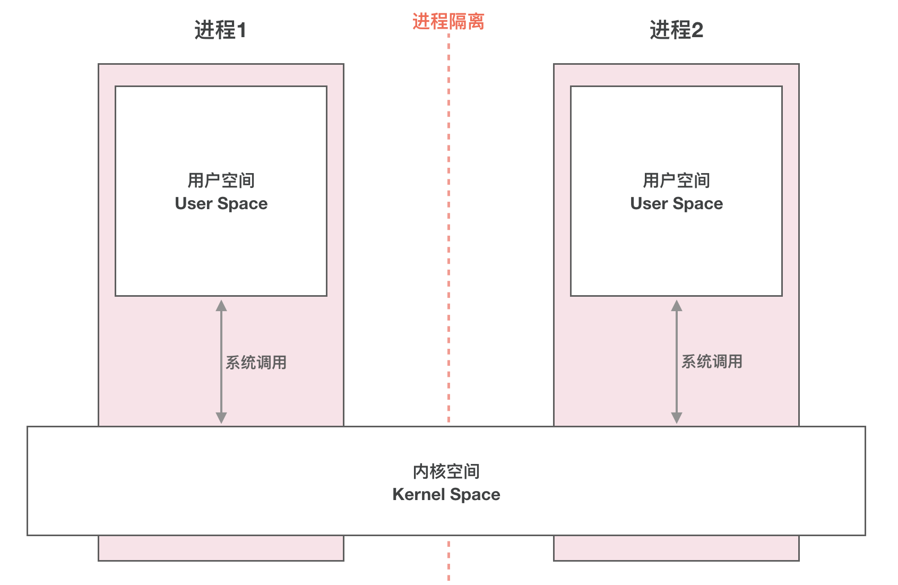
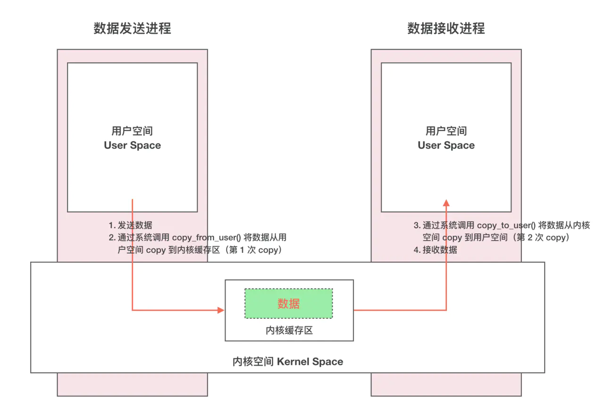
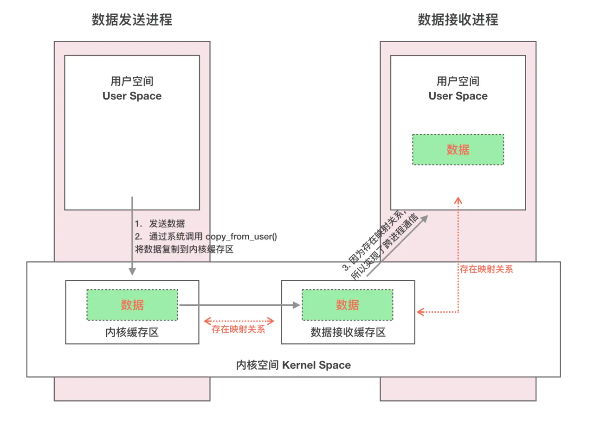
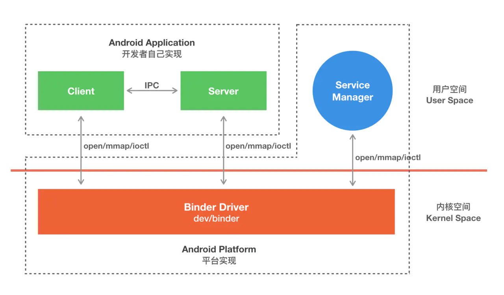
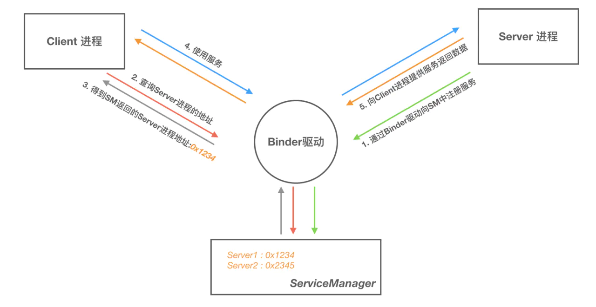

# Binder

## 优点

* 性能

  只需要一次数据拷贝。

  | IPC通信方式          | 内存拷贝次数 |
  | -------------------- | ------------ |
  | Binder               | 1            |
  | 共享内存             | 0            |
  | Socket/管道/消息队列 | 2            |

* 稳定性

  C/S架构，职责明确，相对于共享内存更具备稳定性。虽然共享内存不需要进行数据拷贝，但是使用成本更高，更难以管理，系统更不稳定。

* 安全性

  传统IPC方式没有安全措施，完全依赖上层协议。无法有效判断对方的PID/UID，鉴别对方的身份。并且通信端口是开放的，容易被利用。


## 传统IPC通信原理



* 进程隔离

  进程间数据是不共享的，如果需要访问其它进程的数据，需要进行IPC通信。

* 进程空间划分

  操作系统将虚拟存储空间逻辑上划分为两个部分，一个是用户空间，一个是内核空间。系统内核运行在内核空间，应用运行在用户空间。从而用户进程不能直接操作系统内核，保护系统的安全。

* 系统调用

  虽然在逻辑上对用户空间和内核空间进行了划分，但是用户进程不可避免要使用系统资源（比如访问文件，请求网络）。所以需要一种机制突破这种逻辑上的限制，这就是系统调用。当进程执行系统调用，执行内核代码时，进程处于**内核运行态**。当进程执行应用自己的代码的时候，处于**用户运行态**。

  系统调用主要通过如下两个函数实现：

  ```
  copy_from_user()
  copy_to_user()
  ```

* IPC

  

  传统的IPC方式都需要通过两次数据拷贝，第一次通过`copy_from_user()`将数据从第一个用户空间拷贝到内核空间的内核缓存区，第二次通过`copy_to_user()`将数据从内核缓存区拷贝到第二个用户空间。


## Binder IPC原理

### 动态内核可加载模块

Binder本身不是Linux内核的一部分，是通过**动态内核可加载模块**（Loadable Kernel Module，LKM）机制加载到系统内核中的。在Android系统中，这个动态内核可加载模块就是**Binder驱动**。

### 内存映射

Binder机制中减少了一次数据拷贝是通过内存映射实现的。内存映射是将用户空间的一块内存区域映射到内核空间。映射关系建立以后，双方中任意一方对内存中的数据进行修改后，都能直接放映到对方的空间里。

### IPC原理



步骤如下：

* Binder驱动在内核空间通过`mmap()`创建了一个**数据接收缓存区**。
* 在内核空间开辟一片**内核缓存区**，建立**数据接收缓存区**和**内核缓存区**的映射关系，以及建立**数据接收缓存区**和**接收进程用户空间地址**的映射。
* 发送方通过系统调用`copy_from_user`将数据拷贝到**内核缓存区**，由于存在映射，也就相当于把数据发送到了接收进程空间。

### Binder C/S模型



* 系统通过Binder驱动将一个进程注册为`ServiceManager`。
* Server端通过Binder驱动向`ServiceManager`注册Binder。驱动为这个 Binder 创建位于内核中的实体节点以及`ServiceManager`对实体的引用，将名字以及新建的引用打包传给`ServiceManager`，`ServiceManger`将其填入查找表。
* Client端通过Binder驱动从`ServiceManager`中获取Binder引用进行IPC。

### 通信流程



### 代理模式

当Client请求Server进程时，获得到的Binder对象并不是Server进程中的对象，对象无法跨进程传输。Client端拿到的是一个代理类，它具备Server端承诺的功能，实现了相应的接口。当Client端代理Binder对象方法被调用时，实际上是通过Binder通信调用Server端的Binder对象，最后将结果返回。


## AIDL

* IBinder：IBinder是一个接口，代表了一种跨进程通信的能力。只要实现了这个借口，这个对象就能跨进程传输。
* IInterface：IInterface代表的就是Server进程对象具备什么样的能力（能提供哪些方法，其实对应的就是 AIDL 文件中定义的接口）
* Binder：Java层的Binder类，代表的其实就是Binder本地对象。BinderProxy类是Binder类的一个内部类，它代表远程进程的Binder对象的本地代理。这两个类都继承自IBinder，因而都具有跨进程传输的能力。实际上，在跨越进程的时候，Binder 驱动会自动完成这两个对象的转换。
* Stub：AIDL的时候，编译工具会给我们生成一个名为Stub的静态内部类。这个类继承了Binder，说明它是一个Binder本地对象，它实现了IInterface接口，表明它具有Server承诺给Client的能力。Stub 是一个抽象类，具体的 IInterface 的相关实现需要开发者自己实现。


## Reference

* [Binder系列 - Gityuan](http://gityuan.com/2015/10/31/binder-prepare/)
* [图文详解 Android Binder跨进程通信的原理](https://www.jianshu.com/p/4ee3fd07da14)
* [操作系统：图文详解 内存映射](https://www.jianshu.com/p/719fc4758813)
* [写给 Android 应用工程师的 Binder 原理剖析](https://juejin.im/post/5acccf845188255c3201100f)
