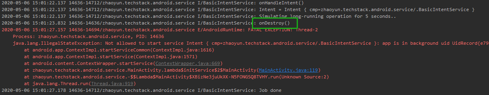

# Service基础

Service是一种用于在后台做长时间工作的系统组件，它没有界面，用户不能直接看到它。它可以运行在一个后台线程中，甚至是一个独立的进程中。当用户切换到其它应用时，它仍可以继续工作。


## vs. Thread

使用Service的目的是执行长时间后台工作。Thread不宜执行过长的后台任务，因为它很容易造成内存泄漏。


## 启动方式

Service有两种启动方式。

* Started Service

  应用组件调用`Context.startService()`启动的服务，它的生命周期不依赖于启动它的组件，可以一直运行下去。

* Bound Service

  应用组件调用`Context.bindService()`启动的服务，它的生命周期与启动它的组件相同。它可以向应用组件提供一个c/s架构的接口，进行方法调用和结果返回，并且这种交互方式可以实现跨进程通信。

虽然一个Service有两种启动方式，但是它可以同时以两种方式工作。它可以先被调用`Context.startService()`启动，长期运行，然后再与一个应用组件绑定启动。


## 可见性

从可见性的角度，可以将Service分为前台Service和后台Service。

* 前台Service

  前台必须和一个通知绑定在一起，告知用户有一个Service正在运行。即便用户切到了其它的应用中，前台Service仍然可以继续运行。它适合用于实现后台下载这类场景。

  可以调用`Service.startForeground()`方法将Service设置为前台Service。

* 后台Service

  与前台Service不用，后台Service没有与用户交互的通知。并且，在`TargetApi >= 26 (Android Oreo)`时，系统会对后台Service有所限制。如果应用已经不处于前台状态，它所拥有的后台Service在运行几分钟后，将会被新系统关闭。


## 生命周期

Service的生命周期如下图：


* `onCreate()`

  当Service被创建时，会调用此方法。这个方法只会被调用一次，如果一个Service已经在运行，将不会再调用到此方法。

* `onDestroy()`

  当系统将要停止Service时，会回调此方法，这是能收到的最后一个回调。我们可以在这里进行必要的回收工作。

### Started Service生命周期

* `onStartCommand()`

  首次调用`Context.startService()`启动Service时，会先后回调`onCreate()`和`onStartCommand()`方法。如果`Service`已经启动，再次调用`Context.startService()`会再次触发`onStartCommand()`。

  `onStartCommand()`方法会传递一个`Intent`参数，描述了启动这个Service需要的参数。

  `onStartCommand()`方法的返回值决定了，当Service被系统杀死后，是否会重新被启动。

  * `START_STICKY`

    被系统杀掉后，系统会尝试重建Service，并保证会调用`onStartCommand()`，Intent为空。

  * `START_STICKY_COMPATIBILITY`

    `START_STICKY`兼容版本，并不保证会启动。

  * `START_NOT_STICKY `

    被系统杀掉后，系统不会重建Service。

  * `START_REDELIVER_INTENT`

    被系统杀掉后，系统会尝试重建Service，并保证会调用`onStartCommand`，并会重新发送Intent。

### Bind Service生命周期

* `onBind()`

  当另一个应用组件调用`Context.bindService()`绑定Service的时候，系统会回调此方法。我们需要使用此方法返回一个`IBinder`接口，提供给Client端，它可以作为RPC的接口被其它组件调用。


# Started Service

## 后台Service

虽然Service的目的是用于做后台长时间的工作，但是它默认运行在定义的应用进程的主线程。所以如果直接执行耗时的操作会阻塞主线程。

可以使用多种方式在Service中启动一个后台线程：

* 继承`IntentService`，它默认封装了`HandlerThread`和`Handler`。
* 继承`JobIntentService`。

* 继承`Service`，自己管理一个异步线程`HandlerThread`和`Handler`，并将后台操作post到`Handler`执行。


## 后台运行限制

Android在`SDK 26(Android O)`之后，加强了[后台运行的限制](https://developer.android.com/about/versions/oreo/background)。如果应用已经进入`Idle`状态，使用后台Service将受到限制，抛出异常。

如果尝试在一个后台线程中持续向一个后台Service发起请求。

```java
new Thread(() -> {
    while (true) {
        SystemClock.sleep(5000);
        Intent intent = new Intent(this, BasicIntentService.class);
        startService(intent);
    }
}).start();
```

那么最终会发生如下异常：



在运行了一段时间后（大约1分钟），这个后台服务已经被系统停止，回调了`onDestory()`。如果再调用`startService()`请求一个后台服务，会抛出`IllegalStateException`。

在`SDK 26(Android O)`之后，可以使用`JobIntentService`来进行处理。


## IntentService

### 概述

`IntentService`是一个Service的子类，它帮助我们封装了一套`Handler`，`Message`，`HandleThread`的后台消息队列。

它是一个抽象类，实现它的子类需要实现`onHandleIntent()`方法。每次发起的Intent会以一条`Message`的形式放到后台线程的消息队列中进行消费。

### 原理

* `onCreate()`

  ```java
  @Override
  public void onCreate() {
      // TODO: It would be nice to have an option to hold a partial wakelock
      // during processing, and to have a static startService(Context, Intent)
      // method that would launch the service & hand off a wakelock.
  
      super.onCreate();
      HandlerThread thread = new HandlerThread("IntentService[" + mName + "]");
      thread.start();
  
      mServiceLooper = thread.getLooper();
      mServiceHandler = new ServiceHandler(mServiceLooper);
  }
  ```

  在`onCreate()`方法中，它新建了一个`HandlerThread`异步线程，并调用`HandlerThread.start()`启动了这个异步线程的`Looper`，并初始化了一个`Handler`来处理异步请求。

* `onStart()`

  ```java
  @Override
  public void onStart(@Nullable Intent intent, int startId) {
      Message msg = mServiceHandler.obtainMessage();
      msg.arg1 = startId;
      msg.obj = intent;
      mServiceHandler.sendMessage(msg);
  }
  ```

  当一次请求被Service接受后，会把这次请求的`Intent`封装到`Message`对象中，发送给`ServiceHandler`处理。

* `ServiceHandler`

  ```java
  private final class ServiceHandler extends Handler {
      public ServiceHandler(Looper looper) {
          super(looper);
      }
  
      @Override
      public void handleMessage(Message msg) {
          onHandleIntent((Intent)msg.obj);
          stopSelf(msg.arg1);
      }
  }
  ```

  `ServiceHandler`接受到`Intent`后，会回调抽象方法`IntentService.onHandleIntent()`，进行实际的处理。因此，`onHandleIntent()`方法已经执行在`HandlerThread`后台线程中了。不同的请求会串行在后台线程中执行。

  当执行完请求后，调用`Service.stopSelf()`方法尝试停止`IntentService`。此时，如果队列中已经没有其它待处理的`Intent`，`IntentService`将会停止，如果还有其它没有处理的`Intent`，服务还不会停止。

  `IntentService`在请求都完成之后会自动停止，不需要自己调用`stopSelf()`方法。


## JobIntentService

### 概述

`JobIntentService`是一个Service的子类，在`Android O`及以上版本运行时，它会使用`JobScheduler`来处理请求，在`Android O`以下运行时，它还是会使用`startService()`的方式处理。

### 如何使用

它是一个抽象类，使用时只需要继承它，并实现`onHandleWork()`抽象方法。使用静态方法`JobIntentService.enqueueWork()`提交请求。

另外需要在`AndroidManifest.xml`中增加如下修改：

* 应用增加`android.permission.WAKE_LOCK`权限

  ```xml
  <uses-permission android:name="android.permission.WAKE_LOCK" />
  ```

* `JobIntentService`增加`android.permission.BIND_JOB_SERVICE`权限

  ```xml
  <service
           android:name=".unbound.background.BasicJobIntentService"
           android:permission="android.permission.BIND_JOB_SERVICE" />
  ```

### 原理

* `WorkEnqueuer`

  `JobIntentService`会根据系统的版本，使用不同的`WorkEnqueuer`来处理请求。

  在`Android O`及以上版本时，使用`JobWorkEnqueuer`，在`Android O`以下版本时使用`CompatWorkEnqueuer`。

  ```java
  public static void enqueueWork(@NonNull Context context, @NonNull ComponentName component, int jobId, @NonNull Intent work) {
      if (work == null) {
          throw new IllegalArgumentException("work must not be null");
      }
      synchronized (sLock) {
          WorkEnqueuer we = getWorkEnqueuer(context, component, true, jobId);
          we.ensureJobId(jobId);
          we.enqueueWork(work);
      }
  }
  ```

  ```java
  static WorkEnqueuer getWorkEnqueuer(Context context, ComponentName cn, boolean hasJobId, int jobId) {
      WorkEnqueuer we = sClassWorkEnqueuer.get(cn);
      if (we == null) {
          if (Build.VERSION.SDK_INT >= 26) {
              if (!hasJobId) {
                  throw new IllegalArgumentException("Can't be here without a job id");
              }
              we = new JobWorkEnqueuer(context, cn, jobId);
          } else {
              we = new CompatWorkEnqueuer(context, cn);
          }
          sClassWorkEnqueuer.put(cn, we);
      }
      return we;
  }
  ```

* `JobWorkEnqueuer`

  `JobWorkenqueuer`将请求交给`JobScheduler`处理。

  ```java
  static final class JobWorkEnqueuer extends JobIntentService.WorkEnqueuer {
  
      @Override
      void enqueueWork(Intent work) {
          // 使用JobScheduler处理
          mJobScheduler.enqueue(mJobInfo, new JobWorkItem(work));
      }
  }
  ```

* `CompatWorkEnqueuer`

  `CompatWorkEnqueuer`直接调用`Context.startService()`处理请求。

  ```java
  static final class CompatWorkEnqueuer extends WorkEnqueuer {
  
      @Override
      void enqueueWork(Intent work) {
          Intent intent = new Intent(work);
          intent.setComponent(mComponentName);
  
          // 使用startService处理
          if (mContext.startService(intent) != null) {
              synchronized (this) {
                  if (!mLaunchingService) {
                      mLaunchingService = true;
                      if (!mServiceProcessing) {
                          mLaunchWakeLock.acquire(60 * 1000);
                      }
                  }
              }
          }
      }
  }
  ```

* `CommandProcessor`

  `JobIntentService`内部使用`AsyncTask`和线程池实现后台处理。

  ```java
  void ensureProcessorRunningLocked(boolean reportStarted) {
      if (mCurProcessor == null) {
          mCurProcessor = new CommandProcessor();
          if (mCompatWorkEnqueuer != null && reportStarted) {
              mCompatWorkEnqueuer.serviceProcessingStarted();
          }
          if (DEBUG) Log.d(TAG, "Starting processor: " + mCurProcessor);
          // 使用AsyncTask和线程池实现后台处理
          mCurProcessor.executeOnExecutor(AsyncTask.THREAD_POOL_EXECUTOR);
      }
  }
  ```

  ```java
  final class CommandProcessor extends AsyncTask<Void, Void, Void> {
      @Override
      protected Void doInBackground(Void... params) {
          GenericWorkItem work;
  
          if (DEBUG) Log.d(TAG, "Starting to dequeue work...");
  
          while ((work = dequeueWork()) != null) {
              if (DEBUG) Log.d(TAG, "Processing next work: " + work);
              onHandleWork(work.getIntent());
              if (DEBUG) Log.d(TAG, "Completing work: " + work);
              work.complete();
          }
  
          if (DEBUG) Log.d(TAG, "Done processing work!");
  
          return null;
      }
  
      @Override
      protected void onCancelled(Void aVoid) {
          processorFinished();
      }
  
      @Override
      protected void onPostExecute(Void aVoid) {
          processorFinished();
      }
  }
  ```


## 与Activity通信

可以使用`LocalBroadcastManager`通过广播的方式与Activity进行通信。

`LocalBroadcastManager`内部使用的是一个运行在主线程的`Handler`进行消息分发。


# Bounded Service

有三种方式可以实现与Bounded Service通信。

* Local Binder
* Messenger
* AIDL


## Local Binder

### 概述

最常见的情况是，Bounded Service和使用它的应用组件都处于同一个应用的同一个进程中。这种情况下，可以使用Local Binder的方式。

### 如何使用

在Service定义一个内部类`LocalBinder`，使它继承`Binder`，并给client端提供一个获取Service对象的方法。

```java
public class LocalBinder extends Binder {

    public BindService getService() {
        return BindService.this;
    }
}
```

`Service.onBind()`方法返回一个`LocalBinder`对象。

```java
private final IBinder mBinder = new LocalBinder();

@Nullable
@Override
public IBinder onBind(Intent intent) {
    return mBinder;
}
```

在Client端`ServiceConnection.onServiceConnected()`回调时，通过前面内部类`LocalBinder`定义的方法直接获取Service对象。

```java
private ServiceConnection mLocalServiceConnection = new ServiceConnection() {
    @Override
    public void onServiceConnected(ComponentName name, IBinder service) {
        LocalService.LocalBinder binder = (LocalService.LocalBinder) service;
        mLocalService = binder.getService();
        mLocalServiceConnected = true;
    }

    @Override
    public void onServiceDisconnected(ComponentName name) {
        mLocalService = null;
        mLocalServiceConnected = false;
    }
};
```

这种实现方式简单，但是只适用于同一个进程中的Service调用。因为处于同一个进程中，在回调中，拿到的`IBinder`对象和`Service.onBind()`方法中返回的对象是同一个，也可以直接获取到Service对象。

如果我们需要在一个应用中跨进程，或者跨应用调用Service，那么需要用到后两种实现方式：`Messenger`和`AIDL`。


## Messenger

### 概述

如果需要跨进程使用Service，那么可以使用`Messenger`类。它是一个对`AIDL`，`Binder`和`Handler`的简单封装，让我们可以更容易地使用。大多数情况下，我们可以直接使用`Messenger`，而不用直接使用`AIDL`。

虽然用`Messenger`实现比用`AIDL`实现要简单很多，但是它也有一些限制。因为它内部使用了`Handler`进行消息队列处理，所以Service对请求的处理是串行的。如果我们希望Service可以并发处理请求，那应该直接使用`AIDL`，并自己实现并发。

### 如何使用

在Service中定义一个Handler来处理请求的消息队列。在`handleMessage()`方法中进行操作，并向client端的返回消息。client端的`Messenger`对象会被存放到`Message.replyTo`变量中。只需要调用它的`send()`方法。

```java
private static class WorkHandler extends Handler {

    @Override
    public void handleMessage(Message msg) {
        if (msg.what == MESSAGE_TIME) {
            Bundle data = new Bundle();
            data.putLong(MainActivity.MESSAGE_DATA_KEY_TIME, System.currentTimeMillis());
            Message message = Message.obtain(null, MainActivity.MESSAGE_TIME);
            message.setData(data);
            try {
                msg.replyTo.send(message);
            } catch (RemoteException e) {
                Log.e(TAG, e.getMessage(), e);
            }
        } else {
            super.handleMessage(msg);
        }
    }
}
```

在`service.onBind()`方法中，返回服务端`Messenger.getBinder()`放回的对象。

```java
@Nullable
@Override
public IBinder onBind(Intent intent) {
    Messenger messenger = new Messenger(new WorkHandler());
    return messenger.getBinder();
}
```

在客户端`ServiceConnection.onServiceConnected()`回调时，使用服务端`IBinder`对象创建与服务端通信的`Messenger`对象。

```java
private ServiceConnection mRemoteServiceConnection = new ServiceConnection() {
    @Override
    public void onServiceConnected(ComponentName name, IBinder service) {
        mRemoteServiceMessenger = new Messenger(service);
    }

    @Override
    public void onServiceDisconnected(ComponentName name) {
        mRemoteServiceMessenger = null;
    }
};
```

在客户端创建处理服务端返回结果的`Handler`消息队列。

```java
private static class RemoteReplyHandler extends Handler {

    @Override
    public void handleMessage(Message msg) {
        if (msg.what == MESSAGE_TIME) {
            long currentTime = msg.getData().getLong(MESSAGE_DATA_KEY_TIME);
            Log.d(TAG, "handleMessage() currentTime = " + currentTime);
        }
        super.handleMessage(msg);
    }
}
```

在需要调用Service方法时，使用之前创建的`Messenger`发送`Message`消息，并把`Message.replyTo`对象设置为使用客户端`Handler`消息队列创建出的`Messenger`对象。

```java
findViewById(R.id.button_remote_service_operation).setOnClickListener(
    view -> {
        if (mRemoteServiceMessenger != null) {
            Message message = Message.obtain(null, MessengerService.MESSAGE_TIME);
            message.replyTo = new Messenger(new RemoteReplyHandler());
            try {
                mRemoteServiceMessenger.send(message);
            } catch (RemoteException e) {
                Log.e(TAG, e.getMessage(), e);
            }
        } else {
            Log.w(TAG, "RemoteServiceMessenger is null");
        }
    }
);
```


## AIDL

如果我们希望后台Service具备并发能力，那么就不能使用`Messenger`了，必须使用`AIDL`。

`AIDL`是`Android Interface Definition Language`的简称，它是一种接口定义语言，语法与Java类似。`Android Build Tool`会根据定义的接口文件，在编译时自动生成跨进程通信需要使用的Java源文件（放在`build/generated`编译目录下），提供给Server端和Client端使用。

### 如何使用

* 创建AIDL文件

  在`src/main/aidl`源码路径下添加后缀为`.aidl`的文件，文件中定义了Service向Client暴露的接口方法。

  ```java
  package zhaoyun.techstack.android.service;
  
  import zhaoyun.techstack.android.service.AidlServiceCallback;
  import zhaoyun.techstack.android.service.bound.remote.WrappedObject;
  
  interface AIDLServiceInterface {
  
      oneway void asyncHeavyWork(in WrappedObject wrappedObject, in AidlServiceCallback callback);
  
      void syncLightWork(inout WrappedObject wrappedObject);
  }
  ```

  * 支持的参数

    方法参数可以支持：`Primitives`，`CharSequence`，`String`，`Primitives`数组，`List`，`Map`，或者`import`的`Parcelable`。

  * 传递对象

    如果要传递一个对象，需要再新建一个`.aidl`文件进行声明。

    ```java
    package zhaoyun.techstack.android.service.bound.remote;
    
    parcelable WrappedObject;
    ```

    并且，在`src/main/java`对应的包名路径下，新建这个类的源文件，并让这个类继承`Parcelable`接口。

    在`Android 10`以后，使用`Build Tool 29`版本可以使用更简洁的语法进行定义。

    ```java
    package zhaoyun.techstack.android.service.bound.remote;
    
    parcelable WrappedObject {
    	int mInt;
    	String mString
    }
    ```

    `Build Tool`会为我们自动生成类的源文件，并实现`Parcelable`接口。

  * 参数修饰浮`in`，`out`，`intout`

    可以在方法参数前添加`in`，`out`或者`intout`修饰符。

    * `in`：默认修饰符，表示参数只用于传递给Server端，不管Server端如何修改它，`RPC`调用结束后，都不会改变Client端对象的值。
    * `out`：表示参数只用于从Server端携带值回Client端，不管Client传递什么对象，Server端接收到的只是一个携带默认值的对象（调用默认构造函数创建的），如果Server端修改了这个对象，它的值将在`RPC`结束后拷贝回Client端的对象上。
    * `inout`：表示Server端即能够接收到Client端发送的对象的值，并且进行修改后，在`RPC`结束时也能拷贝回Client端的对象上。

    `oneway`方法只能使用`in`修饰符参数。

  * 方法修饰符`oneway`

    默认情况下，`RPC`会阻塞Client端，直到Service执行完，Client端才能继续运行。因此，为了不阻塞Client端主线程，我们要么得在后台线程调用Service方法，要么得在方法上添加`oneway`改变这个运行方式。

    * 非`oneway`：Client端会被阻塞，方法可以定义返回值。

    * `oneway`：Client端不会被`RPC`调用阻塞，方法不能定义返回值。

* 服务端创建接口的实现

  在服务端新建一个`AidlServiceInterface.Stub`接口对象，实现方法的具体逻辑。

  ```java
  private AidlServiceInterface.Stub mBinder = new AidlServiceInterface.Stub() {
      @Override
      public void asyncHeavyWork(WrappedObject wrappedObject, AidlServiceCallback callback) throws RemoteException {
          int percent, time;
          for (percent = 0, time = 1; percent < 100; percent += 20, time++) {
              callback.onProgressChanged(percent, wrappedObject);
              SystemClock.sleep(2000);
              wrappedObject.changeSomething(time);
          }
          callback.onProgressChanged(percent, wrappedObject);
      }
  
      @Override
      public void syncLightWork(WrappedObject wrappedObject) {
          wrappedObject.changeSomething(1);
      }
  };
  ```

  并在`Service.onBind()`方法中，返回这个对象。

  ```java
  @Nullable
  @Override
  public IBinder onBind(Intent intent) {
      return mBinder;
  }
  ```

* 客户端保存Service接口

  客户端使用生成的Java类的方法`AidlServiceInterface.Stub.asInterface()`获取接口对象。

  ```java
  private ServiceConnection mAidlRemoteServiceConnection = new ServiceConnection() {
      @Override
      public void onServiceConnected(ComponentName name, IBinder service) {
          mAidlRemoteServiceInterface = AIDLServiceInterface.Stub.asInterface(service);
          mAidlRemoteServiceConnected = true;
      }
  };
  ```

  在需要调用时，直接使用接口上的方法。

  ```java
  private void callAidlRemoteServiceAsyncOperation() {
      if (mAidlRemoteServiceConnected) {
          try {
              initWrappedObject();
              mAidlRemoteServiceInterface.asyncHeavyWork(mWrappedObject, mAidlRemoteServiceCallback);
          } catch (RemoteException e) {
              Log.e(TAG, e.getMessage(), e);
          }
      } else {
          Toast.makeText(this, "Service is not connected", Toast.LENGTH_SHORT).show();
      }
  }
  ```

### 结果回调

* 非`oneway`方法：

  如果我们使用了非`oneway`的方法，可以使用方法返回值进行结果回调，或者使用`out`参数进行回调。

* `oneway`

  如果我们使用了`oneway`方法，参数只能使用`in`修饰符，意味着无法从参数接收到Server端的信息，也不能添加方法返回值，不能从方法返回值进行结果回调。

  那么只能定义回调接口解决。

  例如之前的例子`AIDLServiceInterface`使用了`AidlServiceCallback`参数定义回调：

  ```java
  interface AIDLServiceInterface {
  
      oneway void asyncHeavyWork(in WrappedObject wrappedObject, in AidlServiceCallback callback);
  
      void syncLightWork(inout WrappedObject wrappedObject);
  }
  ```

  ```java
  package zhaoyun.techstack.android.service;
  
  import zhaoyun.techstack.android.service.bound.remote.WrappedObject;
  
  interface AidlServiceCallback {
  
      oneway void onProgressChanged(int percent, in WrappedObject changedObject);
  }
  ```

  在Client端创建回调的Stub对象：

  ```java
  private AidlServiceCallback mAidlRemoteServiceCallback = new AidlServiceCallback.Stub() {
      @Override
      public void onProgressChanged(int percent, WrappedObject changedObject) {
          SystemClock.sleep(500);
      }
  };
  ```

  在`RPC`调用时传递给Server端：

  ```java
  private void callAidlRemoteServiceAsyncOperation() {
      if (mAidlRemoteServiceConnected) {
          try {
              initWrappedObject();
              mAidlRemoteServiceInterface.asyncHeavyWork(mWrappedObject, mAidlRemoteServiceCallback);
          } catch (RemoteException e) {
              Log.e(TAG, e.getMessage(), e);
          }
      } else {
          Toast.makeText(this, "Service is not connected", Toast.LENGTH_SHORT).show();
      }
  }
  ```

  这种实现方式的原理其实是传递了一个Client端的`IBinder`接口给Server端，让Server端在必要的时候可以`RPC`调用Client端的方法。需要注意，回调方法可以也声明成`oneway`，避免Client端在回调的耗时操作阻塞Server端方法执行。并且回调方法中`in`对应的是Client端，表示写入Client端的参数，与Server的接口定义相反。

  另外，虽然在Server端调用回调前已经改变了`WrappedObject`对象内的值，并从回调函数传回给了Client，但是在Client接收到回调时，参数里的`WrappedObject`其实是一个拥有这些值的新对象。原始对象并不会发生变化。


## 连接维护

跨进程Service绑定时，可能会出现Server或者Client进程意外死亡的情况（比如被系统杀死，或者异常崩溃）。我们需要在Server和Client端对这种情况都有相应的容错，保证执行不会出错。

Client端可以通过`ServiceConnection`，`DeathRecipient`进行维护。

Server端可以通过`RemoteCallbackList`进行维护。

### ServiceConnection

Client端在调用`Context.bindService()`时，我们会传入一个`ServiceConnection`对象，接收与Service连接的回调。

比如`LocalService`中使用的对象：

```java
private ServiceConnection mLocalServiceConnection = new ServiceConnection() {
    @Override
    public void onServiceConnected(ComponentName name, IBinder service) {
        LocalService.LocalBinder binder = (LocalService.LocalBinder) service;
        mLocalService = binder.getService();
        mLocalServiceConnected = true;
    }

    @Override
    public void onServiceDisconnected(ComponentName name) {
        mLocalService = null;
        mLocalServiceConnected = false;
    }
};
```

回调方法有两个：

* `onServiceConnected()`：会在服务连接建立完毕后被回调。
* `onServiceDisconnected()`：会在服务连接意外丢失的时候被回调，比如服务崩溃退出，或者被系统杀死。**Client端主动unbind不会回调这个接口**。

### 连接状态记录

我们需要根据服务连接的情况维护一个`boolean`值，在使用Service方法前进行判断，或者在unbind前进行判断，避免发生异常。

```java
private void callLocalServiceOperation() {
    if (mLocalServiceConnected) {
        mLocalService.asyncGetTimeMayBlock(time -> Log.d(TAG, "Current Time = " + time));
    } else {
        Toast.makeText(this, "Service is not connected", Toast.LENGTH_SHORT).show();
    }
}
```

```java
private void unbindLocalService() {
    if (mLocalServiceConnected) {
        unbindService(mLocalServiceConnection);
        mLocalService = null;
        mLocalServiceConnected = false;
    }
}
```

需要更新连接状态的位置有：

* `ServiceConnection.onServiceConnected()`回调时，设置为`true`。

  还有一种方法，就是取`Context.bindService()`方法返回值，设置给连接状态。这种方式会有什么问题呢？

  `ServiceConnection.onServiceConnected()`方法会在Client端的主线程被回调，因为其背后使用的是`ActivityThread.H`主线程Handler进行的bind操作分发。以下两种情况都可能导致`Context.bindService()`方法返回先于`Service.onServiceConnected()`回调：

  * 在Client的后台线程进行`Context.bindService()`
  * 需要bind的Service是一个远程Service，需要跨进程。

  这两种情况下，`Context.bindService()`和`Service.onServiceConnected()`方法的时序没有办法得到保证，就会出现标记位已经设置为`true`，但是连接还未建立，Service接口还是`null`的情况。如果此时调用了`Context.unbindService()`或者调用了Service的方法，将会导致异常。

* `ServiceConnection.onServiceDisconnected()`回调时，设置为`false`。

* 主动调用`Context.unbindService()`时，设置为`false`。

* 如果为连接`IBinder`设置了`DeathRecipient`监听，可以在其回调中设置为`false`。

### DeathRecipient

`DeathRecipient`是`IBinder`中定义的一个接口，可以调用`IBinder.linkToDeath()`向`IBinder`注册监听，或者调用`IBinder.unlinkToDeath()`解除。当`IBinder`意外断开时，会收到`DeathRecipient.binderDied()`回调。

创建`DeathRecipient`接口。

```java
private IBinder.DeathRecipient mDeathRecipient = new IBinder.DeathRecipient() {
    @Override
    public void binderDied() {
        mAidlRemoteServiceInterface = null;
        mAidlRemoteServiceConnected = false;
    }
};
```

在`ServiceConnection.onServiceConnected()`方法中进行注册。

```java
@Override
public void onServiceConnected(ComponentName name, IBinder service) {
    mAidlRemoteServiceInterface = AidlServiceInterface.Stub.asInterface(service);
    mAidlRemoteServiceConnected = true;
    try {
        service.linkToDeath(mDeathRecipient, 0);
    } catch (RemoteException e) {
        Log.e(TAG, e.getMessage(), e);
    }
}
```

在unbind方法中进行解除。

```java
private void unbindAidlRemoteService() {
    if (mAidlRemoteServiceConnected) {
        mAidlRemoteServiceInterface.asBinder().unlinkToDeath(mDeathRecipient, 0);
        unbindService(mAidlRemoteServiceConnection);
        mAidlRemoteServiceInterface = null;
        mAidlRemoteServiceConnected = false;
    }
}
```

### RemoteCallbackList

在涉及到跨进程结果回调时，Server端接收到的回调接口实际上也是一个`IBinder`对象，会存在Client端进程意外停止，调用回调方法异常的问题。如果连接情况单一可以直接使用`DeathRecipient`进行处理，如果连接数量较多，可以使用`RemoteCallbackList`工具类帮助简化。

调用`RemoteCallbackList.register()`方法注册回调。

调用`RemoteCallbackList.unregister()`方法解除回调。

```java
@Override
public void asyncHeavyWork(WrappedObject wrappedObject, AidlServiceCallback callback) throws RemoteException {
    mRemoteCallbackList.register(callback);
    int percent, time;
    for (percent = 0, time = 1; percent < 100; percent += 20, time++) {
        broadcast(percent, wrappedObject);
        SystemClock.sleep(2000);
        wrappedObject.changeSomething(time);
    }
    broadcast(percent, wrappedObject);
    mRemoteCallbackList.unregister(callback);
}
```

调用`RemoteCallbackList.beginBroadcast()`方法获取需要回调的接口数量。

调用`RemoteCallbackList.getBroadcastItem()`方法获取接口。

调用`RemoteCallbackList.finishBroadcast()`方法结束。

```java
private void broadcast(int percent, WrappedObject wrappedObject) throws RemoteException {
    int size = mRemoteCallbackList.beginBroadcast();
    for (int i = 0; i < size; i++) {
        AidlServiceCallback broadcastItem = mRemoteCallbackList.getBroadcastItem(i);
        broadcastItem.onProgressChanged(percent, wrappedObject);
    }
    mRemoteCallbackList.finishBroadcast();
}
```

`RemoteCallbackList`内部也是使用了`DeathRecipient`进行`IBinder`死亡的监听，并构建了`Map<IBinder, Callback>`维护接口，它是线程安全的。


# 问题

## 如何停止一个Service

可以调用`Context.stopService()`或者`Service.stopSelf()`停止。