# Rxjava

基于事件流的响应式编程框架。观察者模式，但是观察者只有一个。

## 重要的类

* `Observable`：被观察者
* `Observer`：观察者
  * `onNext()`：接收事件回调
  * `onError()`：错误回调
  * `onComplete()`：完成回调
* `ObservableOnSubscribe`：接口类，需要实现`subscribe()`方法，提供事件的发射流程。`Observable`创建时需要传递这个接口的实现方式来定义订阅开启时的执行逻辑。

## 操作符

### 创建型

* **create**

  

* **just**

  

* **fromArray**

  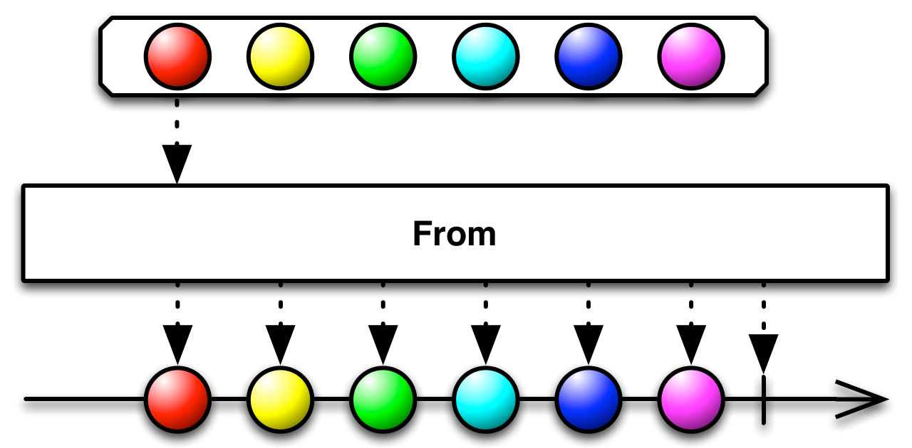

* **empty**

  

* **range**

  

### 变换型

* **map**

  

* **flatMap**

  

* **concatMap**

  

* **groupBy**

  

* **buffer**

  

### 过滤型

* **filter**

  

* **take**

  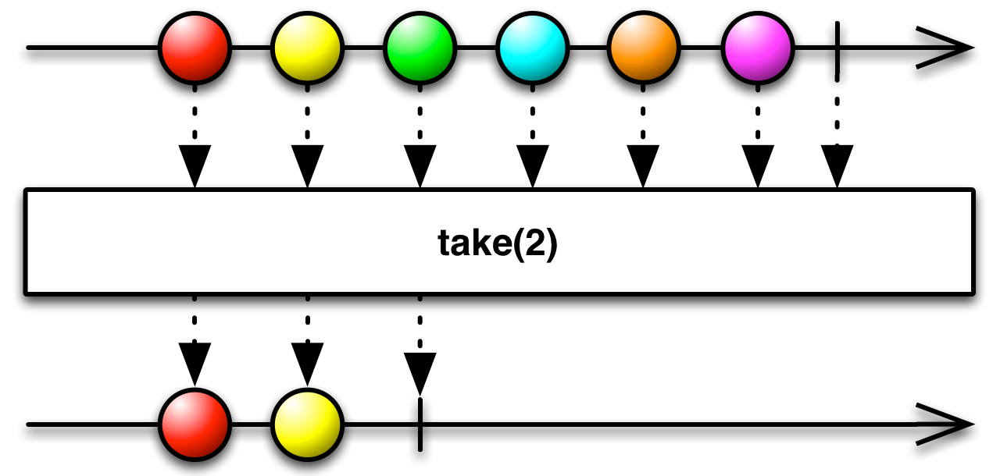

* **distinct**

  

* **elementAt**

  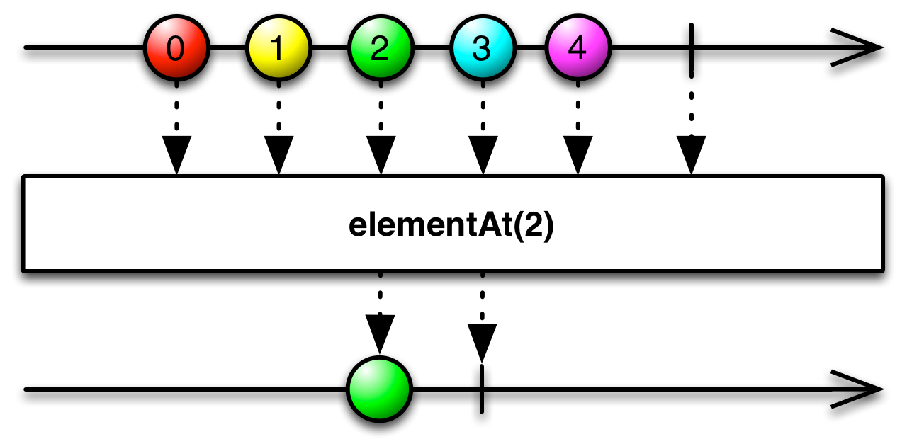

### 条件型

* **all**

  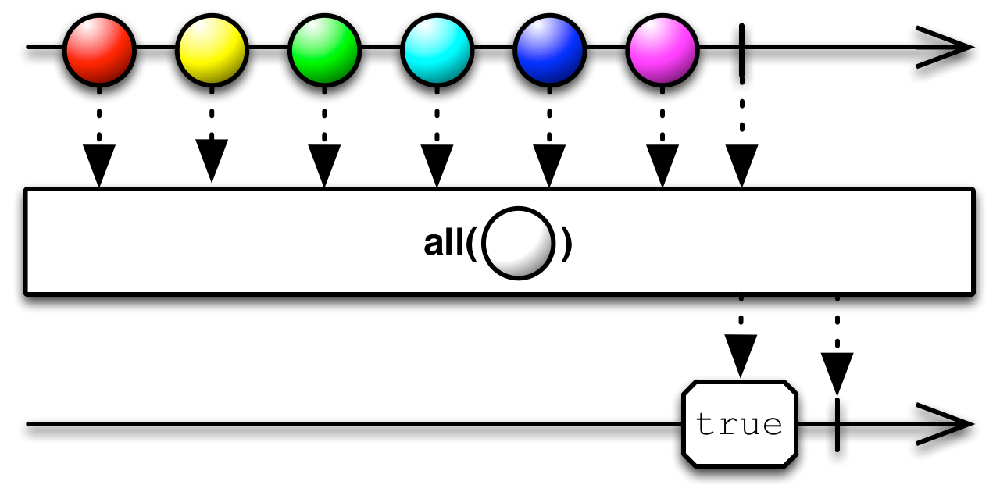

* **contains**

  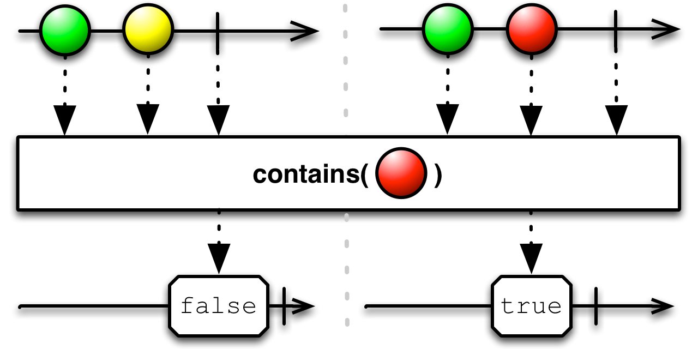

* **isEmpty**

  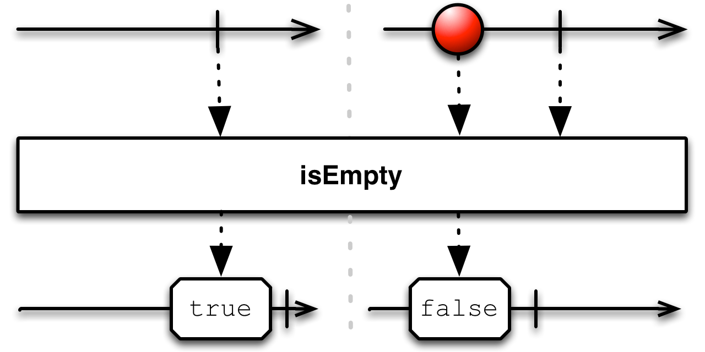

* **exists**

  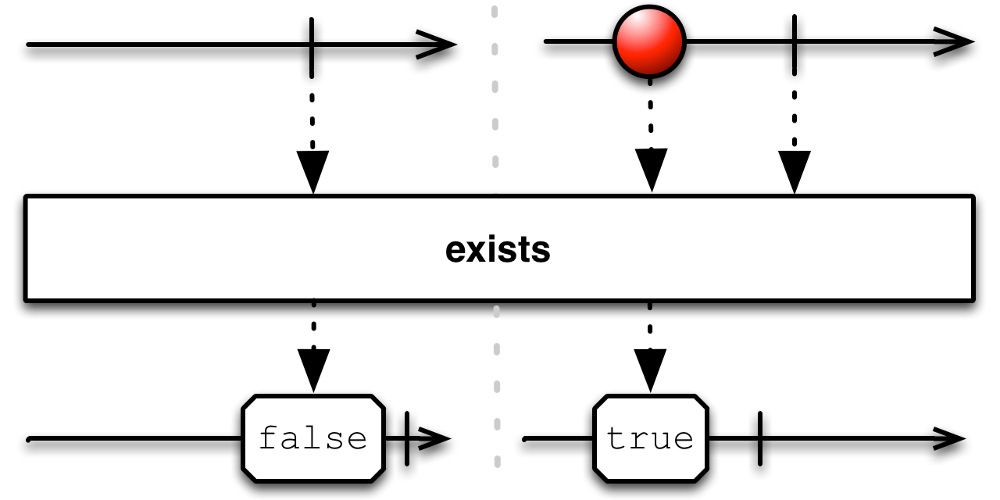

### 合并型

* **startWith**

  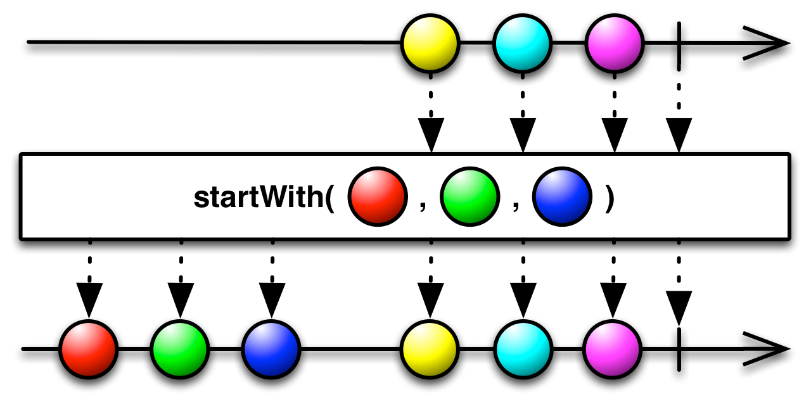

* **concat**

  

* **merge**

  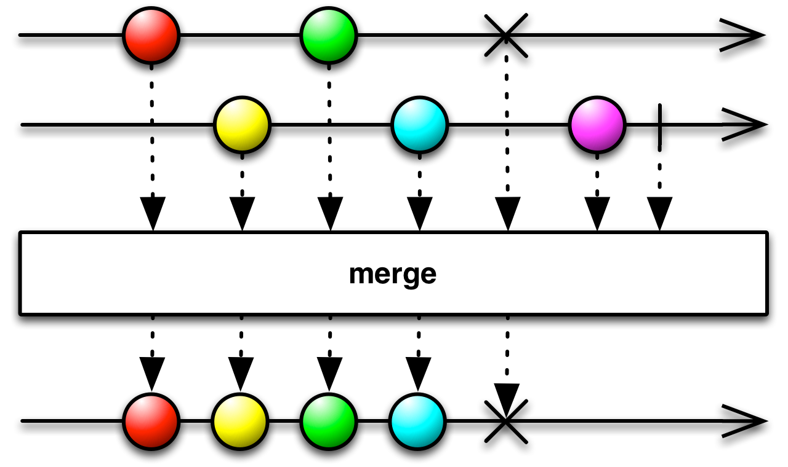

* **zip**

  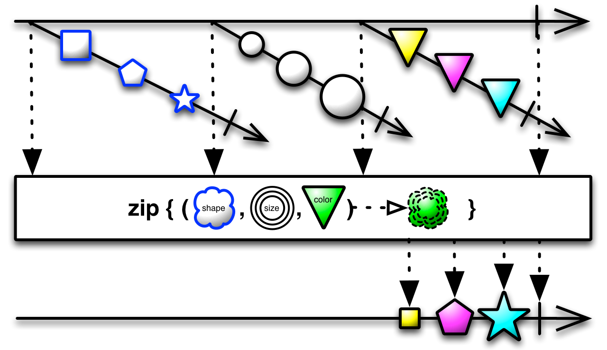

### 异常型

* **onErrorReturn**

  

* **onErrorResumeNext**

  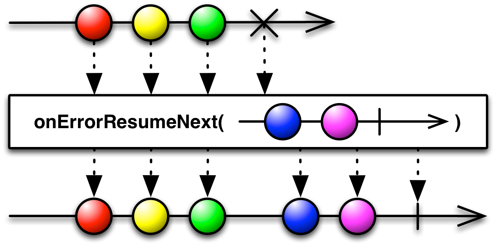

* **onExceptionResumeNext**

  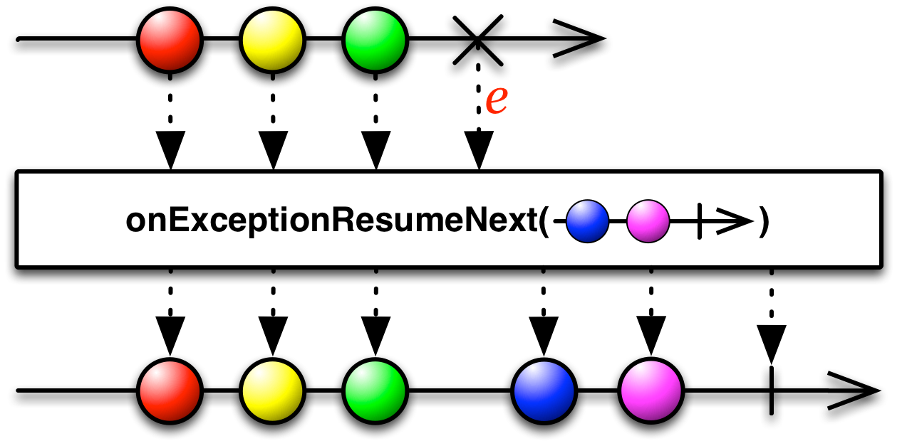

* **retry**

  

## 线程切换

## 背压

使用`Flowable`，而不用`Observable`，下游使用`Subscriber`。

阻塞后放入缓存池。

### 策略

* `BackpressureStrategy.ERROR`：放入缓存池，缓存池满了，抛出异常。
* `BackpressureStrategy.ERROR`：放入缓存池，等待下游处理。
* `BackpressureStrategy.DROP`：放入缓存池，缓存池满了，抛弃后面发射的。