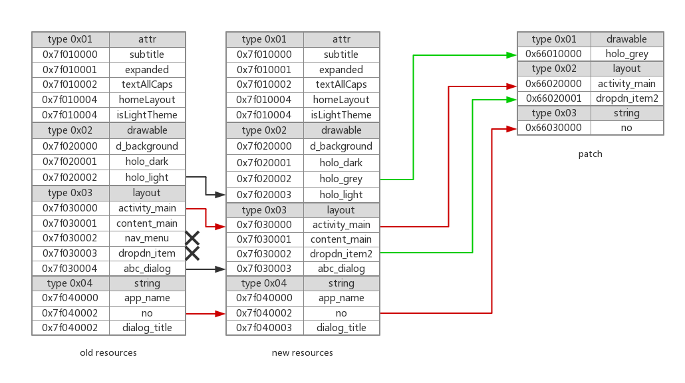

# HotFix

## Android类加载

使用`PathClassLoader`，`DexClassLoader`加载dex文件。

`PathClassLoader`用于加载系统安装的APK。

`DexClassLoader`可以用于加载任意的apk，zip，dex文件。

两者都是继承自`BaseDexClassLoader`，并且都没有重写`loadClass()`方法，使用的都是父类的加载逻辑。仅在构造函数的传参有所区别。

* `PathClassLoader`

  `librarySearchPath`用于传递native库。

  ```java
  public PathClassLoader(String dexPath, ClassLoader parent) {
      super(dexPath, null, null, parent);
  }
  
  public PathClassLoader(String dexPath, String librarySearchPath, ClassLoader parent) {
      super(dexPath, null, librarySearchPath, parent);
  }
  ```

* `DexClassLoader`

  ```java
  public DexClassLoader(String dexPath, String optimizedDirectory, String librarySearchPath, ClassLoader parent) {
      super(dexPath, null, librarySearchPath, parent);
  }
  ```

* `BaseDexClassLoader`

  加载方法`findClass()`会从`pathList`中读取。

  ```java
  public class BaseDexClassLoader extends ClassLoader {
  
      private final DexPathList pathList;
  
      public BaseDexClassLoader(String dexPath, File optimizedDirectory,
                                String librarySearchPath, ClassLoader parent, boolean isTrusted) {
          super(parent);
          this.pathList = new DexPathList(this, dexPath, librarySearchPath, null, isTrusted);
  
          if (reporter != null) {
              reportClassLoaderChain();
          }
      }
  
      @Override
      protected Class<?> findClass(String name) throws ClassNotFoundException {
          List<Throwable> suppressedExceptions = new ArrayList<Throwable>();
          Class c = pathList.findClass(name, suppressedExceptions);
          if (c == null) {
              ClassNotFoundException cnfe = new ClassNotFoundException(
                  "Didn't find class \"" + name + "\" on path: " + pathList);
              for (Throwable t : suppressedExceptions) {
                  cnfe.addSuppressed(t);
              }
              throw cnfe;
          }
          return c;
      }
  }
  ```

* `DexPathList`

  内部保存`Element`数组，每一个`Element`对应一个加载的Dex文件。

  ```java
  /*package*/ final class DexPathList {
      private Element[] dexElements;
  
      DexPathList(ClassLoader definingContext, String dexPath,
                  String librarySearchPath, File optimizedDirectory, boolean isTrusted) {
          // ...
          this.dexElements = makeDexElements(splitDexPath(dexPath), optimizedDirectory,
                                             suppressedExceptions, definingContext, isTrusted);
          // ...
      }
  
      public Class<?> findClass(String name, List<Throwable> suppressed) {
          for (Element element : dexElements) {
              Class<?> clazz = element.findClass(name, definingContext, suppressed);
              if (clazz != null) {
                  return clazz;
              }
          }
  
          if (dexElementsSuppressedExceptions != null) {
              suppressed.addAll(Arrays.asList(dexElementsSuppressedExceptions));
          }
          return null;
      }
  }
  ```


## Qzone

### 原理

`BaseDexClassLoader`类的构造函数中会创建`DexPathList`用于存放所有加载的Dex文件路径。

`DexPathList`类的构造函数中会创建`Element`数组。

Dex替换的修复方案就是使用DexClassLoader加载补丁APK，并且通过反射把Element数组取出来，插入到原Apk的Element数组头部。因为`DexPathList.loadClass()`会顺序从`Element`数组中进行类加载，因此可以让修复的class文件先被加载到，达到修复的目的。

### CLASS_ISPREVERIFIED问题

Dex文件会被虚拟机优化成odex文件，在优化的过程中，如果发现一个类的以下一些方法中引用到的类和class属于同一个class，就会被打上**CLASS_ISPREVERIFIED**标记。

* static方法
* private方法
* 构造函数

并且在使用的时候进行校验。如果A和B本属于同一个Dex，A被打上**CLASS_ISPREVERIFIED**标记，在使用的时，B被替换成了B'，B'属于patch.dex，和A不同，就会触发异常。

### 解决

为了让类避免被打上标记，需要让它依赖另一个dex，于是可以生成一个hack.dex，其中只包含一个类`AntiLazyLoad.class`，在所有类的构造方法中添加代码。

```java
public class A {
    public A() {
        System.out.println(AntiLazyLoad.class);
    }
}
```

### 优点

* Patch比较小，和腾讯Tinker比起来。
* 可以实现类替换。

### 缺点

* 重启生效。
* 在ART模式下，如果类修改了结构，就需要把所有相关的调用类、父类、子类全部加载到Patch.dex里。


## Tinker

### 原理

与Qzone原理类似，区别是通过fix.dex和original.dex对比生成patch.dex，将patch.dex下发，和original.dex进行合并，并使用反射全量替换Elements数组。

在后台进程进行合并操作。

### 优点

* 不用在构造函数里插入代码防止Verify。
* 开发者透明。

### 缺点

* 重启生效。
* 需要开新的进程进行合成。
* 合并需要额外的空间。


## HotFix

### 原理

在native层进行方法体指针的替换。

### 优点

* 即时生效
* 性能高

### 缺点

* 厂商适配问题
* 不支持新增字段、方法


## Robust

参考的InstantRun方案，在项目编译Transform阶段使用Gradle Plugin自定义Transform。使用Javassist在类上增加一个静态变量，并且在所有方法上增加静态变量的判断，如果静态变量不为空，使用Patch的方法。

在运行阶段，解析Patch，使用`BaseDexClassLoader`加载插件，并且使用反射替换要修复类的静态变量。

### 优点

* 成功率高

### 缺点

* 无法新增类，方法。
* 开发不透明。


## 选型

除了不能即时生效，Tinker在各个方法都比较优秀，尤其是可以支持新增类、方法和修复so及资源。


##  资源修复

### InstantRun方案

创建一个新的`AssetsManager`，通过反射调用`addAssetsPath()`添加补丁APK。把系统中Resources用到的`AssetsManager`全部进行替换。

缺点是补丁包资源必须是全量资源。

### Diff方案

构造一个增量的资源文件包，添加到原始的`AssetsManager`后面。



* 红色的为修改。
* 黑色为原始id发生了偏移。
* 黑色的叉为删除。

这个方案还需要额外处理资源id偏移的问题。要做一个类似于aapt打包资源的工作。

### 低版本问题

在Android Kitkat以下的版本，`addAssetPath()`方法并不会直接触发资源的加载。只有在第一次调用`AssetManager::getResTable()`方法时，才会进行资源加载。

解决方案是：

通过`AssetManager.destory()`进行资源的释放，然后再调用`AssetManager.init()`创建一个新的native实例，再进行`AssetManager.addAssetPath()`方法添加补丁文件，触发重新加载。