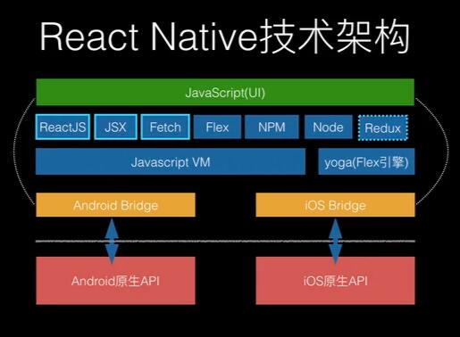

# Hybrid

## 平台实现

### RN

JSX编写页面，映射到Virtual DOM，通过O(N)的diff算法进行DOM树的变化。

调用C++层Bridge桥接原生API，将DOM映射到原生的View。

* JavaScriptCore：负责JS代码的解释执行。
* ReactJS：负责描述和管理VirtualDom，进行diff差量算法，完成DOM的更新计算。
* Bridges：用于把ReactJS的绘制指令给原生组件进行绘制，同时把原生组件接收到的用户事件反馈给ReactJS。

支持：

* UI Rendering

  如视图渲染。

* Device API Access

  如相机、GPS等。

其它功能需要从三方库使用。

**React Native**  是一套 UI 框架，默认情况下 **React Native**  会在 `Activity` 下加载 JS 文件，然后运行在 `JavaScriptCore` 中解析 *Bundle* 文件布局，最终堆叠出一系列的原生控件进行渲染。

简单来说就是 **通过写 JS 代码配置页面布局，然后 React Native 最终会解析渲染成原生控件**，如 `<View>` 标签对应 `ViewGroup/UIView` ，`<ScrollView>` 标签对应 `ScrollView/UIScrollView` ，`<Image>` 标签对应 `ImageView/UIImageView` 等。

### Flutter

Dart编写页面，底层继承了skia渲染引擎，直接在canvas上进行绘制，没有经过原生映射。

**Flutter** 中绝大部分的 `Widget` 都与平台无关， 开发者基于 `Framework` 开发 App ，而 `Framework` 运行在 `Engine` 之上，由 `Engine` 进行适配和跨平台支持。这个跨平台的支持过程，其实就是将 **Flutter UI 中的 `Widget` “数据化” ，然后通过 `Engine` 上的 `Skia` 直接绘制到屏幕上 。**

支持

* UI Rendering
* Device API Access
* Navigation
* Testing
* State management
* Widget Library

### Weex

Vue编写页面，Native端解析DOM，生成原生控件。

## 社区

### RN

Facebook支持，有较程数的工具链。

插件比较分散，没有统一的维护。

刚开始上手一个页面简单，但是开始使用三方lib以后，难度会越来越高。

### Flutter

Google支持，有较丰富的文档。

技术比较新，发展还需要时间。

导航处理、地图服务、相机服务等还不完善。

支持matrial design。

刚开始上手会要记忆built in widget如何使用，但是后续的难度会降低，并不会有RN上lib的问题。

### Weex

社区较小，阿里支持，已经托管Apache。

不考虑。

## 上手难度

### RN

较难。

### flutter

一般。

### Weex

容易。

## 性能

### RN/Weex

多了一层JS引擎，性能不如原生。

### Flutter

自带skia绘制引擎，理论性能更好。

## 未来前景

### RN

已经有比较成熟的解决方案。受制于本身跨平台机制，上限不高。

### Weex

前景不明朗，维护力度小，文档混乱，版本迭代慢。

### Flutter

更新迅速，社区活跃，文档完善。

Goggle推出新操作系统Fuchsia采用Flutter。