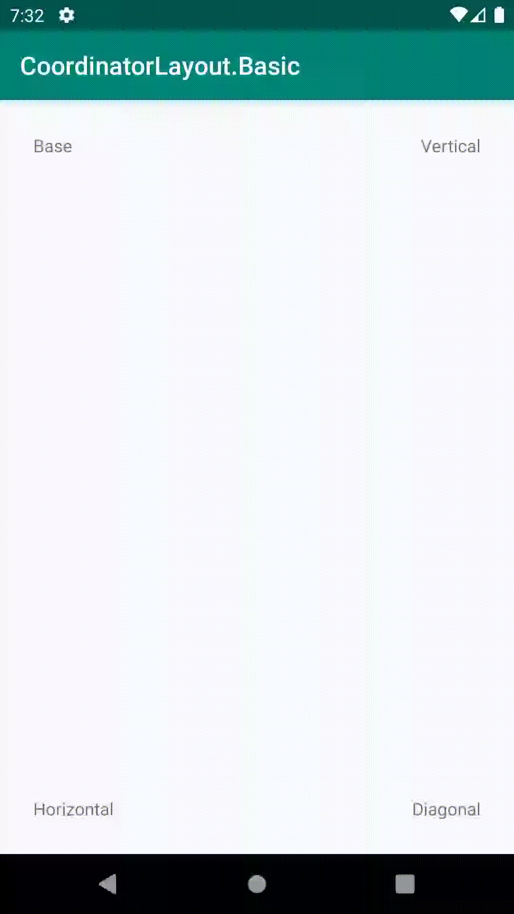

# CoordinatorLayout

`CoordinatorLayout`是一个更强大的`FrameLayout`。它可以作为视图最顶层的容器，子View通过`Coordinator.Behavior`来指定依赖关系和实现复杂的交互动画。

先来看看`CoordinatorLayout`与`Behavior`都能实现的效果。

* 可以配合`AppBarLayout`，达到头部收缩的效果。

  

* 可以自定义`Behavior`让子View之间形成依赖关系，被依赖的子View一发生变化，依赖它的子View进行相应的变化。

  例如下面这个简单的例子，左上方的子View在循环执行动画改变视图位置，另外三个子View通过`Behavior`监听了左上方子View位置的变化，并进行相应的镜像变化。

  

* 也可以自定义`Behavior`实现嵌套滑动的分发。

  


为了充分理解`CoordinatorLayout`的使用方式和设计原理，需要掌握`Dependency Graph`和`Behavior`两个概念。


## Dependency Graph

在`CoorindatorLayout`中，子View通过`Behavior`的方法`layoutDependsOn()`方法定义好了依赖关系。`CoordinatorLayout`会在`prepareChildren()`方法中进行预处理，将依赖关系构建成一张有向无环图（Directed Acyclic Graph, DAG）。

```java
private final DirectedAcyclicGraph<View> mChildDag = new DirectedAcyclicGraph<>();

...

private void prepareChildren() {
    mDependencySortedChildren.clear();
    mChildDag.clear();

    for (int i = 0, count = getChildCount(); i < count; i++) {
        final View view = getChildAt(i);

        final LayoutParams lp = getResolvedLayoutParams(view);
        lp.findAnchorView(this, view);

        mChildDag.addNode(view);

        // Now iterate again over the other children, adding any dependencies to the graph
        for (int j = 0; j < count; j++) {
            if (j == i) {
                continue;
            }
            final View other = getChildAt(j);
            if (lp.dependsOn(this, view, other)) {
                if (!mChildDag.contains(other)) {
                    // Make sure that the other node is added
                    mChildDag.addNode(other);
                }
                // Now add the dependency to the graph
                mChildDag.addEdge(other, view);
            }
        }
    }

    // Finally add the sorted graph list to our list
    mDependencySortedChildren.addAll(mChildDag.getSortedList());
    // We also need to reverse the result since we want the start of the list to contain
    // Views which have no dependencies, then dependent views after that
    Collections.reverse(mDependencySortedChildren);
}
```

`DirectedAcyclicGraph`类实现了有向无环图的功能，调用`DirectedAcyclicGraph.getSortedList()`方法，可以按照依赖顺序将所有子View进行排序，没有任何依赖的子View排在最前，依赖层级最深的子View排在最后。内部的核心步骤是从图中的每个点出发进行一次`dfs`遍历。

```java
public ArrayList<T> getSortedList() {
    mSortResult.clear();
    mSortTmpMarked.clear();

    // Start a DFS from each node in the graph
    for (int i = 0, size = mGraph.size(); i < size; i++) {
        dfs(mGraph.keyAt(i), mSortResult, mSortTmpMarked);
    }

    return mSortResult;
}
```

`DirectedAcyclicGraph.dfs()`方法类限制了子View的依赖关系不能有环，否则会在构建依赖关系图时抛出异常。

```java
private void dfs(final T node, final ArrayList<T> result, final HashSet<T> tmpMarked) {
    ...
    if (tmpMarked.contains(node)) {
        throw new RuntimeException("This graph contains cyclic dependencies");
    }
    ...
}
```

最终，`CoordinatorLayout`将排序结果保存在了`mDependencySortedChildren`变量中。在调用`onChildViewsChanged()`方法时，就是使用这个顺序进行各种事件的分发，保证被依赖的子View的变化能够先于依赖的子View。

> 在进行`NestedScrolling`相关API操作时没有使用这个顺序，直接使用的子View的自然顺序。
>
> 消耗嵌套滑动这个操作不区分先后，子View间可以同时消耗一次嵌套滑动事件，不会因为一个子View先进行消耗，而使得靠后的子View没有偏移量可用。


## Behavior

`Behavior`是`CoordinatorLayout`的静态内部抽象类，自定义的`Behavior`都需要继承它。

### 构造函数

自定义`Behavior`需要实现带`Context`和`AttributeSet`参数的构造方法。

```java
public HorizontalMirrorBehavior(Context context, AttributeSet attrs) {
    super(context, attrs);
}
```

原因是`CoordinatorLayout`在解析`LayoutParams.Behavior`属性时，会调用`CoordinatorLayout.parseBehavior()`方法利用反射构造`Behavior`对象。

```java
LayoutParams(@NonNull Context context, @Nullable AttributeSet attrs) {
    super(context, attrs);

    final TypedArray a = context.obtainStyledAttributes(attrs,
            R.styleable.CoordinatorLayout_Layout);

    this.gravity = a.getInteger(
            R.styleable.CoordinatorLayout_Layout_android_layout_gravity,
            Gravity.NO_GRAVITY);
    mAnchorId = a.getResourceId(R.styleable.CoordinatorLayout_Layout_layout_anchor,
            View.NO_ID);
    this.anchorGravity = a.getInteger(
            R.styleable.CoordinatorLayout_Layout_layout_anchorGravity,
            Gravity.NO_GRAVITY);

    this.keyline = a.getInteger(R.styleable.CoordinatorLayout_Layout_layout_keyline,
            -1);

    insetEdge = a.getInt(R.styleable.CoordinatorLayout_Layout_layout_insetEdge, 0);
    dodgeInsetEdges = a.getInt(
            R.styleable.CoordinatorLayout_Layout_layout_dodgeInsetEdges, 0);
    mBehaviorResolved = a.hasValue(
            R.styleable.CoordinatorLayout_Layout_layout_behavior);
    if (mBehaviorResolved) {
        /* 
         * 如果在xml中设置过Behavior，将调用parseBehavior()方法创建对象
         */
        mBehavior = parseBehavior(context, attrs, a.getString(
                R.styleable.CoordinatorLayout_Layout_layout_behavior));
    }
    a.recycle();

    if (mBehavior != null) {
        // If we have a Behavior, dispatch that it has been attached
        mBehavior.onAttachedToLayoutParams(this);
    }
}
```

```java
static Behavior parseBehavior(Context context, AttributeSet attrs, String name) {
    if (TextUtils.isEmpty(name)) {
        return null;
    }

    final String fullName;
    if (name.startsWith(".")) {
        // Relative to the app package. Prepend the app package name.
        fullName = context.getPackageName() + name;
    } else if (name.indexOf('.') >= 0) {
        // Fully qualified package name.
        fullName = name;
    } else {
        // Assume stock behavior in this package (if we have one)
        fullName = !TextUtils.isEmpty(WIDGET_PACKAGE_NAME)
                ? (WIDGET_PACKAGE_NAME + '.' + name)
                : name;
    }

    try {
        Map<String, Constructor<Behavior>> constructors = sConstructors.get();
        if (constructors == null) {
            constructors = new HashMap<>();
            sConstructors.set(constructors);
        }
        Constructor<Behavior> c = constructors.get(fullName);
        if (c == null) {
            final Class<Behavior> clazz =
                    (Class<Behavior>) Class.forName(fullName, false, context.getClassLoader());
            c = clazz.getConstructor(CONSTRUCTOR_PARAMS);
            c.setAccessible(true);
            constructors.put(fullName, c);
        }
        /* 
         * 调用使用Context和AttributeSet参数的构造方法
         */
        return c.newInstance(context, attrs);
    } catch (Exception e) {
        throw new RuntimeException("Could not inflate Behavior subclass " + fullName, e);
    }
}
```

配合`AppBarLayout`使用时，xml中设置的`app:layout_behavior="@string/appbar_scrolling_view_behavior"`属性实际上也是同样的原理。

在`values.xml`中定义的字符串值是`AppBarLayout.ScrollingViewBehavior`的完整类名路径。用于构造`AppBarLayout.ScrollingViewBehavior`对象。

```xml
<string name="appbar_scrolling_view_behavior"
        translatable="false">
    com.google.android.material.appbar.AppBarLayout$ScrollingViewBehavior
</string>
```

### API

`Behavior`的API可以分为几组：

#### LayoutParams相关

* `onAttachedToLayoutParams()`

  在`LayoutParams`的构造方法中，`Behavior`被创建并绑定到`LayoutParams`时被回调。

  在调用`LayoutParams.setBehavior()`时被回调。

* `onDetachedFromLayoutParams()`

  在调用`LayoutParams.setBehavior()`时被回调。

#### 依赖相关

* `layoutDependsOn()`

  ```java
  @Override
  public boolean layoutDependsOn(@NonNull CoordinatorLayout parent, @NonNull View child, @NonNull View dependency) {
      ...
  }
  ```

  * `child`：设置了当前`Behavior`的子View
  * `dependency`：可以需要依赖的子View

  此方法需要判断`dependency`是否就是需要依赖的子View，如果是的，方法返回`true`。

* `onDependentViewChanged()`

  * `CoordinatorLayout`会在`ViewTreeObserver`中添加`OnPreDrawListener`，在`onPreDraw()`时回调`onDependentViewChanged()`方法。

    ```java
    class OnPreDrawListener implements ViewTreeObserver.OnPreDrawListener {
        @Override
        public boolean onPreDraw() {
            onChildViewsChanged(EVENT_PRE_DRAW);
            return true;
        }
    }
    ```

  * `NestedScrollingParent`相关接口会回调`onDependentViewChanged()`方法。

    * `onNestedPreScroll()`
    * `onNestedScroll()`
    * `onNestedFling()`

    这三个方法中，如果嵌套滑动事件被处理，那么会触发回调。

* `onDependentViewRemoved()`

  * `CoordinaorLayout`会调用`ViewGroup.setOnHierarchyChangeListener()`方法添加`HierarchyChangeListener`，在子View被移除时回调`onDependentViewChanged()`方法。

    ```java
    private class HierarchyChangeListener implements OnHierarchyChangeListener {
        HierarchyChangeListener() {
        }
    
        @Override
        public void onChildViewAdded(View parent, View child) {
            if (mOnHierarchyChangeListener != null) {
                mOnHierarchyChangeListener.onChildViewAdded(parent, child);
            }
        }
    
        @Override
        public void onChildViewRemoved(View parent, View child) {
            /*
             * 回调onChildViewsChanged()方法
             */
            onChildViewsChanged(EVENT_VIEW_REMOVED);
    
            if (mOnHierarchyChangeListener != null) {
                mOnHierarchyChangeListener.onChildViewRemoved(parent, child);
            }
        }
    }
    ```

#### Touch事件相关

`CoordinatorLayout`在`onInterceptTouchEvent()`和`onTouchEvent()`方法中调用`performIntercept()`方法，将事件优先交给子View 的`Behavior`进行处理。

涉及的接口有：

* `onInterceptTouchEvent()`

* `onTouchEvent()`

* `blocksInteractionBelow()`

  block事件分发，位于`DAG`后方的`Behavior`将不再有机会处理事件。

> 需要注意：子View的Behavior会接收到坐标不在控件范围内的事件。可以使用`CoordinatorLayout.isPointInChildBounds()`方法判断点击是否落在子View上。

#### 测量布局相关

`CoordinatorLayout`在`onMeasure()`和`onLayout()`方法中将测量和布局优先交给子View 的`Behavior`进行处理。

涉及的接口有：

* `onMeasureChild()`

* `onLayoutChild()`

#### 嵌套滑动相关

`CoordinatorLayout`实现了`NestedScrollingParent`接口。在嵌套嵌套滑动相关回调中，它会将嵌套滑动事件分发给子View的`Behavior`进行处理。

涉及的接口有：

* `onStartNestedScroll()`
* `onNestedScrollAccepted()`

* `onNestedPreScroll()`
* `onNestedScroll()`
* `onNestedPreFling()`
* `onNestedFling()`
* `onStopNestedScroll()`

需要注意的是，一次嵌套滑动事件可以被多个子View的`Behavior`同时消费。

以`onNestedScroll()`方法为例，最终嵌套滑动的消费量为所有子View消费量的最大值。

```java
public void onNestedScroll(@NonNull View target, int dxConsumed, int dyConsumed,
        int dxUnconsumed, int dyUnconsumed, @ViewCompat.NestedScrollType int type,
        @NonNull int[] consumed) {
    final int childCount = getChildCount();
    boolean accepted = false;
    int xConsumed = 0;
    int yConsumed = 0;

    for (int i = 0; i < childCount; i++) {
        final View view = getChildAt(i);
        if (view.getVisibility() == GONE) {
            // If the child is GONE, skip...
            continue;
        }

        final LayoutParams lp = (LayoutParams) view.getLayoutParams();
        if (!lp.isNestedScrollAccepted(type)) {
            continue;
        }

        final Behavior viewBehavior = lp.getBehavior();
        if (viewBehavior != null) {

            mBehaviorConsumed[0] = 0;
            mBehaviorConsumed[1] = 0;

            viewBehavior.onNestedScroll(this, view, target, dxConsumed, dyConsumed,
                    dxUnconsumed, dyUnconsumed, type, mBehaviorConsumed);
            
            /*
             * 消费量取各个Behavior消费的最大值
             */
            xConsumed = dxUnconsumed > 0 ? Math.max(xConsumed, mBehaviorConsumed[0])
                    : Math.min(xConsumed, mBehaviorConsumed[0]);
            yConsumed = dyUnconsumed > 0 ? Math.max(yConsumed, mBehaviorConsumed[1])
                    : Math.min(yConsumed, mBehaviorConsumed[1]);

            accepted = true;
        }
    }

    consumed[0] += xConsumed;
    consumed[1] += yConsumed;

    if (accepted) {
        onChildViewsChanged(EVENT_NESTED_SCROLL);
    }
}
```


### 总结

`CoordinatorLayout`内部总的来说有几种方式可以实现各个子View之间的交互。

* 子View自己处理视图状态（如，监听Touch事件，改变视图大小位置等状态），其它子View通过依赖接收`onDependentViewChanged()`回调，进行相应的更改。
* 子View实现了`NestedScrollingChild`接口，支持了Touch事件和Fling事件的嵌套滑动功能。嵌套滑动事件回调给`CoordinatorLayout`，再由`CoordinatorLayout`统一进行分发。
