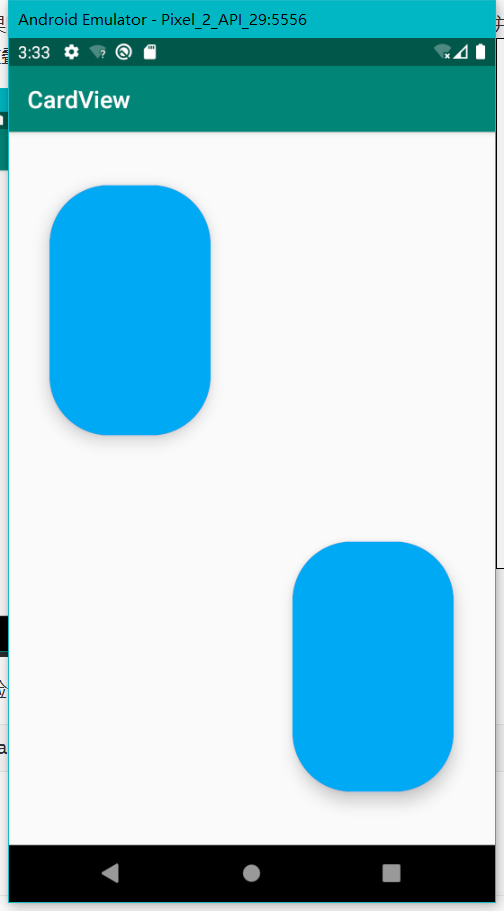
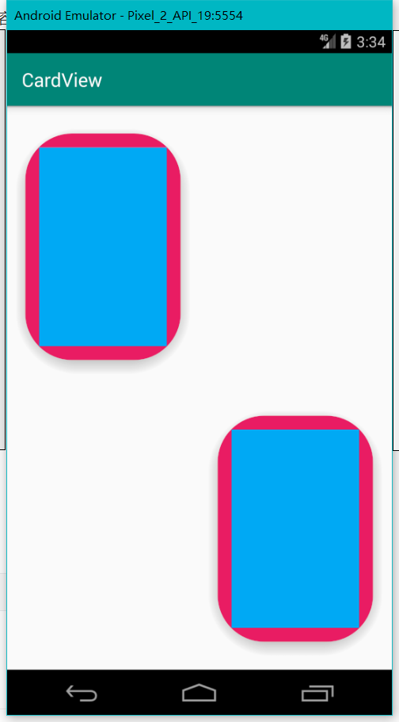

# CardView

`CardView`是`androidx`（`android.support.v7`）包下的组件。

它是一个容器，用于提供统一的卡片样式视觉体验。它最主要的属性是`elevtion`，这个属性控制着`CardView`的z轴高度，以及相应的阴影效果。


# 点击效果

## 水波纹

```xml
<androidx.cardview.widget.CardView
    android:clickable="true"
    android:focusable="true"
    android:foreground="?android:attr/selectableItemBackground"
</androidx.cardview.widget.CardView>
```


## 浮动动画

```xml
<selector xmlns:android="http://schemas.android.com/apk/res/android">
    <item
        android:state_enabled="true"
        android:state_pressed="true">
        <objectAnimator
            android:duration="@android:integer/config_shortAnimTime"
            android:propertyName="translationZ"
            android:valueTo="10dp"
            android:valueType="floatType" />
    </item>
    <item>
        <objectAnimator
            android:duration="@android:integer/config_shortAnimTime"
            android:propertyName="translationZ"
            android:valueTo="0dp"
            android:valueType="floatType" />
    </item>
</selector>
```

```xml
<androidx.cardview.widget.CardView
	android:stateListAnimator="@animator/card_view_animator"
</androidx.cardview.widget.CardView>
```


# Android 5.0以下兼容问题

## 圆角

根据官方文档：

```
Due to expensive nature of rounded corner clipping, on platforms before Lollipop, CardView does not clip its children that intersect with rounded corners. Instead, it adds padding to avoid such intersection (See setPreventCornerOverlap(boolean) to change this behavior).
```

在`Lollipop(5.0)`版本以前，如果`CardView`有圆角，默认情况下，会自动扩大`CardView`并给内容添加`padding`，使内容和圆角部分不重叠。



如果希望和高5.0版本以上视觉体验一致，需要设置`PreventCornerOverlap`为false。

```xml
<androidx.cardview.widget.CardView
	app:cardPreventCornerOverlap="true"
</androidx.cardview.widget.CardView>
```


## Padding

根据官方文档：

```
Before Lollipop, CardView adds padding to its content and draws shadows to that area. This padding amount is equal to maxCardElevation + (1 - cos45) * cornerRadius on the sides and maxCardElevation * 1.5 + (1 - cos45) * cornerRadius on top and bottom.
```

在`Lollipop(5.0)`版本以前，`CardView`会添加`padding`来绘制阴影。


如果希望和高5.0版本以上视觉体验一致，需要设置`useCompactPadding`为false。

```xml
<androidx.cardview.widget.CardView
	app:cardUseCompatPadding="true"
</androidx.cardview.widget.CardView>
```

