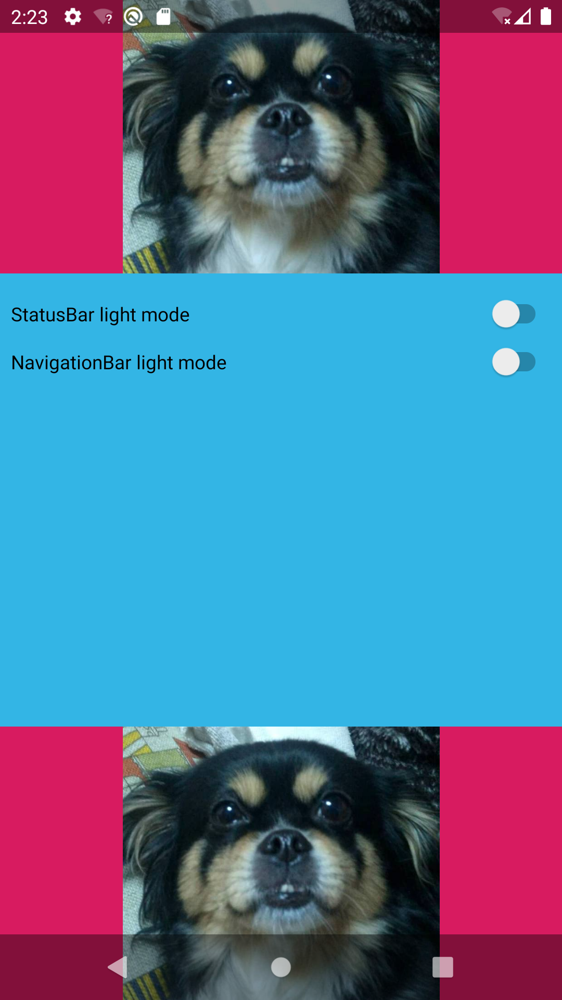
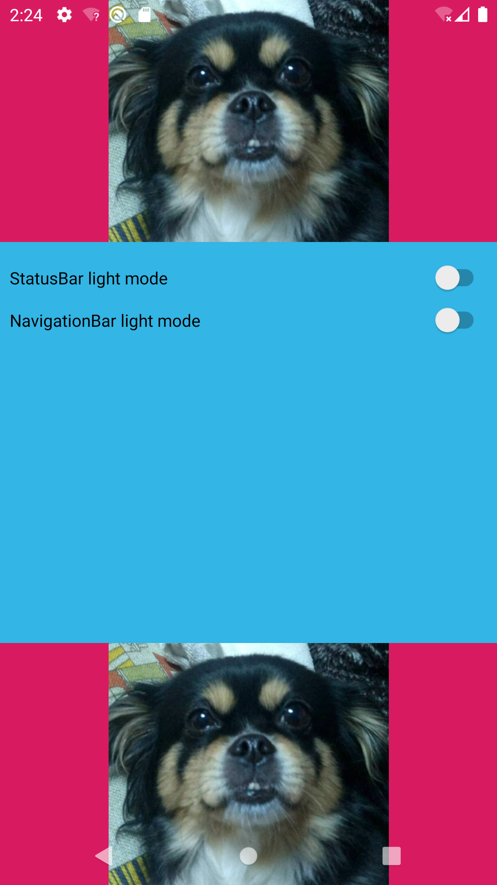

# SystemBar

## 设置颜色

### Android 4.4+

在Android 4.4 KitKat版本之后，5.0 Lollipop版本之前，Window只提供了设置半透明的api。

```java
/**
 * Window flag: request a translucent status bar with minimal system-provided
 * background protection.
 *
 * <p>This flag can be controlled in your theme through the
 * {@link android.R.attr#windowTranslucentStatus} attribute; this attribute
 * is automatically set for you in the standard translucent decor themes
 * such as
 * {@link android.R.style#Theme_Holo_NoActionBar_TranslucentDecor},
 * {@link android.R.style#Theme_Holo_Light_NoActionBar_TranslucentDecor},
 * {@link android.R.style#Theme_DeviceDefault_NoActionBar_TranslucentDecor}, and
 * {@link android.R.style#Theme_DeviceDefault_Light_NoActionBar_TranslucentDecor}.</p>
 *
 * <p>When this flag is enabled for a window, it automatically sets
 * the system UI visibility flags {@link View#SYSTEM_UI_FLAG_LAYOUT_STABLE} and
 * {@link View#SYSTEM_UI_FLAG_LAYOUT_FULLSCREEN}.</p>
 */
 public static final int FLAG_TRANSLUCENT_STATUS = 0x04000000;

/**
 * Window flag: request a translucent navigation bar with minimal system-provided
 * background protection.
 *
 * <p>This flag can be controlled in your theme through the
 * {@link android.R.attr#windowTranslucentNavigation} attribute; this attribute
 * is automatically set for you in the standard translucent decor themes
 * such as
 * {@link android.R.style#Theme_Holo_NoActionBar_TranslucentDecor},
 * {@link android.R.style#Theme_Holo_Light_NoActionBar_TranslucentDecor},
 * {@link android.R.style#Theme_DeviceDefault_NoActionBar_TranslucentDecor}, and
 * {@link android.R.style#Theme_DeviceDefault_Light_NoActionBar_TranslucentDecor}.</p>
 *
 * <p>When this flag is enabled for a window, it automatically sets
 * the system UI visibility flags {@link View#SYSTEM_UI_FLAG_LAYOUT_STABLE} and
 * {@link View#SYSTEM_UI_FLAG_LAYOUT_HIDE_NAVIGATION}.</p>
 */
public static final int FLAG_TRANSLUCENT_NAVIGATION = 0x08000000;
```

实现方式如下：

```java
private static void setStatusBarTransparent(Activity activity) {
    if (Build.VERSION.SDK_INT >= Build.VERSION_CODES.LOLLIPOP) {
        setStatusBarColor(activity, Color.TRANSPARENT);
    } else if (Build.VERSION.SDK_INT >= Build.VERSION_CODES.KITKAT) {
        Window window = activity.getWindow();
        window.addFlags(WindowManager.LayoutParams.FLAG_TRANSLUCENT_STATUS);
    }
}

private static void setNavigationBarTransparent(Activity activity) {
    if (Build.VERSION.SDK_INT >= Build.VERSION_CODES.LOLLIPOP) {
        setNavigationBarColor(activity, Color.TRANSPARENT);
    } else if (Build.VERSION.SDK_INT >= Build.VERSION_CODES.KITKAT) {
        Window window = activity.getWindow();
        window.addFlags(WindowManager.LayoutParams.FLAG_TRANSLUCENT_NAVIGATION);
    }
}
```


### Android 5.0+

在Android 5.0 Lollipop之后，Window对象提供了`Window.setStatusBarColor()`接口和`Window.setNavigationBarColor()`接口直接设置SystemBar颜色。

```java
/**
 * Sets the color of the status bar to {@code color}.
 *
 * For this to take effect,
 * the window must be drawing the system bar backgrounds with
 * {@link android.view.WindowManager.LayoutParams#FLAG_DRAWS_SYSTEM_BAR_BACKGROUNDS} and
 * {@link android.view.WindowManager.LayoutParams#FLAG_TRANSLUCENT_STATUS} must not be set.
 *
 * If {@code color} is not opaque, consider setting
 * {@link android.view.View#SYSTEM_UI_FLAG_LAYOUT_STABLE} and
 * {@link android.view.View#SYSTEM_UI_FLAG_LAYOUT_FULLSCREEN}.
 * <p>
 * The transitionName for the view background will be "android:status:background".
 * </p>
 */
public abstract void setStatusBarColor(@ColorInt int color);

/**
 * Sets the color of the navigation bar to {@param color}.
 *
 * For this to take effect,
 * the window must be drawing the system bar backgrounds with
 * {@link android.view.WindowManager.LayoutParams#FLAG_DRAWS_SYSTEM_BAR_BACKGROUNDS} and
 * {@link android.view.WindowManager.LayoutParams#FLAG_TRANSLUCENT_NAVIGATION} must not be set.
 *
 * If {@param color} is not opaque, consider setting
 * {@link android.view.View#SYSTEM_UI_FLAG_LAYOUT_STABLE} and
 * {@link android.view.View#SYSTEM_UI_FLAG_LAYOUT_HIDE_NAVIGATION}.
 * <p>
 * The transitionName for the view background will be "android:navigation:background".
 * </p>
 * @attr ref android.R.styleable#Window_navigationBarColor
 */
public abstract void setNavigationBarColor(@ColorInt int color);
```

在官方注释中，这两个接口，需要与`FLAG_DRAWS_SYSTEM_BAR_BACKGROUNDS`和`FLAG_TRANSLUCENT_NAVIGATION`一起配合使用。

* 设置`FLAG_DRAWS_SYSTEM_BAR_BACKGROUNDS`
* 禁用`FLAG_TRANSLUCENT_STATUS`或者`FLAG_TRANSLUCENT_NAVIGATION`

另外，给`DecorVeiew`设置`SYSTEM_UI_FLAG_LAYOUT_FULLSCREEN`和`SYSTEM_UI_FLAG_LAYOUT_STABLE`属性。

* `SYSTEM_UI_FLAG_LAYOUT_FULLSCREEN`，设置界面为全屏模式，让界面内容可以延申到SystemBar后面。
* `SYSTEM_UI_FLAG_LAYOUT_STABLE`，设置界面稳定，当`SystemBar`动态显示和隐藏时，系统为设置`fitSystemWindow`属性的view设置的padding大小都不会变化，所以view的内容的位置也不会发生移动。

最后，如果需要让界面内容有默认padding，需要设置`setFitsSystemWindows`和`setClipToPadding`。

* `setFitsSystemWindows`，让界面内容默认padding系统SystemBar的高度。
* `setClipToPadding`，让界面内容可以在padding区域内绘制。

如果系统版本高于Android 10.0 Q，可以使用`Window.setStatusBarContrastEnforced()`和`Window.setNavigationBarContrastEnforced()`接口设置，是否默认增加灰色半透明背景。在这里，我们希望能完全控制SystemBar的颜色，需要把它们设置为false。

* `Window.setNavigationBarContrastEnforced(true)`



* `Window.setNavigationBarContrastEnforced(false)`



于是，最终实现方法如下：

```java
private static void setStatusBarColor(Activity activity, int color) {
    if (Build.VERSION.SDK_INT >= Build.VERSION_CODES.LOLLIPOP) {
        Window window = activity.getWindow();
        window.addFlags(WindowManager.LayoutParams.FLAG_DRAWS_SYSTEM_BAR_BACKGROUNDS);
        window.clearFlags(WindowManager.LayoutParams.FLAG_TRANSLUCENT_STATUS);
        window.setStatusBarColor(color);

        View decorView = window.getDecorView();
        decorView.setSystemUiVisibility(View.SYSTEM_UI_FLAG_LAYOUT_STABLE | View.SYSTEM_UI_FLAG_LAYOUT_FULLSCREEN);

        if (Build.VERSION.SDK_INT >= Build.VERSION_CODES.Q) {
            window.setStatusBarContrastEnforced(false);
        }
    }
}

private static void setNavigationBarColor(Activity activity, int color) {
    if (Build.VERSION.SDK_INT >= Build.VERSION_CODES.LOLLIPOP) {
        Window window = activity.getWindow();
        window.addFlags(WindowManager.LayoutParams.FLAG_DRAWS_SYSTEM_BAR_BACKGROUNDS);
        window.clearFlags(WindowManager.LayoutParams.FLAG_TRANSLUCENT_NAVIGATION);
        window.setNavigationBarColor(color);

        View decorView = window.getDecorView();
        decorView.setSystemUiVisibility(View.SYSTEM_UI_FLAG_LAYOUT_STABLE | View.SYSTEM_UI_FLAG_LAYOUT_HIDE_NAVIGATION);

        if (Build.VERSION.SDK_INT >= Build.VERSION_CODES.Q) {
            window.setNavigationBarContrastEnforced(false);
        }
    }
}

private static void setContentViewFitWindow(Activity activity) {
    ViewGroup contentView = activity.findViewById(Window.ID_ANDROID_CONTENT);
    for (int i = 0; i < contentView.getChildCount(); i++) {
        View child = contentView.getChildAt(i);
        if (child instanceof ViewGroup) {
            ViewGroup viewGroup = (ViewGroup) child;
            viewGroup.setFitsSystemWindows(true);
            viewGroup.setClipToPadding(true);
        }
    }
}
```

