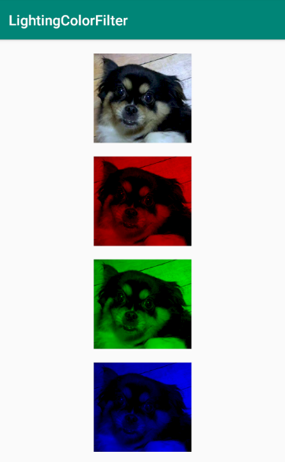
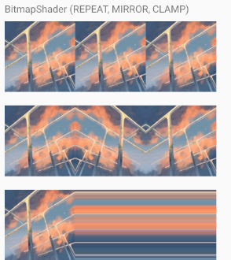
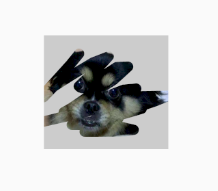
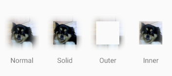

# Canvas

# Paint

## ColorFilter

颜色滤镜，可以调用`Paint.setColorFilter()`方法设置给Paint，改变绘制的颜色。

* LightingColorFilter

  光照ColorFilter，可以简单模拟不同颜色的光照打在原始图像上。

  实际上内部使用的是乘法和加法：

  ```
   R' = R * colorMultiply.R + colorAdd.R
   G' = G * colorMultiply.G + colorAdd.G
   B' = B * colorMultiply.B + colorAdd.B
  ```

  


## Shader

着色器，可以调用`Paint.setShader()`方法设置给Paint，作为绘制时的颜色空间。

如何理解颜色空间？

可以想象设置了shader后，绘制时是在“揭露”设置的shader。类似于刮奖的效果。

* LinearGradient
  
  一组颜色线性排列的色彩空间。
  
  
  
  * 构造函数：
  
    ```java
    public LinearGradient(float x0, float y0, float x1, float y1, @NonNull @ColorInt int[] colors, @Nullable float[] positions, @NonNull TileMode tile) {
        this(x0, y0, x1, y1, convertColors(colors), positions, tile,
             ColorSpace.get(ColorSpace.Named.SRGB));
    }
    ```
  
    * x0，y0：表示起点坐标
  
    * x1，y1：表示终点坐标
  
    * colors：填充的颜色数组
  
    * positions：每种颜色所占的比例，传null为等分
  
    * tile：填充模式（Shader.TileMode.REPEAT，Shader.TileMode.MIRROR，Shader.TileMode.CLAMP）
  
  * 使用例子：
  
    文字的闪动效果。
  
    

  
  
* RadialGradient

  圆形放射状颜色空间。

  * 构造函数：

    ```java
  public RadialGradient(float centerX, float centerY, float radius,
                @ColorLong long centerColor, @ColorLong long edgeColor, @NonNull TileMode tileMode) {
        this(centerX, centerY, radius, new long[] {centerColor, edgeColor}, null, tileMode);
    }
    ```
  
  * centerX：圆心x坐标
    * centerY：圆心y坐标
    * radius：半径
    * centerColor：中心颜色
  * edgeColor：边缘颜色
  
* tileMode：平铺模式
  
* 使用例子：
  
    

  

* BitmapGradient

  图片作为色彩空间，可以设置x方向和y方向的平铺模式。

  

  * 构造函数

    ```java
    public BitmapShader(@NonNull Bitmap bitmap, @NonNull TileMode tileX, @NonNull TileMode tileY) {
        this(bitmap, tileX.nativeInt, tileY.nativeInt);
    }
    ```

    * bitmap：使用的图片
    * tileX：X方向平铺模式
    * tileY：Y方向平铺模式

  * 使用例子：

    刮奖效果。

    

## MaskFilter

* BlurMaskFilter

  * Normal：内部和外围均模糊
  * Solid：内部绘制原始图片，外围模糊
  * Outer：内部不进行绘制，外部模糊
  * Inner：内部模糊

  


# PathMeasure

