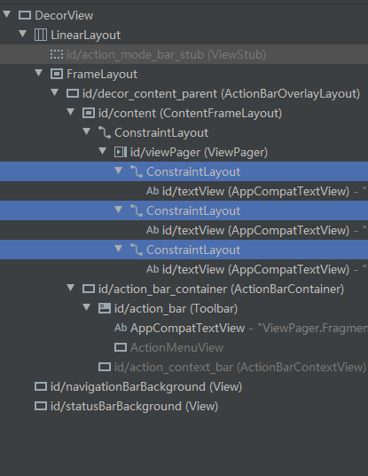
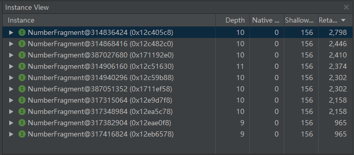
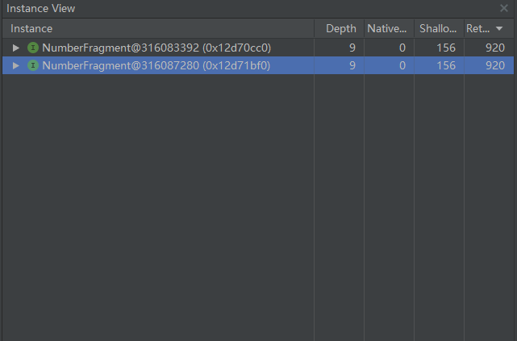
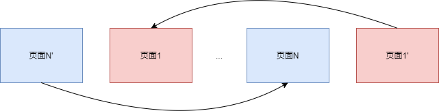
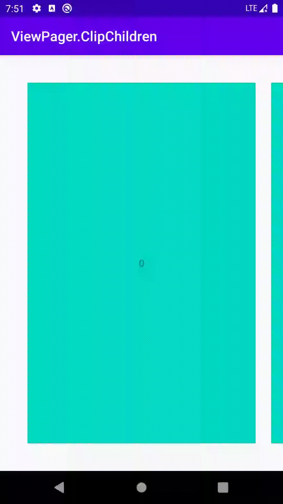

# ViewPager

## 概述

`ViewPager`可以用来展示一组界面，并提供了滑动支持。一般可以用它来实现画廊，广告位等界面。展示的界面可以是`View`或者`Fragment`。

`ViewPager`界面用`View`时，需要配合`PagerAdapter`一起使用。

`ViewPager`界面用`Fragment`时，需要配合`FragmentPagerAdapter`或者`FragmentStatePagerAdapter`一起使用。

更推荐使用`Fragment`，因为它自带生命周期的回调，我们很容易在生命周期的配合下实现资源初始化的管理。


## 常用方法

* `ViewPager.setOffscreenPageLimit(int limit)`

  通过此方法可以设置左右两侧的预加载页面数量，它的默认值为1。

* `ViewPager.setCurrentItem(int item, boolean smoothScroll)`

  通过此方法可以设置切换到的页面。
  
*  通过反射的方式可以更换`ViewPager`滑动使用的`Scroller`。

  ```java
  public static void setViewPagerScroller(ViewPager viewPager, Scroller scroller) {
      try {
          Class clazz = ViewPager.class;
          Field f = clazz.getDeclaredField("mScroller");
          f.setAccessible(true);
          f.set(viewPager, scroller);
      } catch (Exception e) {
          e.printStackTrace();
      }
  }
  ```


## PagerAdapter

`PagerAdapter`用于进行`View`的展示，它是一个抽象类，使用时，需要实现4个方法。

* `instantiateItem()`

  通过`instantiateItem()`方法创建`View`，并在方法内部将`View`添加到`container`中，方法返回与`View`对应的对象，一般可以直接返回创建的`View`对象。

  ```java
  public Object instantiateItem(@NonNull ViewGroup container, int position) {
      View itemView = mLayoutInflater.inflate(R.layout.item_view_number, container, false);
      itemView.setTag(position);
      container.addView(itemView);
      TextView textView = itemView.findViewById(R.id.textView);
      textView.setText(String.valueOf(position));
      return itemView;
  }
  ```

* `destroyItem()`

  通过`destroyItem()`方法销毁`View`，并在方法内部将`View`从`container`中移除。

  ```java
  public void destroyItem(@NonNull ViewGroup container, int position, @NonNull Object object) {
      View itemView = container.findViewWithTag(position);
      container.removeView(itemView);
  }
  ```

* `getCount()`

  返回需要展示的页面数量。

  ```java
  public int getCount() {
      return N;
  }
  ```

* `isViewFromObject()`

  ```java
  public boolean isViewFromObject(@NonNull View view, @NonNull Object object) {
      return view == object;
  }
  ```

  用于判断`View`和`Object`是否是对应的，如果在`instantiateItem()`方法中返回的`View`对象，这里只需要进行对象相等的判断。如果`instantiateItem()`返回的是其它对象，需要进行相应的判断。比如`FragmentPagerAdapter`中，`Object`是`Fragment`类型。

  ```java
  public boolean isViewFromObject(@NonNull View view, @NonNull Object object) {
      return ((Fragment)object).getView() == view;
  }
  ```


## FragmentPagerAdapter

`FragmentPagerAdapter`用于进行`Fragment`的展示，它是一个继承自`PagerAdapter`的抽象类，使用时，需要继承并实现两个方法，并调用父类的构造方法。

* constructor

  ```java
  FragmentAdapter(@NonNull FragmentManager fm) {
      super(fm, BEHAVIOR_RESUME_ONLY_CURRENT_FRAGMENT);
  }
  ```

  其中，传入的第一个参数是`FragmentManager`对象，用于进行`Fragment`的管理，传入的第二个参数是一个标记位，用于标记`FragmentPagerAdapter`对`Fragment`管理的行为。

  `Behavior`标记位有两个值。

  * `BEHAVIOR_SET_USER_VISIBLE_HINT`

    使用这个标记位时，所有在`ViewPager`预加载范围内的`Fragment`都会处于`onResume()`状态。可以通过`Fragment.setUserVisibleHint(boolean isVisibleToUser)`回调判断一个`Fragment`是否被用户看见。

    >  这个标记位已经被官方列为`deprecated`，推荐我们使用第二个标记位。

  * `BEHAVIOR_RESUME_ONLY_CURRENT_FRAGMENT`

    使用这个标记位时，只有当前展示的`Fragment`处于`onResume()`状态，其它预加载的`Fragment`处于`onStart()`状态。

* `getItem()`

  通过`getItem()`方法进行`Fragment`的创建。

  ```java
  public Fragment getItem(int position) {
      return NumberFragment.createInstance(position);
  }
  ```

* `getCount()`

  同`PagerAdapter`一样，`getCount()`返回需要展示的页面数量。

  ```java
  public int getCount() {
      return N;
  }
  ```

### Fragment生命周期

初始时，

* 在预加载范围内的`Fragment`会回调`onAttach()`，`onCreate()`，`onCreateView()`，`onStart()`方法，并处于待命状态。
* 用户可见的当前`Fragment`除了会回调上述的生命周期方法外，还会回调`onResume()`。

当页面切换时，

* 变得可见的`Fragment`会回调`onResume()`。

* 变得不可见的`Fragment`会回调`onPause()`方法。

* 超出预加载范围的`Fragment`会回调`onStop()`，`onDestroyView()`，`onDestory()`。

  但是不会回调它的`onDetach()`方法，`FragmentManager`仍持有了它的对象，继续对它进行管理。

在进行了所有页面的滑动后，视图树中仅保留了预加载范围内的`Fragment`。



但是，内存中所有`Fragment`对象都会保留了。



因此，`FragmentPagerAdapter`只适合在页面数量比较少的情况下使用，否则会造成过大的内存负担。如果有大量的页面，需要考虑使用`FragmnetStatePagerAdapter`。


## FragmentStatePagerAdapter

`FragmentStatePagerAdapter`也用于进行`Fragment`的展示，它是一个继承自`PagerAdapter`的抽象类，使用时，需要实现两个抽象方法，并调用父类的带参数的构造方法。

* constructor

  ```java
  FragmentAdapter(@NonNull FragmentManager fm) {
      super(fm, BEHAVIOR_RESUME_ONLY_CURRENT_FRAGMENT);
  }
  ```

  与`FragmentPagerAdapter`一样，第一个参数需要传入`FragmentManager`对象，第二个参数需要传入标记位。

* `getItem()`

  与`FragmentPagerAdapter`一样，通过`getItem()`方法进行`Fragment`对象的创建。

  ```java
  public Fragment getItem(int position) {
      return NumberFragment.createInstance(position);
  }
  ```

* `getCount()`

  同`PagerAdapter`一样，`getCount()`返回需要展示的页面数量。

  ```java
  public int getCount() {
      return N;
  }
  ```

### Fragment生命周期

`FragmentStatePagerAdapter`与`FragmentPagerAdapter`对`Fragment`生命周期的处理基本完全一致，除了`Fragment`超出预加载范围的时。

在`Fragment`超出预加载范围时，会依次回调`onStop()`，`onDestroyView()`，`onDestroy()`，`onDetach()`方法。`FragmentManager`不再持有`Fragment`对象，重新加载时需要再次调用`getItem()`方法创建`Fragment`对象。




## View复用

当使用`PagerAdapter`时，可以使用`View`的复用进行优化，减少调用`LayoutInflator.inflate()`和`View.findViewById()`方法产生的开销。

实现方式和`ListView`的复用机制类似，分为两部分。

一是`ConvertView`，用于减少`LayoutInflator.inflate()`的调用。

二是`ViewHolder`，用于减少`View.findViewById()`的调用。

```java
public Object instantiateItem(@NonNull ViewGroup container, int position) {
    View convertView = mViewCacheQueue.poll();
    ViewHolder viewHolder;
    if (convertView != null) {
        viewHolder = (ViewHolder) convertView.getTag();
    } else {
        convertView = mLayoutInflater.inflate(R.layout.item_view_number, container, false);
        TextView textView = convertView.findViewById(R.id.textView);
        viewHolder = new ViewHolder(textView);
        convertView.setTag(viewHolder);
    }
    viewHolder.mTextView.setText(String.valueOf(position));
    container.addView(convertView);
    return convertView;
}
```

```java
public void destroyItem(@NonNull ViewGroup container, int position, @NonNull Object object) {
    View itemView = (View) object;
    container.removeView(itemView);
    mViewCacheQueue.add(itemView);
}
```


## 循环

首页Banner循环播放的需求可以使用`ViewPager`来实现。

实现循环播放主要有两种思路。

### 方法1

第一种是将页面数量设置为`Integer.MAX_VALUE`，并且将初始的位置设置到中间，让页面不断循环重复，让页面看起来是循环的。


### 方法2

第二种是在页面1的左侧添加一个额外的页面N'，在页面N的右侧添加一个额外的页面1'，监听`ViewPager`的页面滚动回调，当页面滚动到左侧的页面N'时，跳转到页面N，当页面滚到到右侧的页面1'时，跳转到页面1。



* 特殊处理页面数据

  由于添加了额外两个辅助页面，因此，页面的数据需要重新校准position。

  ```java
  public Object instantiateItem(@NonNull ViewGroup container, int position) {
      View itemView = mLayoutInflater.inflate(R.layout.item_view_number, container, false);
      itemView.setTag(position);
      container.addView(itemView);
      TextView textView = itemView.findViewById(R.id.textView);
      textView.setText(String.valueOf(getValue(position)));
      return itemView;
  }
  ```

  ```java
  private int getValue(int position) {
      if (position == 0) {
          return N - 1;
      } else if (position == N + 1) {
          return 0;
      } else {
          return position - 1;
      }
  }
  ```

* 特殊处理`getCount()`

  `getCount()`方法需要增加额外的两个页面。

  ```java
  public int getCount() {
      return N + 2;
  }
  ```

* 添加`ViewPager.onPageChangedListener()`

  在`onPageSelected()`回调时，如果当前的页面是页面N'（对应position为0）或者页面1'（对应position为N+1），标记需要重新设置位置。

  注意不能直接在此时进行操作，否则会导致`ViewPager`的`Fling`操作不连贯。

  ```java
  public void onPageSelected(int position) {
      if (position == 0) {
          mNeedResetPosition = true;
          mResetPosition = N;
      } else if (position == N + 1) {
          mNeedResetPosition = true;
          mResetPosition = 1;
      } else {
          mNeedResetPosition = false;
          mResetPosition = position;
      }
  }
  ```

  在`ViewPager`处于`SCROLL_STATE_IDLE`，也就是停止`Fling`之后，调用`ViewPager.setCurrentItem()`进行页面跳转。`smoothScrollTo`参数设置为`false`，让用户没有感知。

  ```java
  public void onPageScrollStateChanged(int state) {
      if (state == ViewPager.SCROLL_STATE_IDLE && mNeedResetPosition) {
          mViewPager.setCurrentItem(mResetPosition, false);
      }
  }
  ```

这种实现方式也有缺点，当`Fling`操作正在滑向添加的辅助页面时，如果用户通过拖动拖向页面边缘，会导致来不及回调`onPageSelected()`方法进行页面跳转，表现出撞到`ViewPager`的边界。设置`View.setOverScrollMode(View.OVER_SCROOL_NEVER)`可以隐藏掉撞击边界产生的`EdgeEffect`，但是不能根治这个问题。


## 自动播放

自动播放可以使用`Handler`消息队列实现。

在`Handler.handleMessage()`时，切换`ViewPager`并发送延迟执行下一次切换的消息。

```java
public void handleMessage(@NonNull Message msg) {
    if (msg.what == MESSAGE_AUTO_PLAY) {
        ViewPager viewPager = mViewPagerWeakReference.get();
        if (viewPager != null) {
            if (mState == ViewPager.SCROLL_STATE_IDLE) {
                viewPager.setCurrentItem(viewPager.getCurrentItem() + 1, true);
            }
            schedule();
        }
    }
}
```

除此之外，还需要考虑一些其它的优化问题。

* `Handler`需要注意内存泄漏。

* 在`Activity.onPause()`时暂停播放，在`Activity.onResume()`时开始播放。

  ```java
  @Override
  protected void onResume() {
      super.onResume();
      mLoopViewPagerApproach1.scheduleAutoPlay();
  }
  
  @Override
  protected void onPause() {
      super.onPause();
      mLoopViewPagerApproach1.stopAutoPlay();
  }
  ```

* 在`ViewPager.onDetachedFromWindow()`时暂停播放，在`ViewPager.onAttachedToWindow()`时开始播放。

  ```java
  @Override
  protected void onAttachedToWindow() {
      super.onAttachedToWindow();
      mAutoPlayHandler.schedule();
  }
  
  @Override
  protected void onDetachedFromWindow() {
      super.onDetachedFromWindow();
      mAutoPlayHandler.stop();
  }
  ```

* 在用户拖动时，忽略消息。使用`OnPageChangeListener.onPageScrollStateChanged()`回调确定当前拖动状态。

  ```java
  @Override
  public void handleMessage(@NonNull Message msg) {
      if (msg.what == MESSAGE_AUTO_PLAY) {
          ViewPager viewPager = mViewPagerWeakReference.get();
          if (viewPager != null) {
              if (mState == ViewPager.SCROLL_STATE_IDLE) {
                  viewPager.setCurrentItem(viewPager.getCurrentItem() + 1, true);
              }
              schedule();
          }
      }
  }
  ```

  ```java
  @Override
  public void onPageScrollStateChanged(int state) {
      mState = state;
  }
  ```


## 页面切换效果

通过`ViewPager.setPageTransformer()`方法，可以设置页面切换的动画效果。

`tranformPage()`方法会在页面切换过程中进行回调。

```java
private static class CustomPageTransformer implements ViewPager.PageTransformer {

    private static final float MIN_SCALE = 0.85f;
    private static final float MIN_ALPHA = 0.1f;

    @Override
    public void transformPage(@NonNull View page, float position) {
        int width = page.getWidth();

        if (position < -1) {
            page.setAlpha(0);
        } else if (position <= 0) {
            page.setAlpha(1);
            page.setTranslationX(0);
            page.setScaleX(1);
            page.setScaleY(1);
        } else if (position <= 1) {
            float scale = MIN_SCALE + (1 - position) * (1 - MIN_SCALE);
            float alpha = MIN_ALPHA + (1 - position) * (1 - MIN_ALPHA);
            page.setAlpha(alpha);
            page.setTranslationX(width * -position);
            page.setScaleX(scale);
            page.setScaleY(scale);
        } else {
            page.setAlpha(0);
        }
    }
}
```


## LazyLoad 

我们有时需要让预加载的页面不要马上加载数据，而是当用户切换到页面时再进行加载。通常可以使用`Fragment`配合`FragmentPagerAdapter`或者`FragmentStatePagerAdapter`进行实现。

如果构造Adapter时使用的是`BEHAVIOR_SET_USER_VISIBLE_HINT`，可以在`Fragment.setUserVisibleHint()`方法时进行判断当前`Framgent`是否对用户可见，从而实现懒加载。

如果构造Adapter时使用的是`BEHAVIOR_RESUME_ONLY_CURRENT_FRAGMENT`，可以在`Fragment.onResume()`方法时进行懒加载。


## 一屏多页

一屏多页的效果如下：



为了实现这个效果，我们需要使用`ViewGroup.setClipChildren()`属性。这个属性可以控制子View的绘制是否可以超出它自身的范围。

xml设置如下：

```xml
<?xml version="1.0" encoding="utf-8"?>
<androidx.constraintlayout.widget.ConstraintLayout xmlns:android="http://schemas.android.com/apk/res/android"
    xmlns:app="http://schemas.android.com/apk/res-auto"
    xmlns:tools="http://schemas.android.com/tools"
    android:layout_width="match_parent"
    android:layout_height="match_parent"
    android:clipChildren="false"
    tools:context=".MainActivity">

    <androidx.viewpager.widget.ViewPager
        android:id="@+id/viewPager"
        android:layout_width="match_parent"
        android:layout_height="match_parent"
        android:layout_margin="40dp"
        android:clipChildren="false"
        app:layout_constraintBottom_toBottomOf="parent"
        app:layout_constraintEnd_toEndOf="parent"
        app:layout_constraintStart_toStartOf="parent"
        app:layout_constraintTop_toTopOf="parent">

    </androidx.viewpager.widget.ViewPager>
</androidx.constraintlayout.widget.ConstraintLayout>
```

* `ViewPager`和它的父容器上都进行设置`clipChildren`属性。
* `ViewPager`设置合适的margin。

代码设置如下：

```java
@Override
protected void onCreate(Bundle savedInstanceState) {
    super.onCreate(savedInstanceState);
    setContentView(R.layout.activity_main);

    ViewPager viewPager = findViewById(R.id.viewPager);
    viewPager.setAdapter(new ViewAdapter(this));
    viewPager.setPageMargin(60);
    viewPager.setOffscreenPageLimit(2);
}
```

* 调用`ViewPager.setPageMargin()`方法设置页面间距。

* 调用`ViewPager.setOffscreenPageLimit()`方法将limit设置为至少为2。这一步的目的是为了扩大预加载的范围，否则会出现，当滑动停止时，两侧的页面才进行加载的问题。

  产生这个问题的原因是因为`ViewPager`在scroll停止时才会进行下一个预加载的页面的创建。

