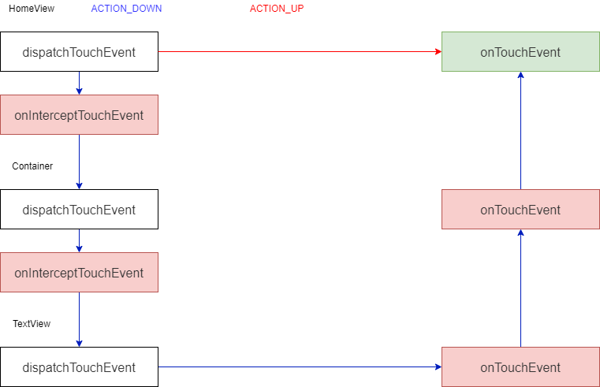
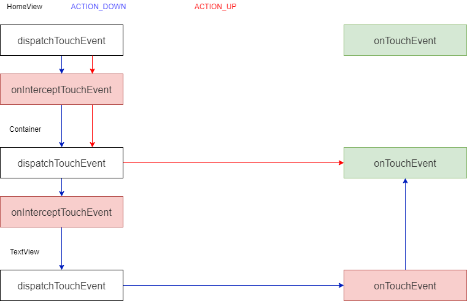
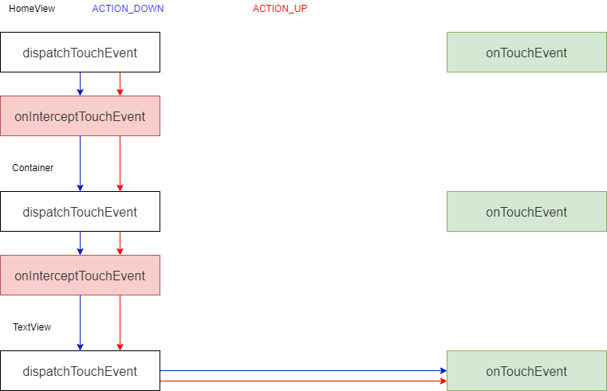
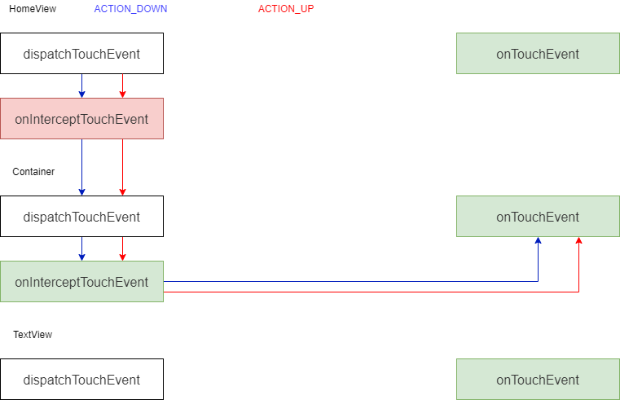

Reference

* [Manage touch events in a ViewGroup - Android Developers](https://developer.android.com/training/gestures/viewgroup)
* [Android的Touch事件分发机制简单探析](https://www.cnblogs.com/net168/p/4165970.html)
* [View—事件分发](https://www.jianshu.com/p/006a12da8dac)


# 1. 原理
## 1.1 MotionEvent

用户的点击事件被封装到`MotionEvent`对象中。


## 1.2 事件发起的入口

1. 调用`Activity.dispatchTouchEvent`

   ```java
   public boolean dispatchTouchEvent(MotionEvent ev) {
       if (ev.getAction() == MotionEvent.ACTION_DOWN) {
           onUserInteraction();
       }
       // 事件传递给Window，也就是PhoneWindow对象
       if (getWindow().superDispatchTouchEvent(ev)) {
           return true;
       }
       return onTouchEvent(ev);
   }
   ```

   `Window`抽象类只有唯一的一个实现类`PhoneWindow`。

2. 调用`PhoneWindow.superDispatchTouchEvent()`

   ```java
   private DecorView mDecor;
   
   @Override
   public boolean superDispatchTouchEvent(MotionEvent event) {
       // 事件传递给DecorView
   	return mDecor.superDispatchTouchEvent(event);
   }
   ```

3. 调用`DecorView.superDispatchTouchEvent`

   ```java
   public boolean superDispatchTouchEvent(MotionEvent event) {
       // 事件传递给ViewGroup
   	return super.dispatchTouchEvent(event);
   }
   ```

   `DecorView`继承自`FrameLayout`，因此`super.dispatchTouchEvent(event)`最终会调用`ViewGroup`类上的`dispatchTouchEvent(event)`方法。

至此，`MotionEvent`事件开始进入视图树里的分发流程。


## 1.3 事件分发的设计理念

* 记忆能力

  处理一组`MotionEvent`（`ACTION_DOWN`，`ACTION_MOVE`，`ACTION_UP`）时，`ViewGroup`会记住上一次有能力消费的子`View`，下次还交给它处理。如果上次没有一个子`View`有消费能力，那么这次`ViewGroup`将会自己处理。在处理触发频繁的`ACTION_MOVE`事件序列时，这种记忆能力将有效缩减分发时间。

* 分发能力

  只有`ViewGroup`具备真正的分发事件的功能，使用的方法是：`ViewGroup.dispatchTouchEvent(event)`。虽然`View`也有此方法，但是`View`并不具备把事件分发给别人的能力（例如同一级别的另一个`View`，或者叫sibling）。`View`只能在自己的管辖范围内，把`MotionEvent`分发给注册的`OnTouchListener`，或者分发给`onTouchEvent()`方法，进而给到注册的`OnClickListener`。

* 拦截能力

  只有`ViewGroup`具备拦截事件的能力，`View`是不具备这个能力的，毕竟`View`也没有子控件，不存在拦截的这个概念。相应的，`ViewGroup`上也有`ViewGroup.requestDisallowInterceptTouchEvent()`方法，允许子控件关闭父控件的拦截功能。


## 1.4 核心方法

* `View.dispatchTouchEvent()`

  核心代码：

  1. 如果设置了`OnTouchListener`接口，回调`OnTouchListener`接口。
  2. 事件分发给`onTouchEvent()`方法。如果`OnTouchListener`消费了事件，将不会再进入`onTouchEvent()`方法，也将不会回调到设置的`OnClickListener`或者`OnLongClickListener`。

  ```java
  public boolean dispatchTouchEvent(MotionEvent event) {
  	// Accessibility功能相关
  	if (event.isTargetAccessibilityFocus()) {
  		if (!isAccessibilityFocusedViewOrHost()) {
  			return false;
  		}
  		event.setTargetAccessibilityFocus(false);
  	}
  
  	boolean result = false;
  
      // Debug相关
  	if (mInputEventConsistencyVerifier != null) {
  		mInputEventConsistencyVerifier.onTouchEvent(event, 0);
  	}
  
  	final int actionMasked = event.getActionMasked();
      
      // Nested Scroll相关
  	if (actionMasked == MotionEvent.ACTION_DOWN) {
  		stopNestedScroll();
  	}
  
      // 有其它应用的Window可能在当前Window之上，遮挡了当前Window
      // 出于安全的考虑，可以过滤掉这种MotionEvent
      // 如果View设置了FILTER_TOUCHES_WHEN_OBSCURED
      // 当MotionEvent有FLAG_WINDOW_IS_OBSCURED时会被过滤
  	if (onFilterTouchEventForSecurity(event)) {
          // 事件被处理成滚动条拖动
  		if ((mViewFlags & ENABLED_MASK) == ENABLED && handleScrollBarDragging(event)) {
  			result = true;
  		
  		
          // 1. 回调OnTouchListener接口
  		ListenerInfo li = mListenerInfo;
  		if (li != null && li.mOnTouchListener != null
  				&& (mViewFlags & ENABLED_MASK) == ENABLED
  				&& li.mOnTouchListener.onTouch(this, event)) {
  			result = true;
  		}
  
          // 2. 事件分发给onTouchEvent
  		if (!result && onTouchEvent(event)) {
  			result = true;
  		}
  	}
  
      // Debug相关
  	if (!result && mInputEventConsistencyVerifier != null) {
  		mInputEventConsistencyVerifier.onUnhandledEvent(event, 0);
  	}
  
  	// NestedScroll相关
  	if (actionMasked == MotionEvent.ACTION_UP ||
  			actionMasked == MotionEvent.ACTION_CANCEL ||
  			(actionMasked == MotionEvent.ACTION_DOWN && !result)) {
  		stopNestedScroll();
  	}
  
  	return result;
  }
  ```

  

* `View.onTouchEvent()`

  核心代码：

  1. 在`ACTION_UP`事件时，回调`onClickListener`接口。
  2. 在`ACTION_DOWN`事件时，回调`onLongClickListener`接口。
  3. 如果`View`是`clickable`，事件将被消费。

  ```java
  public boolean onTouchEvent(MotionEvent event) {
  	final float x = event.getX();
  	final float y = event.getY();
  	final int viewFlags = mViewFlags;
  	final int action = event.getAction();
  
      // 是否可以点击
      // 是否可以长按
      // 是否可以Context点击（蓝牙触控笔使用时的功能）
  	final boolean clickable = ((viewFlags & CLICKABLE) == CLICKABLE
  			|| (viewFlags & LONG_CLICKABLE) == LONG_CLICKABLE)
  			|| (viewFlags & CONTEXT_CLICKABLE) == CONTEXT_CLICKABLE;
  
  	if ((viewFlags & ENABLED_MASK) == DISABLED) {
  		if (action == MotionEvent.ACTION_UP && (mPrivateFlags & PFLAG_PRESSED) != 0) {
  			setPressed(false);
  		}
  		mPrivateFlags3 &= ~PFLAG3_FINGER_DOWN;
  		// DISABLED的VIEW，如果clickable为true，也会消费掉MotionEvent
  		return clickable;
  	}
      
      // 转发给TouchDelegate
      // 用于处理点击区域扩大
  	if (mTouchDelegate != null) {
  		if (mTouchDelegate.onTouchEvent(event)) {
  			return true;
  		}
  	}
  
      // 可点击或者可以显示Tooltip
  	if (clickable || (viewFlags & TOOLTIP) == TOOLTIP) {
  		switch (action) {
  			case MotionEvent.ACTION_UP:
  				mPrivateFlags3 &= ~PFLAG3_FINGER_DOWN;
  				if ((viewFlags & TOOLTIP) == TOOLTIP) {
  					handleTooltipUp();
  				}
  				if (!clickable) {
  					removeTapCallback();
  					removeLongPressCallback();
  					mInContextButtonPress = false;
  					mHasPerformedLongPress = false;
  					mIgnoreNextUpEvent = false;
  					break;
  				}
  				boolean prepressed = (mPrivateFlags & PFLAG_PREPRESSED) != 0;
  				if ((mPrivateFlags & PFLAG_PRESSED) != 0 || prepressed) {
  					// take focus if we don't have it already and we should in
  					// touch mode.
  					boolean focusTaken = false;
  					if (isFocusable() && isFocusableInTouchMode() && !isFocused()) {
  						focusTaken = requestFocus();
  					}
  
  					if (prepressed) {
  						// The button is being released before we actually
  						// showed it as pressed.  Make it show the pressed
  						// state now (before scheduling the click) to ensure
  						// the user sees it.
  						setPressed(true, x, y);
  					}
  
  					if (!mHasPerformedLongPress && !mIgnoreNextUpEvent) {
  						// This is a tap, so remove the longpress check
  						removeLongPressCallback();
  
  						// Only perform take click actions if we were in the pressed state
  						if (!focusTaken) {
  							// 使用Post是为了在处理点击回调前，执行一些View的状态改变
  							if (mPerformClick == null) {
  								mPerformClick = new PerformClick();
  							}
                              // 1. 回调OnClick
  							if (!post(mPerformClick)) {
  								performClickInternal();
  							}
  						}
  					}
  
  					if (mUnsetPressedState == null) {
  						mUnsetPressedState = new UnsetPressedState();
  					}
  
  					if (prepressed) {
  						postDelayed(mUnsetPressedState,
  								ViewConfiguration.getPressedStateDuration());
  					} else if (!post(mUnsetPressedState)) {
  						// If the post failed, unpress right now
  						mUnsetPressedState.run();
  					}
  
  					removeTapCallback();
  				}
  				mIgnoreNextUpEvent = false;
  				break;
  
  			case MotionEvent.ACTION_DOWN:
  				if (event.getSource() == InputDevice.SOURCE_TOUCHSCREEN) {
  					mPrivateFlags3 |= PFLAG3_FINGER_DOWN;
  				}
  				mHasPerformedLongPress = false;
  
  				if (!clickable) {
  					checkForLongClick(
  							ViewConfiguration.getLongPressTimeout(),
  							x,
  							y,
  							TOUCH_GESTURE_CLASSIFIED__CLASSIFICATION__LONG_PRESS);
  					break;
  				}
  
  				if (performButtonActionOnTouchDown(event)) {
  					break;
  				}
  
  				// Walk up the hierarchy to determine if we're inside a scrolling container.
  				boolean isInScrollingContainer = isInScrollingContainer();
  
  				// For views inside a scrolling container, delay the pressed feedback for
  				// a short period in case this is a scroll.
  				if (isInScrollingContainer) {
  					mPrivateFlags |= PFLAG_PREPRESSED;
  					if (mPendingCheckForTap == null) {
  						mPendingCheckForTap = new CheckForTap();
  					}
  					mPendingCheckForTap.x = event.getX();
  					mPendingCheckForTap.y = event.getY();
                      // 2. 延时回调OnLongClickListener
  					postDelayed(mPendingCheckForTap, ViewConfiguration.getTapTimeout());
  				} else {
  					// Not inside a scrolling container, so show the feedback right away
  					setPressed(true, x, y);
                      // 2. 回调OnLongClickListener
  					checkForLongClick(
  							ViewConfiguration.getLongPressTimeout(),
  							x,
  							y,
  							TOUCH_GESTURE_CLASSIFIED__CLASSIFICATION__LONG_PRESS);
  				}
  				break;
  
  			case MotionEvent.ACTION_CANCEL:
  				if (clickable) {
  					setPressed(false);
  				}
  				removeTapCallback();
  				removeLongPressCallback();
  				mInContextButtonPress = false;
  				mHasPerformedLongPress = false;
  				mIgnoreNextUpEvent = false;
  				mPrivateFlags3 &= ~PFLAG3_FINGER_DOWN;
  				break;
  
  			case MotionEvent.ACTION_MOVE:
  				if (clickable) {
  					drawableHotspotChanged(x, y);
  				}
  
  				final int motionClassification = event.getClassification();
  				final boolean ambiguousGesture =
  						motionClassification == MotionEvent.CLASSIFICATION_AMBIGUOUS_GESTURE;
  				int touchSlop = mTouchSlop;
  				if (ambiguousGesture && hasPendingLongPressCallback()) {
  					final float ambiguousMultiplier =
  							ViewConfiguration.getAmbiguousGestureMultiplier();
  					if (!pointInView(x, y, touchSlop)) {
  						// The default action here is to cancel long press. But instead, we
  						// just extend the timeout here, in case the classification
  						// stays ambiguous.
  						removeLongPressCallback();
  						long delay = (long) (ViewConfiguration.getLongPressTimeout()
  								* ambiguousMultiplier);
  						// Subtract the time already spent
  						delay -= event.getEventTime() - event.getDownTime();
  						checkForLongClick(
  								delay,
  								x,
  								y,
  								TOUCH_GESTURE_CLASSIFIED__CLASSIFICATION__LONG_PRESS);
  					}
  					touchSlop *= ambiguousMultiplier;
  				}
  
  				// Be lenient about moving outside of buttons
  				if (!pointInView(x, y, touchSlop)) {
  					// Outside button
  					// Remove any future long press/tap checks
  					removeTapCallback();
  					removeLongPressCallback();
  					if ((mPrivateFlags & PFLAG_PRESSED) != 0) {
  						setPressed(false);
  					}
  					mPrivateFlags3 &= ~PFLAG3_FINGER_DOWN;
  				}
  
  				final boolean deepPress =
  						motionClassification == MotionEvent.CLASSIFICATION_DEEP_PRESS;
  				if (deepPress && hasPendingLongPressCallback()) {
  					// process the long click action immediately
  					removeLongPressCallback();
  					checkForLongClick(
  							0 /* send immediately */,
  							x,
  							y,
  							TOUCH_GESTURE_CLASSIFIED__CLASSIFICATION__DEEP_PRESS);
  				}
  
  				break;
  		}
  
          // 3. 如果可点击或者可以显示Tooltip
  		return true;
  	}
  
  	return false;
  }
  ```

  

* `ViewGroup.dispatchTouchEvent()`

  `ViewGroup`重写了`View.dispatchTouchEvent()`来进行事件的分发。

  核心代码：

  1. `TouchTarget`责任链构建了一条`TouchTarget`链表，用于保存一系列Touch操作序列中，所有有消费事件能力的子View，链表头使用`mFirstTouchTarget`保存。单指操作时，该链表只有一个`TouchTarget`，多指操作时，链表可能会有多个`TouchTarget`。

  2. 在`ACTION_DOWN`（`ACTION_POINTER_DOWN`）时，构建`TouchTarget`责任链。

     遍历子View，判断事件是否落入在其中，它是否可以消费此次事件。如果事件被消费了，将当前子View通过`addTouchTarget()`方法添加到`TouchTarget`责任链头。

     如果责任链为空，表明没有子View能够消费事件，将会调用`ViewGroup.dispatchTransformedTouchEvent()`方法，自己消费事件。

  3. 在其它`ACTION`时，通过`TouchTarget`责任链的记忆功能，直接分发事件，不再便利子View。

     如果责任链为空，表明没有子View能够消费事件，将会调用`ViewGroup.dispatchTransformedTouchEvent(null)`方法，自己消费事件。

     如果责任链不为空，表明有子View能消费事件，将会调用`ViewGroup.dispatchTransformedTouchEvent(child)`方法，将事件分发给子View。

  ```java
  @Override
  public boolean dispatchTouchEvent(MotionEvent ev) {
  	if (mInputEventConsistencyVerifier != null) {
  		mInputEventConsistencyVerifier.onTouchEvent(ev, 1);
  	}
  
  	if (ev.isTargetAccessibilityFocus() && isAccessibilityFocusedViewOrHost()) {
  		ev.setTargetAccessibilityFocus(false);
  	}
  
  	boolean handled = false;
      // 有其它应用的Window可能在当前Window之上，遮挡了当前Window
      // 出于安全的考虑，可以过滤掉这种MotionEvent
      // 如果View设置了FILTER_TOUCHES_WHEN_OBSCURED
      // 当MotionEvent有FLAG_WINDOW_IS_OBSCURED时会被过滤
  	if (onFilterTouchEventForSecurity(ev)) {
  		final int action = ev.getAction();
  		final int actionMasked = action & MotionEvent.ACTION_MASK;
  		
  		if (actionMasked == MotionEvent.ACTION_DOWN) {
              // ACTION_DOWN时清空状态
  			// 因为上一次手势的ACTION_UP或ACTION_CANCEL事件可能被Framework丢弃了
              // View的状态可能是脏的
  			cancelAndClearTouchTargets(ev);
  			resetTouchState();
  		}
  
  		final boolean intercepted;
        
          // 如果是ACTION_DOWN事件或者mFirstTouchTarget存在时
          // 那么表明子View有消费MotionEvent的能力（或者有可能，在ACTION_DOWN情况时）
          // 需要调用onInterceptTouchEvent()来确定是否需要拦截
          // 否则表明子View没有消费MotionEvent的能力，直接拦截
  		if (actionMasked == MotionEvent.ACTION_DOWN
  				|| mFirstTouchTarget != null) {
              // 处理requestDisallowInterceptTouchEvent()方法
  			final boolean disallowIntercept = (mGroupFlags & FLAG_DISALLOW_INTERCEPT) != 0;
  			if (!disallowIntercept) {
  				intercepted = onInterceptTouchEvent(ev);
  				ev.setAction(action);
  			} else {
  				intercepted = false;
  			}
  		} else {
  			intercepted = true;
  		}
  
  		if (intercepted || mFirstTouchTarget != null) {
  			ev.setTargetAccessibilityFocus(false);
  		}
  
  		final boolean canceled = resetCancelNextUpFlag(this)
  				|| actionMasked == MotionEvent.ACTION_CANCEL;
  
  		final boolean split = (mGroupFlags & FLAG_SPLIT_MOTION_EVENTS) != 0;
  		TouchTarget newTouchTarget = null;
  		boolean alreadyDispatchedToNewTouchTarget = false;
          
          // 没有被取消，没有被拦截
  		if (!canceled && !intercepted) {
  			View childWithAccessibilityFocus = ev.isTargetAccessibilityFocus()
  					? findChildWithAccessibilityFocus() : null;
  
              // ACTION_DOWN和ACTION_POINTER_DOWN事件时
              // 事件分发给子View构建责任链
  			if (actionMasked == MotionEvent.ACTION_DOWN
  					|| (split && actionMasked == MotionEvent.ACTION_POINTER_DOWN)
  					|| actionMasked == MotionEvent.ACTION_HOVER_MOVE) {
  				final int actionIndex = ev.getActionIndex(); // always 0 for down
  				final int idBitsToAssign = split ? 1 << ev.getPointerId(actionIndex)
  						: TouchTarget.ALL_POINTER_IDS;
  
  				removePointersFromTouchTargets(idBitsToAssign);
  
  				final int childrenCount = mChildrenCount;
  				if (newTouchTarget == null && childrenCount != 0) {
  					final float x = ev.getX(actionIndex);
  					final float y = ev.getY(actionIndex);
                      
                      // 将子View按照Z轴重新排序
  					// Z轴坐标越高的控件越有希望能消费Mot
  					final ArrayList<View> preorderedList = buildTouchDispatchChildList();
  					final boolean customOrder = preorderedList == null
  							&& isChildrenDrawingOrderEnabled();
  					final View[] children = mChildren;
  					for (int i = childrenCount - 1; i >= 0; i--) {
  						final int childIndex = getAndVerifyPreorderedIndex(
  								childrenCount, i, customOrder);
  						final View child = getAndVerifyPreorderedView(
  								preorderedList, children, childIndex);
  
  						if (childWithAccessibilityFocus != null) {
  							if (childWithAccessibilityFocus != child) {
  								continue;
  							}
  							childWithAccessibilityFocus = null;
  							i = childrenCount - 1;
  						}
  
                          // 判断事件落在子View范围内
  						if (!child.canReceivePointerEvents()
  								|| !isTransformedTouchPointInView(x, y, child, null)) {
  							ev.setTargetAccessibilityFocus(false);
  							continue;
  						}
  
                          // 如果当前子View处理过前序MotionEvent
                          // 把当前事件也分给它
  						newTouchTarget = getTouchTarget(child);
  						if (newTouchTarget != null) {
  							newTouchTarget.pointerIdBits |= idBitsToAssign;
  							break;
  						}
  
  						resetCancelNextUpFlag(child);
                          
                          // 判断子View是否能消费MotionEvent
  						if (dispatchTransformedTouchEvent(ev, false, child, idBitsToAssign)) {
                              // 如果可以消费事件
  							mLastTouchDownTime = ev.getDownTime();
  							if (preorderedList != null) {
  								for (int j = 0; j < childrenCount; j++) {
  									if (children[childIndex] == mChildren[j]) {
  										mLastTouchDownIndex = j;
  										break;
  									}
  								}
  							} else {
  								mLastTouchDownIndex = childIndex;
  							}
  							mLastTouchDownX = ev.getX();
  							mLastTouchDownY = ev.getY();
                              
                              // 记录当前TouchTarget到责任链中
  							newTouchTarget = addTouchTarget(child, idBitsToAssign);
  							alreadyDispatchedToNewTouchTarget = true;
  							break;
  						}
                          
  						ev.setTargetAccessibilityFocus(false);
  					}
  					if (preorderedList != null) preorderedList.clear();
  				}
  
                  // 如果没有子View可以消费，但是责任链不为空
  				if (newTouchTarget == null && mFirstTouchTarget != null) {
  					// 把事件分配给最早的TouchTarget
  					newTouchTarget = mFirstTouchTarget;
  					while (newTouchTarget.next != null) {
  						newTouchTarget = newTouchTarget.next;
  					}
  					newTouchTarget.pointerIdBits |= idBitsToAssign;
  				}
  			}
  		}
  
  		if (mFirstTouchTarget == null) {
              // 如果没有子View可以消费
  			handled = dispatchTransformedTouchEvent(ev, canceled, null,
  					TouchTarget.ALL_POINTER_IDS);
  		} else {
              // 如果有子View可以消费
  			TouchTarget predecessor = null;
  			TouchTarget target = mFirstTouchTarget;
  			while (target != null) {
  				final TouchTarget next = target.next;
  				if (alreadyDispatchedToNewTouchTarget && target == newTouchTarget) {
                      // 如果调用过子View的dispatchTouchEvent了，就已经被处理过了
  					handled = true;
  				} else {
  					final boolean cancelChild = resetCancelNextUpFlag(target.child)
  							|| intercepted;
  					if (dispatchTransformedTouchEvent(ev, cancelChild,
  							target.child, target.pointerIdBits)) {
  						handled = true;
  					}
  					if (cancelChild) {
  						if (predecessor == null) {
  							mFirstTouchTarget = next;
  						} else {
  							predecessor.next = next;
  						}
  						target.recycle();
  						target = next;
  						continue;
  					}
  				}
  				predecessor = target;
  				target = next;
  			}
  		}
  
  		if (canceled
  				|| actionMasked == MotionEvent.ACTION_UP
  				|| actionMasked == MotionEvent.ACTION_HOVER_MOVE) {
  			resetTouchState();
  		} else if (split && actionMasked == MotionEvent.ACTION_POINTER_UP) {
  			final int actionIndex = ev.getActionIndex();
  			final int idBitsToRemove = 1 << ev.getPointerId(actionIndex);
              removePointersFromTouchTargets(idBitsToRemove);
  		}
  	}
  
  	if (!handled && mInputEventConsistencyVerifier != null) {
  		mInputEventConsistencyVerifier.onUnhandledEvent(ev, 1);
  	}
  	return handled;
  }
  ```

  

* `ViewGroup.TouchTarget`

  核心代码：

  1. `TouchTarget`维护了一个单向链表。
  2. 静态成员`sRecycleBin`维护了一个`TouchTarget`的缓存链表（相当于一个对象池），每次创建`TouchTarget`时先尝试复用缓存链表中的对象。

  ```java
  private static final class TouchTarget {
      
  	private static final int MAX_RECYCLED = 32;
      // 缓存池同步锁
  	private static final Object sRecycleLock = new Object[0];
      // 缓存池，减少对象创建因此的内存抖动
  	private static TouchTarget sRecycleBin;
      // 当前缓存池大小
  	private static int sRecycledCount;
  
  	public static final int ALL_POINTER_IDS = -1; // all ones
  
  	// 接收Touch事件的子View
  	public View child;
  
  	// 当前TouchTarget捕获的所有手指id的合并
  	public int pointerIdBits;
  
  	// TouchTarget链表
  	public TouchTarget next;
  
  	private TouchTarget() {
  	}
  
      // 从缓存中取出一个TouchTarget对象复用
  	public static TouchTarget obtain(@NonNull View child, int pointerIdBits) {
  		if (child == null) {
  			throw new IllegalArgumentException("child must be non-null");
  		}
  
  		final TouchTarget target;
  		synchronized (sRecycleLock) {
  			if (sRecycleBin == null) {
                  // 缓存中没有对象，新建TouchTarget
  				target = new TouchTarget();
  			} else {
                  // 缓存中还有对象，取出缓存链表头部TouchTarget
  				target = sRecycleBin;
  				sRecycleBin = target.next;
  				 sRecycledCount--;
  				target.next = null;
  			}
  		}
  		target.child = child;
  		target.pointerIdBits = pointerIdBits;
  		return target;
  	}
  
      // 回收当前TouchTarget到缓存里
  	public void recycle() {
  		if (child == null) {
  			throw new IllegalStateException("already recycled once");
  		}
  
  		synchronized (sRecycleLock) {
  			if (sRecycledCount < MAX_RECYCLED) {
                  // 如果缓存还有空余，将当前TouchTarget放到缓存链表头
  				next = sRecycleBin;
  				sRecycleBin = this;
  				sRecycledCount += 1;
  			} else {
                  // 如果缓存没有空余，废弃当前TouchTarget
  				next = null;
  			}
  			child = null;
  		}
  	}
  }
  ```

  

* `ViewGroup.addTouchTarget()`

  核心代码：

  1. 从`TouchTarget`缓存中取一个`TouchTarget`对象。
  2. 将`TouchTarget`添加到责任链表头部。

  ```java
  private TouchTarget addTouchTarget(@NonNull View child, int pointerIdBits) {
      // 从缓存中取一个TouchTarget对象
      final TouchTarget target = TouchTarget.obtain(child, pointerIdBits);
      // 将取出的对象添加到责任链表头部
      target.next = mFirstTouchTarget;
      mFirstTouchTarget = target;
      return target;
  }
  ```

  

* `ViewGroup.dispatchTransformedTouchEvent`

  核心代码：

  1. 没有分发的子View，调用`View.dispatchTouchEvent()`自己消费
  2. 有分发的子View，调用子view的`dispatchTouchEvent()`

  ```java
  private boolean dispatchTransformedTouchEvent(MotionEvent event, boolean cancel,
          View child, int desiredPointerIdBits) {
  	final boolean handled;
  
  	// 特殊处理Cancel的情况
      // 只关心action，不关心内容
  	final int oldAction = event.getAction();
  	if (cancel || oldAction == MotionEvent.ACTION_CANCEL) {
  		event.setAction(MotionEvent.ACTION_CANCEL);
  		if (child == null) {
              // 1. 没有分发的子View，自己处理
  			handled = super.dispatchTouchEvent(event);
  		} else {
              // 2. 分发给子View
  			handled = child.dispatchTouchEvent(event);
  		}
  		event.setAction(oldAction);
  		return handled;
  	}
  
  	final int oldPointerIdBits = event.getPointerIdBits();
  	final int newPointerIdBits = oldPointerIdBits & desiredPointerIdBits;
  
  	if (newPointerIdBits == 0) {
  		return false;
  	}
  
  	final MotionEvent transformedEvent;
  	if (newPointerIdBits == oldPointerIdBits) {
  		if (child == null || child.hasIdentityMatrix()) {
  			if (child == null) {
                  // 1. 没有分发的子View，自己处理
  				handled = super.dispatchTouchEvent(event);
  			} else {
                  // 坐标转换
  				final float offsetX = mScrollX - child.mLeft;
  				final float offsetY = mScrollY - child.mTop;
  				event.offsetLocation(offsetX, offsetY);
  
                  // 2. 分发给子View
  				handled = child.dispatchTouchEvent(event);
  
                  // 坐标转换
  				event.offsetLocation(-offsetX, -offsetY);
  			}
  			return handled;
  		}
  		transformedEvent = MotionEvent.obtain(event);
  	} else {
  		transformedEvent = event.split(newPointerIdBits);
  	}
  
  	if (child == null) {
          // 1. 没有分发的子View，自己处理
  		handled = super.dispatchTouchEvent(transformedEvent);
  	} else {
  		final float offsetX = mScrollX - child.mLeft;
  		final float offsetY = mScrollY - child.mTop;
  		transformedEvent.offsetLocation(offsetX, offsetY);
  		if (! child.hasIdentityMatrix()) {
  			transformedEvent.transform(child.getInverseMatrix());
  		}
  
          // 2. 分发给子View
  		handled = child.dispatchTouchEvent(transformedEvent);
  	}
  
  	// Done.
  	transformedEvent.recycle();
  	return handled;
  }
  ```


# 2. 实例

## 2.1 Situation 1

除了HomeView，没有子View可以响应事件。

这种情况下，因为记忆功能，后续事件将不再转发给子View。


* 返回值

  | Return    | dispatchTouchEvent | onInterceptTouchEvent | onTouchEvent |
  | :-------- | :----------------: | :-------------------: | :----------: |
  | HomeView  |       false        |         false         |     true     |
  | Container |       false        |         false         |    false     |
  | TextView  |       false        |         false         |    false     |

  

* Logcat输出

  ```
  I/HomeView: dispatchTouchEvent() ACTION_DOWN
  I/HomeView: onInterceptTouchEvent() ACTION_DOWN
  I/HomeView: onInterceptTouchEvent() ACTION_DOWN returned: false
  I/Container: dispatchTouchEvent() ACTION_DOWN
  I/Container: onInterceptTouchEvent() ACTION_DOWN
  I/Container: onInterceptTouchEvent() ACTION_DOWN returned: false
  I/TextView: dispatchTouchEvent() ACTION_DOWN
  I/TextView: onTouchEvent() ACTION_DOWN
  I/TextView: onTouchEvent() ACTION_DOWN returned: false
  I/TextView: dispatchTouchEvent() ACTION_DOWN returned: false
  I/Container: onTouchEvent() ACTION_DOWN
  I/Container: onTouchEvent() ACTION_DOWN returned: false
  I/Container: dispatchTouchEvent() ACTION_DOWN returned: false
  I/HomeView: onTouchEvent() ACTION_DOWN
  I/HomeView: onTouchEvent() ACTION_DOWN returned: true
  I/HomeView: dispatchTouchEvent() ACTION_DOWN returned: true
  
  I/HomeView: dispatchTouchEvent() ACTION_UP
  I/HomeView: onTouchEvent() ACTION_UP
  I/HomeView: onTouchEvent() ACTION_UP returned: true
  I/HomeView: dispatchTouchEvent() ACTION_UP returned: true
  ```

  

* 流程图

  


## 2.2 situation 2

HomeView和Container有消费事件的能力。

Down事件会先被Container消费。

由于记忆功能，后续的事件全部会直接传递给Container消费，将不再传递给TextView。


* 返回值


| Return    | dispatchTouchEvent | onInterceptTouchEvent | onTouchEvent |
| :-------- | :----------------: | :-------------------: | :----------: |
| HomeView  |       false        |         false         |     true     |
| Container |       false        |         false         |     true     |
| TextView  |       false        |          N/A          |    false     |

  

* Logcat输出

```
I/HomeView: dispatchTouchEvent() ACTION_DOWN
I/HomeView: onInterceptTouchEvent() ACTION_DOWN
I/HomeView: onInterceptTouchEvent() ACTION_DOWN returned: false
I/Container: dispatchTouchEvent() ACTION_DOWN
I/Container: onInterceptTouchEvent() ACTION_DOWN
I/Container: onInterceptTouchEvent() ACTION_DOWN returned: false
I/TextView: dispatchTouchEvent() ACTION_DOWN
I/TextView: onTouchEvent() ACTION_DOWN
I/TextView: onTouchEvent() ACTION_DOWN returned: false
I/TextView: dispatchTouchEvent() ACTION_DOWN returned: false
I/Container: onTouchEvent() ACTION_DOWN
I/Container: onTouchEvent() ACTION_DOWN returned: true
I/Container: dispatchTouchEvent() ACTION_DOWN returned: true
I/HomeView: dispatchTouchEvent() ACTION_DOWN returned: true

I/HomeView: dispatchTouchEvent() ACTION_UP
I/HomeView: onInterceptTouchEvent() ACTION_UP
I/HomeView: onInterceptTouchEvent() ACTION_UP returned: false
I/Container: dispatchTouchEvent() ACTION_UP
I/Container: onTouchEvent() ACTION_UP
I/Container: onTouchEvent() ACTION_UP returned: true
I/Container: dispatchTouchEvent() ACTION_UP returned: true
I/HomeView: dispatchTouchEvent() ACTION_UP returned: true
```


* 流程图

  


# Situation 3

HomeView，Container和TextView有消费事件的能力。

Down事件会先被Text消费。

由于记忆功能，后续的事件全部会直接传递给TextView消费。


* 返回值


| Return    | dispatchTouchEvent | onInterceptTouchEvent | onTouchEvent |
| :-------- | :----------------: | :-------------------: | :----------: |
| HomeView  |       false        |         false         |     true     |
| Container |       false        |         false         |     true     |
| TextView  |       false        |          N/A          |     true     |

  

* Logcat输出

```
I/HomeView: dispatchTouchEvent() ACTION_DOWN
I/HomeView: onInterceptTouchEvent() ACTION_DOWN
I/HomeView: onInterceptTouchEvent() ACTION_DOWN returned: false
I/Container: dispatchTouchEvent() ACTION_DOWN
I/Container: onInterceptTouchEvent() ACTION_DOWN
I/Container: onInterceptTouchEvent() ACTION_DOWN returned: false
I/TextView: dispatchTouchEvent() ACTION_DOWN
I/TextView: onTouchEvent() ACTION_DOWN
I/TextView: onTouchEvent() ACTION_DOWN returned: true
I/TextView: dispatchTouchEvent() ACTION_DOWN returned: true
I/Container: dispatchTouchEvent() ACTION_DOWN returned: true
I/HomeView: dispatchTouchEvent() ACTION_DOWN returned: true

I/HomeView: dispatchTouchEvent() ACTION_UP
I/HomeView: onInterceptTouchEvent() ACTION_UP
I/HomeView: onInterceptTouchEvent() ACTION_UP returned: false
I/Container: dispatchTouchEvent() ACTION_UP
I/Container: onInterceptTouchEvent() ACTION_UP
I/Container: onInterceptTouchEvent() ACTION_UP returned: false
I/TextView: dispatchTouchEvent() ACTION_UP
I/TextView: onTouchEvent() ACTION_UP
I/TextView: onTouchEvent() ACTION_UP returned: true
I/TextView: dispatchTouchEvent() ACTION_UP returned: true
I/Container: dispatchTouchEvent() ACTION_UP returned: true
I/HomeView: dispatchTouchEvent() ACTION_UP returned: true
```


* 流程图

  


# Situation 4

HomeView，Container和TextView有消费事件的能力。

但由于Container会拦截事件，Down事件会先被Conatainer消费，并不会传递到TextView。

由于记忆功能，后续的事件全部会直接传递给Container消费，并且不会再调用到Container的onInterceptTouchEvent进行判断。


* 返回值


| Return    | dispatchTouchEvent | onInterceptTouchEvent | onTouchEvent |
| :-------- | :----------------: | :-------------------: | :----------: |
| HomeView  |       false        |         false         |     true     |
| Container |       false        |         true          |     true     |
| TextView  |       false        |          N/A          |     true     |

  

* Logcat输出

```
I/HomeView: dispatchTouchEvent() ACTION_DOWN
I/HomeView: onInterceptTouchEvent() ACTION_DOWN
I/HomeView: onInterceptTouchEvent() ACTION_DOWN returned: false
I/Container: dispatchTouchEvent() ACTION_DOWN
I/Container: onInterceptTouchEvent() ACTION_DOWN
I/Container: onInterceptTouchEvent() ACTION_DOWN returned: true
I/Container: onTouchEvent() ACTION_DOWN
I/Container: onTouchEvent() ACTION_DOWN returned: true
I/Container: dispatchTouchEvent() ACTION_DOWN returned: true
I/HomeView: dispatchTouchEvent() ACTION_DOWN returned: true

I/HomeView: dispatchTouchEvent() ACTION_UP
I/HomeView: onInterceptTouchEvent() ACTION_UP
I/HomeView: onInterceptTouchEvent() ACTION_UP returned: false
I/Container: dispatchTouchEvent() ACTION_UP
I/Container: onTouchEvent() ACTION_UP
I/Container: onTouchEvent() ACTION_UP returned: true
I/Container: dispatchTouchEvent() ACTION_UP returned: true
I/HomeView: dispatchTouchEvent() ACTION_UP returned: true
```


* 流程图

  

