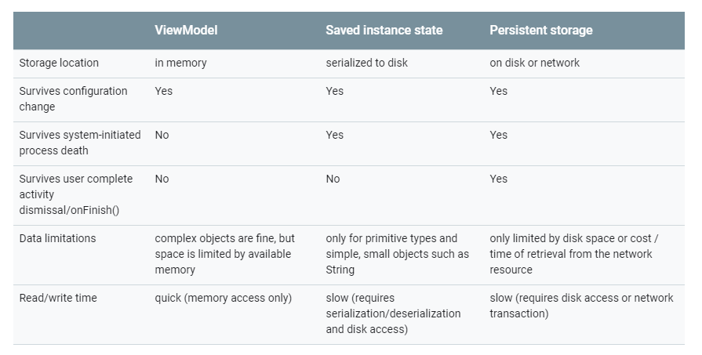

# Activity

## 常见问题

### `onStop()`和`onPause()`区别

* `onPause()`

  界面失去焦点，但对用户仍然可见。

  可以做一些轻量的回收工作，不建议做类似于DB操作、网络请求的比较重的回收工作，因为这个处于这个阶段的界面可能会很快切换到`onResume()`状态。

  另外，在多窗口模式下，只有一个window是获得焦点的，其它Activity虽然处于`onPause()` 状态，界面显示仍需要更新，从这个角度也不应该在这里进行类似于停止动画的回收工作。

* `onStop()`

  界面完全不可见。

  可以做一个比较重的回收工作，如网路请求和DB操作。

### `onSaveInstanceState()`和`onRestoreInstanceState()`

* 用途

  这两个方法用于保存视图的临时状态，一般不用于保存复杂的数据。

  
  
  需要注意的是，两个方法都需要调用super的方法，以完成整个视图树的保存和重建。方法最终会回调到`View.onSaveInstanceState()`和`View.onRestoreInstanceState()`，系统View已经替我们实现好了状态的恢复。

* 回调时机

  如果是用户主动关闭Activity，比如按返回键、从常用任务栏中划动删除任务等，是用户的主观行为，不会回调`onSaveInstanceState()`。

  如果是用户切换到其它应用，或者configuration变化，这些情况会回调`onSaveInstanceState()`。

* 生命周期

  * `onSaveInstanceState()`

    * `targetApi` < `Androd Honeycomb 3.0(SDK 11)`

      发生在`onPause()`之前。

    * `Androd Honeycomb 3.0(SDK 11)` <=  `targetApi` < `Androd Pie 9.0(SDK 29)`

      发生在`onPause()`之后，`onStop()`之前。

    * `Androd Pie 9.0(SDK 29)` <= `targetApi`

      发生在`onStop()`之后。

  * `onRestoreInstanceState()`

    `onRestoreInstanceState()`发生在`onStart()`之后。

### Activity启动流程

