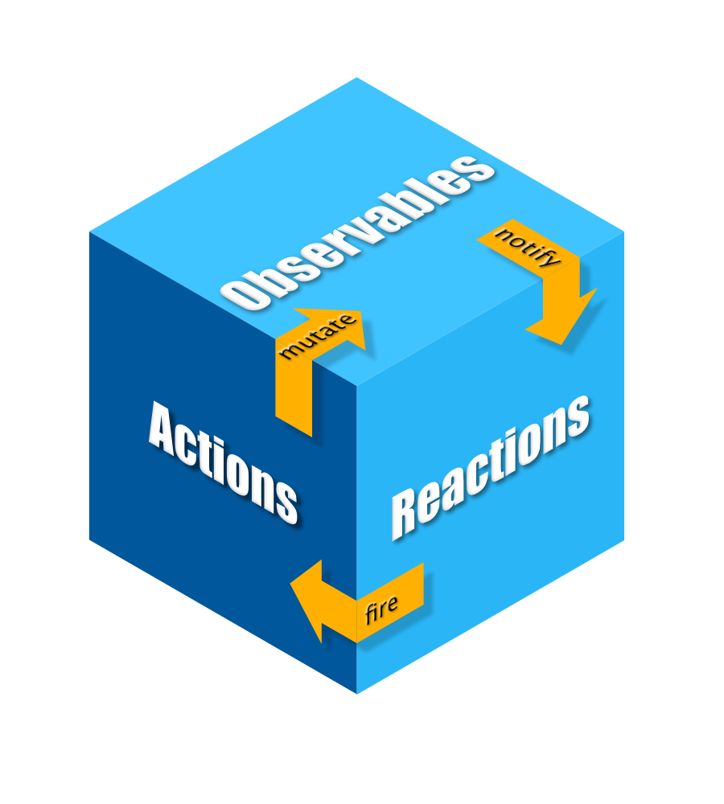

# MobX

## 基本使用

### 依赖

在`pubspec.yaml`中添加：

```yaml
dependencies:
	mobx:
	flutter_mobx:
	
dev_dependencies:
	mobx_codegen:
	build_runner:
```

### 创建state

创建state类`_Counter`，其中管理状态属性，并对外暴露修改属性的方法。MobX会根据`_Counter`类生成`_$Counter`类。

使用`part`关键字引入MobX生成的代码部分。

并且定义提供给Widget使用的类`Counter`，使用`with`关键字mixin使用`_$Counter`。

```dart
// 引入mobx依赖
import 'package:mobx/mobx.dart';

// 引入mobx自动生成的代码
part 'counter.g.dart';

// 定义给Widget使用的State类
class Counter = _Counter with _$Counter;

// 定义State类
abstract class _Counter with Store {

  // 观测的属性 使用@observable注解修饰
  @observable
  int value = 0;

  // 属性暴露的操作 使用@increment注解修饰
  @action
  void increment() {
    value++;
  }

  @action
  void decrement() {
    value--;
  }

  @action
  void reset() {
    value = 0;
  }
}
```

### 在Widget中使用

定义顶级变量`Counter`。

用`Observer`包裹需要使用`Counter`对象的Widget，在Widget中直接使用`Counter`对象。

```dart
// 定义Counter的顶层变量
final counter = Counter();

class MobxPlayground extends StatelessWidget {

  @override
  Widget build(BuildContext context) {
    // ...

    // 使用Observer包裹需要使用Counter的Widget
    Observer(
      builder: (context) => Text(
        // 直接使用counter
        '${counter.value}',
        style: Theme.of(context).textTheme.headline4,
      ),
    ),
    FlatButton.icon(
      // 直接使用counter
      onPressed: () => counter.increment(),
      icon: Icon(Icons.add),
      label: Text("increment"),
    ),

    // ...
  }
}
```

### codegen

使用flutter命令进行代码生成：

```shell
flutter packages pub run build_runner build
```

或者使用命令持续watch源码文件，动态修改生成文件：

```shell
flutter packages pub run build_runner watch
```

也可以用命令清除旧的代码冲突：

```shell
flutter packages pub run build_runner watch --delete-conflicting-outputs
```


## 核心原理

MobX包括三个核心概念：**Observable**，**Action**，**Reaction**。

三个部分相互流转，完成交互的状态变化。



在上述的例子中，`Counter`定义了**Observable**和**Action**，Widget针对状态的变化进行**Reaction**绘制。

### Observable

**Observable**代表了应用中可变化的状态，可以简单到**Counter**例子中的一个`int`，复杂到一整个对象结构。

**Observable**到变化会触发**Observer**的变化，进而触发Widget中的**Reaction**。

>需要注意，如果一个对象标注了@observable注解，MobX不能跟踪对象属性上的变化。
>
>更好的做法是把这些属性都使用@observable注解标注。

### Computed Observable

除了上述的可变化的**core state**，还有另一类状态**derived state**。它们是通过**core state**和其它**derived state**计算而来的。

> State in MobX = Core-State + Derived-State

使用`@computed`注解标注**derived state**。

例如，在上面Counter的例子中，增加一个`square`状态，用于表示`value`的平方。

```dart
@observable
int value = 0;

@computed
int get squareOfValue {
  return value * value;
}
```

当`value`发生变化时，`square`也会发生变化。

### Action

**Action**方法定义了**Observable**如何发生变化。

**Action**保证了**Observer**的通知只在**Action**完全执行结束后才会触发。并且**Action**可以嵌套，通知会在最上层的**Action**结束后触发。

### Reaction

// TODO

### Observer

`Observer`类是flutter_mobx包中提供的Widget，创建时使用`builder`方法创建。它会监听`builder`方法中使用的`observable`，在`observable`发生变化时重新渲染视图。