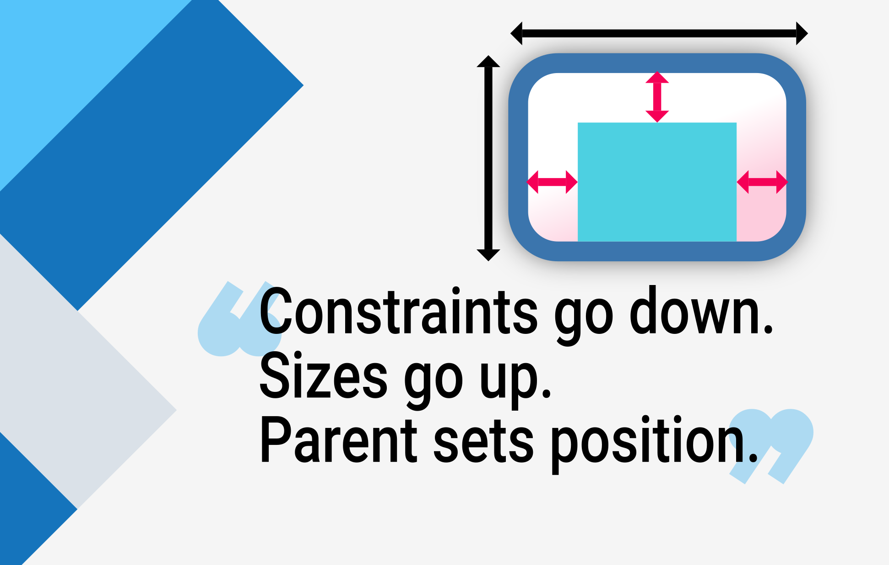

# Constraints



## 流程

* 一个Widget从父Widget那里获取到宽高的限制，定义在`BoxConstraints`类中，限制参数包括限制的最小最大宽高。

  ```dart
  const BoxConstraints({
    this.minWidth = 0.0,
    this.maxWidth = double.infinity,
    this.minHeight = 0.0,
    this.maxHeight = double.infinity,
  });
  ```

* 当前Widget遍历自己的子Widget，将它们的Constraints传递给它们。这些Constraints根据不同的Widget特性会不同，不同的子Widget之间也可能不同。让子Widget决定自己的大小。

* 这个过程一直递归下去，直到子Widget确定了自己的大小，把大小通知返回给当前Widget。

* 当前Widget排列子Widget，计算自己的宽高。

* 当前Widget把自己的宽高返回给父Widget。


## 限制

* 子Widget必须在父Widget规定的Constraints下决定自己的大小，通常不能喂任意大小。
* 子Widget无法决定自己在屏幕中的位置，因为父Widget进行子Widget的排列。
* 无法单独讨论一个Widget的位置和大小，必须把整个视图树当作一个整体一起考虑。