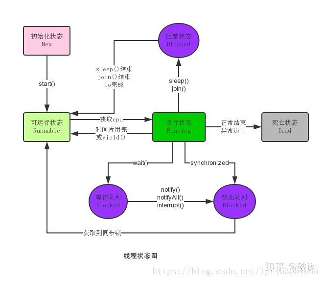

# Concurrent

## 线程

### vs. 进程

* 进程

  进程是程序的一次执行过程，是一个动态概念，是程序在执行过程中分配和管理资源的基本单位，每一个进程都有一个自己的地址空间，至少有 5 种基本状态，它们是：初始态，执行态，等待状态，就绪状态，终止状态。

* 线程

   线程是CPU调度和分派的基本单位，它可与同属一个进程的其他的线程共享进程所拥有的全部资源。

* 联系

   线程是进程的一部分，一个线程只能属于一个进程，而一个进程可以有多个线程，但至少有一个线程。

* 区别

  根本区别：进程是操作系统资源分配的基本单位，而线程是任务调度和执行的基本单位

  在开销方面：每个进程都有独立的代码和数据空间（程序上下文），程序之间的切换会有较大的开销；线程可以看做轻量级的进程，同一类线程共享代码和数据空间，每个线程都有自己独立的运行栈和程序计数器（PC），线程之间切换的开销小。

  所处环境：在操作系统中能同时运行多个进程（程序）；而在同一个进程（程序）中有多个线程同时执行（通过CPU调度，在每个时间片中只有一个线程执行）

  内存分配方面：系统在运行的时候会为每个进程分配不同的内存空间；而对线程而言，除了CPU外，系统不会为线程分配内存（线程所使用的资源来自其所属进程的资源），线程组之间只能共享资源。

  包含关系：没有线程的进程可以看做是单线程的，如果一个进程内有多个线程，则执行过程不是一条线的，而是多条线（线程）共同完成的；线程是进程的一部分，所以线程也被称为轻权进程或者轻量级进程。


### 状态



### 创建方式

* 传入Runnable
* 传入Future
* 继承Thread重写run方法


## 锁

### synchronized

Java内置锁，非公平。可以作用于实例方法，静态方法，代码块。实例方法锁住的是当前实例，静态方法锁住的是当前类的Class类，代码块锁住的是传入的对象。

原理是进入锁的对象上的Monitor阻塞队列。

* 偏向锁：markword中记录偏向的线程，这个线程可以可以反复重入
* 轻量锁：使用CAS自旋获取，会消耗CPU
* 重量锁：阻塞

### volatile

* 禁止指令重排序。在赋值后插入内存屏障Lock指令，不能把重排序的指令放到内存屏障之前。
* 线程可见性。一个线程更新了后，会告诉其它线程使用时要从主存更新，保证了值的修改对其它线程可见。

### final

保证了可见性。

### ReentrantLock

可重入锁，构造方法可以传入参数控制是否公平。

* `ReentrantLock.lock()`
* `ReentrantLock.unlock()`
* `ReentrantLock.tryLock()`

**condition**

* 使用`ReentrantLock.newCondition()`方法获取`Condition`对象。

* 通过condition让不同线程wait在不同的条件上。

**读写锁**

* `ReentrantReadWriteLock`

* `ReentrantReadWriteLock.ReadLock`
* `ReentrantReadWriteLock.WriteLock`

**手写不可重入的锁**

```java
public class Lock{
    private boolean isLocked = false;
    public synchronized void lock() throws InterruptedException{
        while(isLocked){    
            wait();
        }
        isLocked = true;
    }
    public synchronized void unlock(){
        isLocked = false;
        notify();
    }
}
```


## happens-before

* 程序顺序原则，即在一个线程内必须保证语义串行性，也就是说按照代码顺序执行。
* 锁规则，解锁happens-before下一个加锁。
* volatile规则，volatile变量的写happens-before读。
* 线程启动规则，线程start操作happens-before线程内部操作。
* 线程终止规则，线程内部操作happens-before线程结束。
* 线程中断规则，线程中断方法（Thread.interrupt()）happens-before线程中断检测方法（Thread.interrupted()）。
* 传递性。A happens-before B，B happens-before C，A happens-before C。
* 对象终结规则，对象构造函数结束happends-before Object.finalize()方法。


## 死锁

死锁产生的4个必要条件：

- 互斥使用(Mutual exclusion)

  指进程对所分配到的资源进行排它性使用，即在一段时间内某资源只由一个进程占用。如果此时还有其它进程请求资源，则请求者只能等待，直至占有资源的进程用毕释放。

- 不可抢占(No preemption)

  指进程已获得的资源，在未使用完之前，不能被剥夺，只能在使用完时由自己释放。

- 请求和保持(Hold and wait)

  指进程已经保持至少一个资源，但又提出了新的资源请求，而该资源已被其它进程占有，此时请求进程阻塞，但又对自己已获得的其它资源保持不放。

- 循环等待(Circular wait) 指在发生死锁时，必然存在一个进程——资源的环形链，即进程集合{P0，P1，P2，···，Pn}中的P0正在等待一个P1占用的资源；P1正在等待P2占用的资源，……，Pn正在等待已被P0占用的资源。


## 无同步方案 

### ThreadLocal

### 栈内封闭

没有使用到需要共享的资源。


## 工具

### CountDownLatch

* `CountDownLatch.await()`
* `CountDownLatch.countDown()`

### CyclicBarrier

* `CyclicBarrier.wait()`

### Semaphore

* `Semaphore.acquire()`
* `Semaphore.release()`


## 容器类

### BlockingQueue

### ConcurrentHashMap


## 线程池

### 参数

* `corePoolSize`：

  线程池中核心线程数最大值。

  线程池新建线程的时候，如果当前线程总数小于`corePoolSize`，则新建的是核心线程，如果超过`corePoolSize`，则新建的是非核心线程。
  核心线程默认情况下会一直存活在线程池中，即使这个核心线程啥也不干(闲置状态)。
  如果指定`ThreadPoolExecutor`的`allowCoreThreadTimeOut`这个属性为`true`，那么核心线程如果不干活的话，超过一定时间，就会被销毁掉。

* `maximumPoolSize`：

  线程池中线程总数最大值。

  线程总数 = 核心线程数 + 非核心线程数。

* `keepAliveTime`：

  线程池中非核心线程闲置超时时长。

  一个非核心线程，如果不干活(闲置状态)的时长超过这个参数所设定的时长，就会被销毁掉。
  如果设置`allowCoreThreadTimeOut`为`true`，则会作用于核心线程。

* `TimeUnit`：

  枚举类型，`keepAliveTime`的单位。

* `BlockingQueue`：

  线程池中任务队列。

  维护着等待执行的`Runnable`对象。当所有的核心线程都在干活时，新添加的任务会被添加到这个队列中等待处理，如果队列满了，则新建非核心线程执行任务。

### 常用队列

* `LinkedBlockingQueue`：

  这个队列接收到任务的时候，如果当前线程数小于核心线程数，则新建线程(核心线程)处理任务；如果当前线程数等于核心线程数，则进入队列等待。由于这个队列没有最大值限制，即所有超过核心线程数的任务都将被添加到队列中，这也就导致了`maximumPoolSize`的设定失效，因为总线程数永远不会超过`corePoolSize`。

* `ArrayBlockingQueue`：

  可以限定队列的长度。接收到任务的时候，如果没有达到`corePoolSize`的值，则新建核心线程执行任务，如果达到了，则入队等候，如果队列已满，则新建非核心线程执行任务，又如果总线程数到了`maximumPoolSize`，并且队列也满了，则发生错误。

* `DelayQueue`：

  队列内元素必须实现Delayed接口，这就意味着你传进去的任务必须先实现Delayed接口。这个队列接收到任务时，首先先入队，只有达到了指定的延时时间，才会执行任务。

  ```java
  public interface Delayed extends Comparable<Delayed> {
      long getDelay(TimeUnit unit);
  }
  ```

* `SynchronousQueue`：

  这个队列接收到任务的时候，会直接提交给线程处理，而不保留它。所以为了保证不出现<线程数达到了`maximumPoolSize`而不能新建线程>的错误，使用这个类型队列的时候，`maximumPoolSize`一般指定成`Integer.MAX_VALUE`，即无限大。

### 默认线程池

* `Executors.CachedThreadPool()`：

  可缓存线程池。

  ```java
  public static ExecutorService newCachedThreadPool(ThreadFactory threadFactory) {
      return new ThreadPoolExecutor(0, Integer.MAX_VALUE,
                                    60L, TimeUnit.SECONDS,
                                    new SynchronousQueue<Runnable>(),
                                    threadFactory);
  }
  ```

  * 线程数无限制。
  * 有空闲线程则复用空闲线程，若无空闲线程则新建线程。

* `Executors.newFixedThreadPool()`：

  固定大小线程池。

  ```java
  public static ExecutorService newFixedThreadPool(int nThreads) {
      return new ThreadPoolExecutor(nThreads, nThreads,
                                    0L, TimeUnit.MILLISECONDS,
                                    new LinkedBlockingQueue<Runnable>());
  }
  ```

  * 固定的线程数。
  * 超出的请求在队列中等待。

* `Executors.newScheduledThreadPool()`：

  定时及周期性任务执行。

  ```java
  public static ScheduledExecutorService newScheduledThreadPool(int corePoolSize) {
      return new ScheduledThreadPoolExecutor(corePoolSize);
  }
  
  public ScheduledThreadPoolExecutor(int corePoolSize) {
      super(corePoolSize, Integer.MAX_VALUE,
            DEFAULT_KEEPALIVE_MILLIS, MILLISECONDS,
            new DelayedWorkQueue());
  }
  ```

* `Executors.newSingleThreadExecutor()`：

  单线程。

  ```java
  public static ExecutorService newSingleThreadExecutor() {
      return new FinalizableDelegatedExecutorService
          (new ThreadPoolExecutor(1, 1,
                                  0L, TimeUnit.MILLISECONDS,
                                  new LinkedBlockingQueue<Runnable>()));
  }
  ```

### Executor

* `ExecutorService.submit()`：

  返回`Future`对象。

  可调用`Future.cancel()`取消。

* `ExecutorService.shutDown()`：

  停止。在等待的线程仍然会执行完。

* `ExecutorService.shutDownNow()`：

  停止。在等待的线程不会执行。