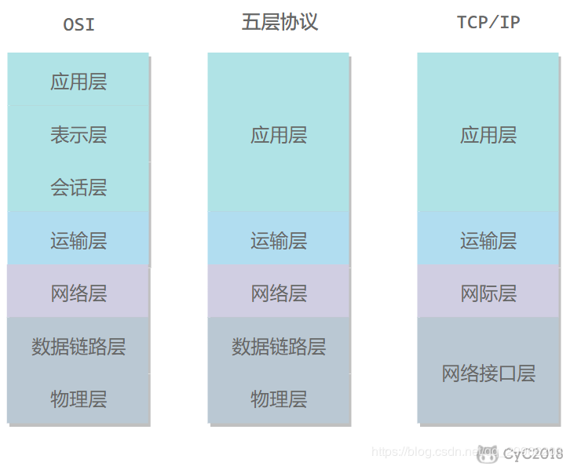
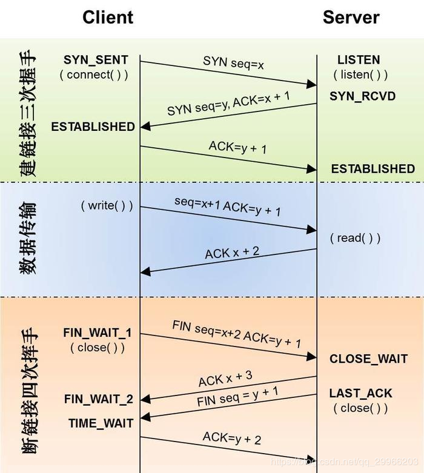
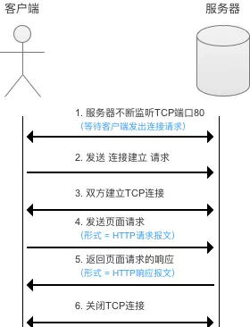
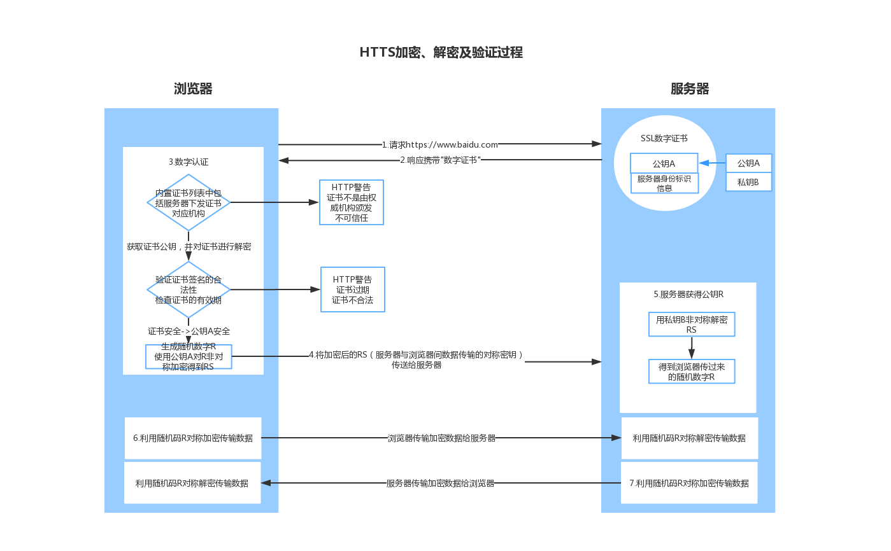

# Network

## 分层

## TCP

### 整体流程

### 报文段标识符

* 确认ACK ：TCP协议规定只有ACK=1时有效，也规定连接建立后所有发送的报文的ACK必须为1。
* 同步SYN：在连接建立时用来同步序号。当SYN=1而ACK=0时，表明这是一个连接请求报文。对方若同意建立连接，则应在响应报文中使SYN=1和ACK=1，因此SYN置1就表示这是一个连接请求或连接接受报文。
* 终止FIN：用来释放一个连接。当 FIN = 1 时，表明此报文段的发送方的数据已经发送完毕，并要求释放连接。
* 序号seq：用于对字节流进行编号。例如序号为 301，表示第一个字节的编号为 301，如果携带的数据长度为 100 字节，那么下一个报文段的序号应为 401。
* 确认号ack：期望收到的下一个报文段的序号。例如 B 正确收到 A 发送来的一个报文段，序号为 501，携带的数据长度为 200 字节，因此 B 期望下一个报文段的序号为 701，B 发送给 A 的确认报文段中确认号就为 701。

### 三次握手

* 最初两端的TCP进程都处于CLOSED关闭状态，Client（A）主动打开连接，而Server（B）处于LISTEN（监听状态），等待A的连接请求并被动打开连接（由客户端执行connect触发）。
* 第一次握手：由Client发出请求连接数据包： SYN=1 ACK=0 seq=x（TCP规定SYN=1时不能携带数据，但要消耗一个序号，因此声明自己的序号是 seq=x）此时Client进入SYN-SENT（同步已发送）状态，等待Server确认。
* 第二次握手：Server收到请求报文后，如果同意建立连接，则向A发送连接确认报文，即 SYN=1 ACK=1 seq=y，ack=x+1，此时Server进入SYN-RCVD（同步收到）状态。
* 第三次握手：Client收到Server的确认（SYN+ACK）后，向Server发出确认报文段，即 ACK=1，seq=x+1， ack=y+1，TCP连接已经建立，Client进入ESTABLISHED（已建立连接）状态。
  Server收到Client的确认后，也进入ESTABLISHED状态，完成三次握手；此时Client和Server可以开始传输数据。

### 四次挥手

* 数据传输结束后，通信的双方都可释放连接，A和B都处于ESTABLISHED状态。
* 第一次挥手：当Client发起终止连接请求的时候，会发送一个（FIN为1,seq=u）的没有数据的报文，这时Client停止发送数据（但仍可以接受数据） ，进入FIN_WAIT1（终止等待1）状态，等待Server确认
* 第二次挥手：Server收到连接释放报文后会给Client一个确认报文段（ACK=1,ack=u+1,seq=v）， 进入CLOSE-WAIT（关闭等待）状态。Client收到Server的确认后进入FIN_WAIT2状态，等待Server请求释放连接，Server仍可向Client发送数据。
* 第三次挥手：Server数据发送完成后，向Client发起请求连接释放报文（FIN=1,ACK=1,seq=w,ack = u+1）,Server进入LAST-ACK（最后确认）状态，等待Client确认。
* 第四次挥手：Client收到连接释放报文段后，回复一个确认报文段（ACK=1,seq=u+1,ack=w+1），进入 TIME_WAIT（时间等待） 状态，Server收到后进入CLOSED（连接关闭）状态。经过等待2MSL 时间（最大报文生存时间），Client进入CLOSED状态。

### 问题

**为什么需要三次握手？**

* 为了实现可靠数据传输， TCP 协议的通信双方， 都必须维护一个序列号， 以标识发送出去的数据包中， 哪些是已经被对方收到的。 三次握手的过程即是通信双方相互告知序列号起始值， 并确认对方已经收到了序列号起始值的必经步骤。
  如果只是两次握手， 至多只有连接发起方的起始序列号能被确认， 另一方选择的序列号则得不到确认。

**为什么需要四次挥手？**

* 为了让服务器发送还未传送完毕的数据。只有传送完毕后，服务器会发送FIN连接释放报文。
  因为当Server端收到Client端的SYN连接请求报文后，可以直接发送SYN+ACK报文。其中ACK报文是用来应答的，SYN报文是用来同步的。但是关闭连接时，当Server端收到FIN报文时，很可能并不会立即关闭SOCKET（服务端数据未传输完毕），FIN报文仅仅表示Client没有需要发送的数据，但是仍能接受数据，Server的数据未必全部发送出去，需要等待Server的数据发送完毕后发送FIN报文给Client才能表示同意关闭连接。
  所以只能先回复一个ACK报文，告诉Client端，“你发的FIN报文我收到了”。只有等到我Server端所有的报文都发送完了，我才能发送FIN报文，因此不能一起发送。故需要四步握手。

**为什么A在TIME-WAIT状态必须等待2MSL的时间？**

MSL最长报文段寿命Maximum Segment Lifetime，MSL=2
客户端接收到服务器端的 FIN 报文后进入此状态，此时并不是直接进入 CLOSED 状态，还需要等待一个时间计时器设置的时间 2MSL。这么做有两个理由：

* 保证A发送的最后一个ACK报文段能够到达B。
  如果 B 没收到 A 发送来的确认报文（A发送的最后一个ACK报文段可能丢失），那么就会重新发送连接释放请求报文，A 等待一段时间就是为了处理这种情况的发生。
* 防止本次已失效的连接请求报文段出现在新的连接中。
  等待一段时间是为了让本连接持续时间内所产生的所有报文都从网络中消失，使得下一个新的连接不会出现旧的连接请求报文。

### 可靠性

#### 超时重传

TCP 使用超时重传来实现可靠传输：如果一个已经发送的报文段在超时时间内没有收到确认，那么就重传这个报文段。

#### 滑动窗口

#### 流量控制

流量控制是为了控制发送方发送速率，保证接收方来得及接收。
接收方发送的确认报文中的窗口字段可以用来控制发送方窗口大小，从而影响发送方的发送速率。将窗口字段设置为 0，则发送方不能发送数据。

#### 拥塞控制

如果网络出现拥塞，分组将会丢失，此时发送方会继续重传，从而导致网络拥塞程度更高。因此当出现拥塞时，应当控制发送方的速率。这一点和流量控制很像，但是出发点不同。流量控制是为了让接收方能来得及接收，而拥塞控制是为了降低整个网络的拥塞程度。

## UDP

UDP 是一个简单的传输层协议。和 TCP 相比，UDP 有下面几个显著特性：

- UDP 缺乏可靠性。UDP 本身不提供确认，序列号，超时重传等机制。UDP 数据报可能在网络中被复制，被重新排序。即 UDP 不保证数据报会到达其最终目的地，也不保证各个数据报的先后顺序，也不保证每个数据报只到达一次
- UDP 数据报是有长度的。每个 UDP 数据报都有长度，如果一个数据报正确地到达目的地，那么该数据报的长度将随数据一起传递给接收方。而 TCP 是一个字节流协议，没有任何（协议上的）记录边界。
- UDP 是无连接的。UDP 客户和服务器之前不必存在长期的关系。UDP 发送数据报之前也不需要经过握手创建连接的过程。
- UDP 支持多播和广播。

## HTTP

- 基于TCP/IP通信协议传递数据（HTML、图片文件，查询结果等）

- 属于应用层协议

- 采用客户端-服务端（请求-响应 C/S）工作方式，具体工作流程如下：

  

### 请求

### 响应

### 方法

| 请求方法 | 用法                                       | 说明                                                         |
| -------- | ------------------------------------------ | ------------------------------------------------------------ |
| OPTIONS  | 返回服务器针对特定资源所支持的HTTP请求方法 | 返回：Allow: GET,POST,HEAD等                                 |
| HEAD     | 获取报文首部                               | 与GET方法类似，但不返回报文实体主体部分。用于确认URL的有效性以及资源更新日期时间等 |
| GET      | 获取资源                                   | 当前网络请求中，绝大部分使用GET方法                          |
| POST     | 传输实体主体                               | 向指定资源传输数据（例如提交表单或者上传文件）。数据被包含在请求体中。POST请求可能会导致新的资源的创建和/或已有资源的修改 |
| PUT      | 上传文件                                   | 由于自身不带验证机制，任何人都可以上传文件，因此存在安全性问题，一般不使用该方法 |
| DELETE   | 删除文件                                   | 与 PUT 功能相反，并且同样不带验证机制                        |
| TRACE    | 追踪路径                                   | 回显服务器收到的请求，主要用于测试或诊断。                   |

**GET**和**POST**的区别：

|          | GET                                                     | POST                                             |
| -------- | ------------------------------------------------------- | ------------------------------------------------ |
| 作用     | 获取资源                                                | 传输实体数据                                     |
| 参数位置 | 附在URL之后                                             | 提交的数据放在HTTP报文的请求体中                 |
| 参数长度 | 提交的数据大小有限制（因为浏览器对URL的长度有限制）     | 提交的数据没有限制                               |
| 参数形式 | 键值对形式                                              | 表单形式、JSON                                   |
| 参数类型 | 只允许ASCII字符                                         | 任何类型                                         |
| 安全性   | 安全性低。请求参数直接在URL上可见，报文可缓存在浏览器内 | 安全性高。请求参数在HTTP请求数据中，浏览器无缓存 |
| 应用场景 | 传递小量、不敏感的数据。用于从指定资源请求数据          | 传递大量、敏感数据。用于向指定资源提交数据       |

### 缓存

* Last-Modified，If-Modified-Since：
  Last-Modified 为服务器相应请求时，告诉浏览器资源的最后修改时间。当浏览器再次请求服务器时，将在请求中添加参数 If-Modified-Since（值为上次响应里面的Last-Modified值），服务器收到请求后发现有头If-Modified-Since 则与被请求资源的最后修改时间进行比对。
  若资源的最后修改时间 大于 If-Modified-Since，说明资源又被改动过，则响应整片资源内容，返回状态码200；若资源的最后修改时间 小于或等于 If-Modified-Since，说明资源无新修改，则响应HTTP 304，告知浏览器继续使用所保存的cache。
* Etag/If-None-Match：
  Etag 为服务器响应请求时，告诉浏览器当前资源在服务器的唯一标识（生成规则由服务器决定）。再次请求服务器时，通过此字段通知服务器客户段缓存数据的唯一标识。服务器收到请求后发现有头If-None-Match 则与被请求资源的唯一标识进行比对。
  若不同，说明资源又被改动过，则响应整片资源内容，返回状态码200；相同，说明资源无新修改，则响应HTTP 304，告知浏览器继续使用所保存的cache。

### Cookie & Session

cookie & session均是解决HTTP无状态协议的一种记录客户状态的机制。

* cookie——客户端的通行证
  Cookie 是服务器发送到用户浏览器并保存在本地浏览器的一小块数据，它会在浏览器之后向同一服务器再次发起请求时被携带上，用于告知服务端两个请求是否来自同一浏览器。由于之后每次请求都会需要携带 Cookie 数据，因此会带来额外的性能开销（尤其是在移动环境下）。
  创建过程：
  * 服务器发送的响应报文包含 Set-Cookie 首部字段，客户端得到响应报文后把 Cookie 内容保存到浏览器中。
  * 客户端之后对同一个服务器发送请求时，会从浏览器中取出 Cookie 信息并通过 Cookie 请求首部字段发送给服务器。

* session——服务端的客户档案
  除了可以将用户信息通过 Cookie 存储在用户浏览器中，也可以利用 Session 存储在服务器端，存储在服务器端的信息更加安全。
  Session 可以存储在服务器上的文件、数据库或者内存中。也可以将 Session 存储在 Redis 这种内存型数据库中，效率会更高。
  使用 Session 维护用户登录状态的过程如下：
  * 用户进行登录时，用户提交包含用户名和密码的表单，放入 HTTP 请求报文中；
  * 服务器验证该用户名和密码，如果正确则把用户信息存储到 Redis 中，它在 Redis 中的 Key 称为 Session ID；
  * 服务器返回的响应报文的 Set-Cookie 首部字段包含了这个 Session ID，客户端收到响应报文之后将该 Cookie 值存入浏览器中；
  * 客户端之后对同一个服务器进行请求时会包含该 Cookie 值，服务器收到之后提取出 Session ID，从 Redis 中取出用户信息，继续之前的业务操作。

### Http 1.0 1.x 2.0

* Http 1.0

  特点：

  * 无状态、无连接
  * HTTP1.0规定浏览器和服务器保持短暂的连接，浏览器的每次请求都需要与服务器建立一个TCP连接，服务器处理完成后立即断开TCP连接（无连接），服务器不跟踪每个客户端也不记录过去的请求（无状态）。

  问题：

  * 连接无法复用：每次请求都要经历三次握手和慢启动
    队头阻塞：由于HTTP1.0规定下一个请求必须在前一个请求响应到达之前才能发送。假设前一个请求响应一直不到达，那么下一个请求就不发送，同样的后面的请求也给阻塞了

* Http 1.x

  特点：

  * 持久连接：通过请求管道化实现，多个http 请求可以复用一个TCP连接，服务器端按照FIFO原则来处理不同的Request（实现"并行"传输）
  * 缓存处理：cache-control
  * 一个服务器能够创建多个Web站点：Host
  * 断点续传、身份认证、状态管理等

  问题：

  * 请求管道化并没有真正地实现”并行“，且在 HTTP/1.1 协议中浏览器客户端在同一时间，针对同一域名下的请求有一定数量限制。超过限制数目的请求会被阻塞。

* Http 2.0

  特点：

  * 二进制分帧：在应用层和传输层之间增加一个二进制分帧，在不改动 HTTP/1.x 的语义、方法、状态码、URI 以及首部字段的情况下, 解决了HTTP1.1 的性能限制，改进传输性能，实现低延迟和高吞吐量
  2. 实现多路复用：多路复用允许同时通过单一的 HTTP/2 连接发起多重的请求-响应消息。即HTTP/2 通信都在一个连接上完成，这个连接可以承载任意数量的双向数据流，实现真正的并行传输
  3. 头部压缩
  * 服务器推送：是一种在客户端请求之前发送数据的机制。

## HTTPS

## SOCKET

Socket 即 套接字，是通信的基石，是应用层 与 TCP/IP 协议族通信的中间软件抽象层，本质为一个封装了 TCP / IP协议族 的编程接口（属于传输层）。网络上的两个进程端口通过Socket实现一个双向的通信连接从而进行数据交换。

## 对比

**WebSocket和Socket区别**

可以把WebSocket想象成HTTP(应用层)，HTTP和Socket什么关系，WebSocket和Socket就是什么关系。

HTTP 协议有一个缺陷：通信只能由客户端发起，做不到服务器主动向客户端推送信息。

WebSocket协议它的最大特点就是，服务器可以主动向客户端推送信息，客户端也可以主动向服务器发送信息，是真正的双向平等对话，属于服务器推送技术的一种。

**socket和http的区别**

Http协议：简单的对象访问协议，对应于应用层。Http协议是基于TCP链接的。

Socket是对TCP/IP协议的封装，Socket本身并不是协议，而是一个调用接口（API），通过Socket，我们才能使用TCP/IP协议。

Http连接：http连接就是所谓的短连接，及客户端向服务器发送一次请求，服务器端相应后连接即会断掉。

socket连接：socket连接及时所谓的长连接，理论上客户端和服务端一旦建立连接，则不会主动断掉；但是由于各种环境因素可能会是连接断开，比如说：服务器端或客户端主机down了，网络故障，或者两者之间长时间没有数据传输，网络防火墙可能会断开该链接已释放网络资源。所以当一个socket连接中没有数据的传输，那么为了位置连续的连接需要发送心跳消息，具体心跳消息格式是开发者自己定义的。